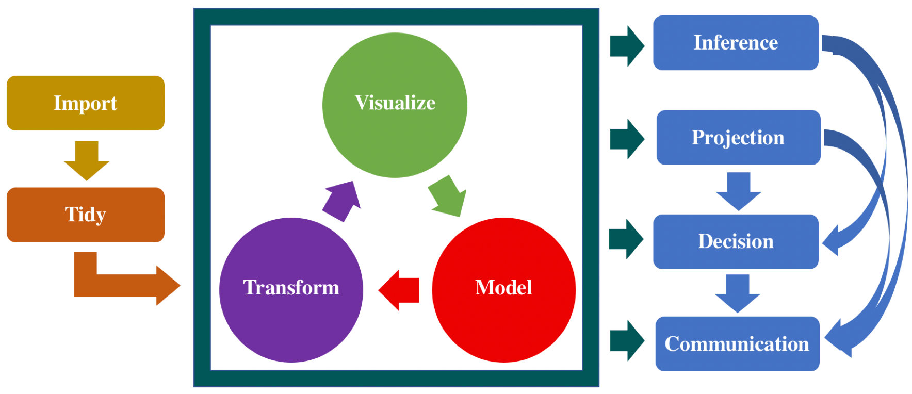

```{r set-options, collapse=TRUE, include=FALSE}
options(width = 60)
```

# Introduction {#intro}

## Aims and Scope of This Book

Epidemiologic data are paramount to targeting and implementing evidence-based control measures to protect the public’s health and safety. Nowhere are data more important than during a field epidemiologic investigation to identify the cause of an urgent public health problem that requires immediate intervention. Many of the steps to conducting a field investigation rely on identifying relevant existing data or collecting new data that address the key investigation objectives.

In today’s information age, the challenge is not the lack of data but rather how to identify the most relevant data for meaningful results and how to combine data from various sources that might not be standardized or interoperable to enable analysis. Accessing or collecting clean, valid, reliable, and timely data challenges most field epidemiologic investigations. Infectious disease learning requires lots of iteration between data manipulation, visualization, and modeling. 

The purpose of this book is to provide an overview of modern data science tools and methods that have been developed specifically to analyze infectious disease data. The readers are assumed to have a background in high school mathematics and introductory-level statistics, but no specialist knowledge of infectious diseases is assumed. Since the topic of this book is an enormous one, we do not claim to provide comprehensive coverage of all existing methods. However, we will describe many of the critical approaches, and throughout, there will be many examples and case studies. This book serves the complementary purpose of introducing graduate students and others to the field of infectious disease data analysis, acting as a reference for researchers in this field, and helping practicing data scientists and infectious disease epidemiologists to develop the ability to use R to understand basic data structures, basic data processing skills, and basic data visualization skills.

## The Structure of This Book

### Infectious disease data

The material in this book is concerned with the statistical analysis of quantitative data obtained by observing the spread of **infectious diseases**. According to @porta2014dictionary: 

>Infectious disease (or communicable disease) is defined as an illness caused by a specific infectious agent or its toxic product that results from transmission of that agent or its products from an infected person, animal, or reservoir to a susceptible host, either directly or indirectly through an intermediate plant or animal host, vector or inanimate environment.

Surveillance systems generate data that help public health officials understand existing and emerging infectious diseases. Without a proper understanding of the health problem (etiology, distribution, and mechanism of infection), it will be difficult to ameliorate the health issue.

Coronavirus disease (COVID-19) is an infectious disease caused by a newly discovered coronavirus. The current COVID-19 pandemic raises important questions about opening, sharing and using data, and highlights the challenges associated with data use. It is well known that data is critical to understanding the impact of infectious disease, but also to inform the appropriate response, planning and allocation of resources. 

### Basic characteristics of the infection process

*Reservoir of infection*, also called *primary source of infection*, is a location (person, animal, arthropod, plant, soil, or substance) in which the infectious agent finds conditions that permit it to survive and multiply and from where it can be transmitted to another susceptible host. See @barreto2006infectious.

For the infection of a new host to occur, there must be an opportunity for a susceptible host to be exposed to the infectious agent—that is, there must be contact between the agent and the host. The infectious disease is transmitted to a susceptible host, when the individual takes in a sufficient quantity of causative organism. When a susceptible takes in an amount of infectious material, sufficient to induce infection, we say that the individual has made an *infectious contact*. Following the time of the infection, the newly infected individual generally passes through a *latent period* during which the infection develops purely internally, without the emission of any kind of infectious material. The *latent period* is the time from infection to onset of the ability to infect. It ends when the infected individual becomes infectious, and for the duration of the infectious period, we refer to the infected individual as an *infective* who can transmit infection to susceptibles. The infectious period ends when the infected individual ceases to be infectious, and he either becomes susceptible again or becomes a removal for some time. A *removal* is an individual who are immune or dead as a consequence of infection. A *removal* plays no part in the spread of the disease. The states of isolation and immunity may be temporary or permanent. Each infected individual is also referred to as a *case*.

```{r infection, out.width = "50%", echo=FALSE, fig.align = "center", fig.show='hold', fig.cap="Chain of infection. Source: Centers for Disease Control and Prevention [@dicker1992principles]."}
knitr::include_graphics(c("figures/infection.jpg"))
```


### Data visualization

Data visualization or information visualization always played a crucial role in scientific analysis. In many infectious disease studies, data visualization could be a good starting point for the users to understand how far the disease will spread and to illustrate our findings and statistical insights. Besides, the ability to visualize, track, and predict the spread of the disease can help raise awareness, understand the impact of the disease, and ultimately assist in prevention efforts. 

Data visualization is having a big moment during the COVID-19 pandemic. Social media feeds are overwhelmed with infection heat maps and charts depicting transmission patterns. We have all seen models projecting the spread of the novel coronavirus. The COVID-19 pandemic also poses new challenges to data scientists, too, for its vast and rapid spread and significant economic impact. 

A lot of work has been done on visualizing COVID-19 data since the outbreak of the pandemic. The daily counts of cases and deaths of COVID-19 are crucial for understanding how this pandemic is spreading. Thanks to the contribution of the data science communities across the world, multiple sources provide the COVID-19 data with different precision and focus. To clean the data, we first fetch data from various sources and compile them into the same format for further comparison and integration. Appendix B describes the data used in the examples, case studies, and lab exercises in the book. 

R offers the opportunity to scale and automate tasks, document and track them, and reliably reproduce their output. The first few chapters investigate existing R visualization techniques used to manipulate and represent infectious disease data. Chapter \@ref(dplyr) provides an introduction to data wrangling and how to use R packages `dplyr` and `tidyr` to manipulate your data in a useful form for visualization and modeling. This chapter is for someone who is already somewhat familiar with `R`, but would like to know more about using it for fundamental data analysis and manipulation.

```{r process, out.width = "70%", echo=FALSE, fig.align = "center", fig.show='hold', fig.cap="The stages of a data science workflow. Original source: @wickham2016r"}

```

Graphs can be presented using a variety of media: print, projection, dashboard, etc. The visualizations can be primarily classified into two groups: visualization with zero or less interactivity represents the first group, and complex interactive visualization techniques and tools represent the second. See Figure \@ref(fig:plottypes) for different types of visualization. Before constructing any display of epidemiologic data, it is important to first determine the point to be conveyed and which media you want to use for communications

```{r plottypes, out.width = "40%", echo=FALSE, fig.align = "center", fig.show='hold', fig.cap="Types of visualization plots."}
knitr::include_graphics(c("figures/static_plot.png","figures/plotly_plot.png", "figures/animation2.png", "figures/county_risk_ts.png"))
```

Chapter \@ref(ggplot2) introduces static visualization, which uses basic graphs such as bar and line graphs for representing attributes of the COVID-19 dataset. We use a collection of graphs for comparing cumulative or daily new cases and deaths between states/counties in the US. 

Chapter \@ref(plotly) provide insight and practical skills for creating interactive and dynamic web graphics for data analysis from R. This kind of visualizations allow user interaction like hovering the mouse over bars and points in the charts. It makes heavy use of `plotly` for rendering graphics, but you’ll also learn about other R packages that augment a data science workflow, such as the `tidyverse` and `shiny`. Along the way, you’ll gain insight into best practices for visualization of infectious disease data, statistical graphics, and graphical perception. Chapter \@ref(shiny) focuses on linking `plotly` graphs with `shiny`, an open-source R package that provides an elegant and powerful web framework for building web applications. Chapter \@ref(map) is an in-depth look at visualizing data in a spatial setting and presenting findings through some geospatial visualization.


<!-- In summary, we have identified the following challenges while visualizing data related to the spread of the COVID-19 pandemic: -->

<!-- * Range of data: The number of cases and deaths range from a tenth of a million to less than a hundred in different states, regions, and counties. It is difficult to plot this wide range of values sharing a single scale. The trend may look flat for some states or counties where the number of new cases is in hundreds when plotted with a state or coounty where it is in thousands. -->

<!-- * Data transformation: Usually in science, researchers use log or semilog transformation for plotting data with a wide range. However, presently the COVID statistics have a huge influence on people's perception of threat, and a flat logarithmic curve may undermine the effect of the disease among common people if they do not follow the actual data transformation. -->

<!-- * Proportional statistics: A plethora of statistics is defining new variables such as number of people affected per capita or per million population or proportion of death with respect to total number of affected people. These statistics often exaggerate the problem for both small and large counties. For example, a huge number of deaths may seem a small proportion of per million people in cities such as New York City and only a few deaths may seem a big number for a small and less populous country. -->

<!-- * Information overload: When the graphs present data for multiple states or countries, all graphs turn indistinguishable at the early stage of the pandemic and countries where the spread has not yet reached peak clutter together even for a set of line graphs. -->


### Modeling and Forecasting

The concepts and techniques discussed in Chapters \@ref(dplyr)--\@ref(shiny) have dealt with describing, visualizing, and exploring the data. The use of scientific models for understanding the dynamics of infectious diseases has a very rich history in epidemiology.

Starting in December 2019 in China, the outbreak of COVID-19 has spread globally within weeks. To efficiently combat COVID-19, it is crucial to have a better understanding of how far the virus will spread, and how many lives it will claim. Scientific modeling is an essential tool to answer these questions and ultimately assist in disease prevention, policymaking, and resource allocation. 

Chapter \@ref(modeling) presents a few classic epidemic modeling approaches, and takes the reader through steps required for fundamental infectious data analysis and presentation of data typically encountered in epidemiology using COVID-19 data set. Chapter \@ref(regression) introduces the analytical techniques of regression and discrimination as a means of quantifying the effect of a set of explanatory variables on the spatial distribution of a particular outcome.

Chapter \@ref(timeseries) takes the reader through time series modeling and forecasting. Chapter \@ref(NN) introduces some neural network models for forecasting. Chapter \@ref(ensemble) describes the ensemble methods using multiple forecasting algorithms to improve the predictive performance.


