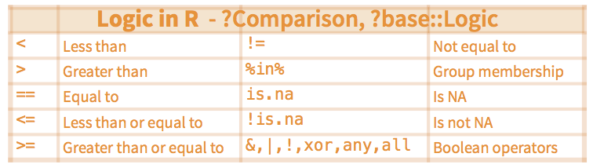
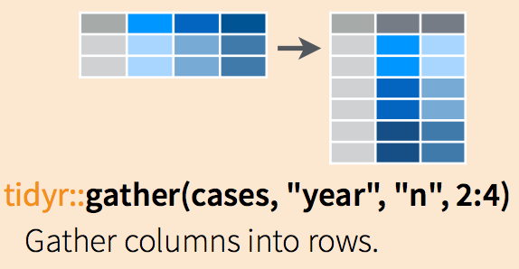

# Data Wrangling with `dplyr` and `tidyr` {#dplyr}

The package `dplyr` is an R package for making tabular data wrangling easier by using a limited set of functions that can be combined to extract and summarize insights from your data. It pairs nicely with the package `tidyr`, enabling you to swiftly convert between different data formats (long vs. wide) for plotting and analysis. It addresses the common problem of reshaping your data for plotting and use by different R functions. Sometimes we want data sets where we have one row per measurement. Sometimes we want a dataframe where each measurement type has its own column, and rows are instead more aggregated groups. Sometimes you may want to select important variables, filter out key observations, create new variables and obtain summary statistics. As illustrated in Figure \@ref(fig:process1), you may need to work back and forth between these formats, which is nontrivial, and `tidyr` and `dplyr` give you the right tools for this and more sophisticated data wrangling.

```{r process1, out.width = "75%", echo=FALSE, fig.align = "center", fig.cap="A typical data science process."}

```


The packages `dplyr` and `tidyr` are built to work directly with data frames. In this chapter, you will learn how to use these packages to perform data manipulation and transform your data into the appropriate form.


## Learning `dplyr`

```{R, results='hide'}
# load the packages
library(tidyverse)
library(dplyr)
```

### Tibbles

Throughout this book, we work with “tibbles” instead of R’s traditional “data.frame”. Tibbles are data frames, but they are a modern reimagining of the “data.frame”, keeping what time has proven to be effective, and throwing out what is not. Here we will use the `tibble` package, which provides opinionated data frames that make working in the `tidyverse` a little easier. 

```{R, eval=FALSE, warning=FALSE, message=FALSE}
# The easiest way to get tibble is to install the whole tidyverse:
 install.packages("tidyverse")

# Alternatively, install just tibble:
install.packages("tibble")
```

In most places, we will use the term “tibble” and “data frame” interchangeably; when we want to draw particular attention to R’s built-in data frame, we will call them “data.frame”. See @wickham2016r for more details about how to create and use “tibbles”.

### Import data 

Recall R offers many ways to import data:

* `read_csv()` reads comma delimited files, `read_csv2()` reads semicolon separated files. 

* `read_tsv()` reads tab delimited files, and `read_delim()` reads in files with any delimiter.

* `read_fwf()` reads fixed width files. You can specify fields either by their widths with `fwf_widths()` or their position with `fwf_positions()`. 

* `read_table()` reads a common variation of fixed width files where columns are separated by white space.

* `load()` loads an `.RData` file and import all of the objects contained in the `.RData` file into your current workspace. 

Below we will work on COVID-19 county level infected count data (`I.county`), and we can obtain the data from Github R package `slid`. It is a “data frame” which includes “ID” (county-level Federal Information Processing System code), “County” (name of county), “State” (name of state), “XYYYY.MM.DD” (the number of cumulative infected cases in a county related to the date of YYYY.MM.DD) for 3,104 counties in the US. For example, the variable `X2020.01.22` is the number of cumulative infected cases in a county on 01/22/2020. See Appendix B for more detailed description of the data and its source.


```{R,  results='hide', warning=FALSE, message=FALSE}
# install the slid package from github
# library(devtools)
# devtools::install_github('covid19-dashboard-us/slid')
# load objects in I.county into my workspace
library(slid)
data(I.county)

# make I.county a tibble with as_tibble()
I.county <- as_tibble(I.county)

# preview the data
# View(I.county)
```

### Common `dplyr` functions

Next, we will learn some of the most common `dplyr` functions:

* `select()`: subset columns;
* `filter()`: subset rows on conditions;
* `mutate()`: create new columns by using information from other columns;
* `group_by()` and `summarize()`: create summary statistics on grouped data;
* `arrange()`: sort results;
* `join()` family: combine datasets.

A typical code structure of `dplyr` is:

```{R, eval=FALSE}
data.new <- data.original %>%
  select rows or columns to manipulate %>%
  arrange or group the data %>%
  summarize the data
```

The first argument is a data frame, and the subsequent arguments separated by `%>%` describe the data manipulation and/or summary, and the result is a new data frame. We will explain more details in the following sections.

## Selecting Columns and Filtering Rows

### Subset Variables (Columns)

To select columns of a dataframe, use `select()`. The first argument to this function is the data frame (`I.county`), and the subsequent arguments are the columns to keep, separated by commas. Alternatively, if you are selecting columns adjacent to each other, you can use a `:` to select a range of columns, read as “select columns from __ to __”.

```{R, eval=TRUE, results='hide', warning=FALSE, message=FALSE}
# load the tidyverse
dplyr::select(I.county, ID, County, State)
# select a series of connected columns
dplyr::select(I.county, ID, County, State, X2020.12.11:X2020.12.01)
```

### Subset Observations (Rows) 

To choose rows based on specific criteria, we can use the `filter()` function. The arguments after the dataframe are the condition(s) we want for our final dataframe to adhere to (e.g. `State` name is “Iowa”). We can chain a series of conditions together using commas between each condition.

```{R, results='hide'}
# all Iowa counties
dplyr::filter(I.county, State == "Iowa")
```

Here is an example of `filter()` function with multiple conditions: 

```{R, eval=TRUE, results='hide'}
# all Iowa counties with cumulative infection count > 10000
dplyr::filter(I.county, State == "Iowa", X2020.12.11 > 10000)
```

To use filtering effectively, it is better to know some of the comparison and logical operators. Figure \@ref(fig:logic) shows some commonly used R logic comparisons:

```{r logic, out.width = "75%", echo=FALSE, fig.align = "center", fig.cap="Some commonly used logic comparisons."}

```

### Pipes

What if you want to select and filter at the same time? There are three ways to do this: use intermediate steps, nested functions, or pipes.

With intermediate steps, you create a temporary dataframe and use that as input to the next function, like this:

```{R eval=TRUE}
# all Iowa counties from 2020.12.01 to 2020.12.11
# method 1
Iowa.I.county <- dplyr::filter(I.county, State == "Iowa")
Iowa.I.county.DEC <- dplyr::select(Iowa.I.county, 
                                   X2020.12.11:X2020.12.01)
```

This is readable, but can clutter up your workspace with lots of objects that you have to name individually. With multiple steps, that can be hard to keep track of.

You can also nest functions (i.e. one function inside of another), like this:

```{R, eval=TRUE, results='hide'}
# all Iowa counties from 2020.12.01 to 2020.12.11
# method 2
Iowa.I.county.DEC <- 
  dplyr::select(dplyr::filter(I.county, State == "Iowa"), 
                ID, County, State, X2020.12.11:X2020.12.01)
```

This is handy but can be difficult to read if too many functions are nested, as R evaluates the expression from the inside out (in this case, filtering, then selecting).

The last option, **pipes**, are a recent addition to R. **Pipes** let you take the output of one function and send it directly to the next, which is useful when you need to do many things to the same dataset. Pipes in R look like `%>%` and are made available via the `magrittr` package, installed automatically with `dplyr`.

```{R results='hide'}
# all Iowa counties from 2020.12.01 to 2020.12.11
# method 3
I.county %>%
  dplyr::filter(State == "Iowa") %>%
  dplyr::select(ID, County, X2020.12.11:X2020.12.01)
```

In the above code, we use the **pipe** to send the interviews dataset first through `filter()` to keep rows for the state of Iowa, then through `select()` to keep only the count in December. Since `%>%` takes the object on its left and passes it as the first argument to the function on its right, we don't need to explicitly include the `dataframe` as an argument to the `filter()` and `select()` functions anymore.

Some may find it helpful to read the pipe like the word "then". For instance, in the above example, we take the dataframe `I.county`, then we filter for rows with `State == "Iowa"`, then we select columns from `X2020.12.11` to `X2020.12.01`. The `dplyr` functions are somewhat simple, but by combining them into linear workflows with the pipe, we can accomplish more complex data wrangling operations.

If we want to create a new object with this smaller version of the data, we can assign it a new name:

```{R eval=TRUE}
# assign a name to all Iowa counties 
# from 2020.12.01 to 2020.12.11
Iowa.I.county.DEC <- I.county %>%
  dplyr::filter(State == "Iowa") %>%
    dplyr::select(ID, County, X2020.12.11:X2020.12.01)

head(Iowa.I.county.DEC)
```

### Select and order top n entries (by group if grouped data).

The function `top_n` can be used to select top (or bottom) n rows (by value).

This is a convenient wrapper that uses `filter()`and `min_rank()` to select the top or bottom entries in each group, ordered by `wt`.

**Usage**

```{r eval=FALSE}
top_n(x, n, wt)
```

**Arguments**

* `x`: a `tbl()` to filter
* `n`: number of rows to return. If `x` is grouped, this is the number of rows per group. Will include more than `n` rows if there are ties. If `n` is positive, selects the top `n` rows. If negative, selects the bottom `n` rows.
* `wt` (Optional). The variable to use for ordering. If not specified, defaults to the last variable in the `tbl`.

This argument is automatically quoted and later evaluated in the context of the data frame. It supports unquoting.

Let us find the top ten counties with the largest cumulative infected count on December 11, 2020. 

```{R eval=TRUE}
# top ten counties with the cum. infected count
I.county.top10 <- I.county %>% top_n(10, wt = X2020.12.11)
I.county.top10$County
```

Let us find the bottom ten counties with the smallest cumulative infected count on December 11, 2020. 

```{R eval=TRUE}
# bottom ten counties with the cum. infected count
I.county.bottom10 <- I.county %>% top_n(-10, wt = X2020.12.11)
I.county.bottom10$County
```

Let us find the county with the largest cumulative infected count on December 11, 2020 for each state. 

```{R eval=TRUE}
# county with the largest cum. infected count for each state
I.county.top1 <- I.county %>% 
  group_by(State) %>%
  top_n(1, wt = X2020.12.11) %>% 
  dplyr::select(State, County)
```

## Make New Variables: Mutate

Frequently you will want to create new columns based on the values in existing columns, for example, to obtain the number of daily new cases based on the cumulative count. For this, we can use the `mutate()` function.

```{R eval=TRUE}
# create a new variable Y2020.12.11 (new count 2020.12.11)
I.county.new <- I.county %>% 
    dplyr::filter(State == "Iowa") %>%
    dplyr::select(ID, County, X2020.12.11:X2020.12.10) %>% 
    mutate(Y2020.12.11 = X2020.12.11 - X2020.12.10)

head(I.county.new)
```

If we want to obtain the number of daily new cases based on the cumulative count for the dates in December only, we can try the following:

```{R eval=TRUE}
# create variables Y2020.12.01 : Y2020.12.11
# with daily new count

I.county.Iowa <- I.county %>% 
  dplyr::filter(State == "Iowa")

I.county.tmp <- I.county.Iowa[, -(1:3)]
I.county.Iowa.new <- I.county.Iowa
I.county.Iowa.new[, -(1:3)] <- I.county.tmp - 
  cbind(I.county.tmp[, -1], 0)

I.county.Iowa.DEC <- I.county.Iowa.new %>% 
dplyr::select(ID, County, X2020.12.11:X2020.12.01)  

name.tmp <- substring(names(I.county.Iowa.DEC)[-(1:2)], 2)
names(I.county.Iowa.DEC)[-(1:2)] <- paste0("Y", name.tmp)
head(I.county.Iowa.DEC)
```


## Summarize Data

Many data analysis tasks can be approached using the split-apply-combine paradigm: split the data into groups, apply some analysis to each group, and then combine the results. `dplyr` makes this very easy via the `group_by()` function.

The `summarize()` function uses summary functions, functions that take a vector of values and return a single value, such as:

* `dplyr::first`: first value of a vector.
* `dplyr::last`: last value of a vector.
* `dplyr::nth`: nth value of a vector.
* `dplyr::n`: number of values in a vector.
* `dplyr::n_distinct`: number of distinct values in a vector.
* `IQR`: IQR of a vector.
* `min`: minimum value in a vector.
* `max`: maximum value in a vector.
* `mean`: mean value of a vector.
* `median`: median value of a vector.
* `var`: variance of a vector.
* `sd`: standard deviation of a vector.

The `group_by()` function is often used together with `summarize()`, which collapses each group into a single-row summary of that group. The `group_by()` takes as arguments the column names that contain the categorical variables for which you want to calculate the summary statistics. Once the data are grouped, you can also summarize multiple variables simultaneously (and not necessarily on the same variable). So to compute the state level cumulative infected count by `State`:

```{R eval=TRUE}
# state level cumulative infected count
# method 1: summarize()
I.state <- I.county %>%
  group_by(State) %>%
  summarize(across(X2020.12.11:X2020.01.22, 
                   ~ sum(.x, na.rm = TRUE)))
head(I.state, 2)
```

or we can use `summarize_at()`, which affects variables selected with a character vector or `vars()`: 

```{R eval=TRUE}
# state level cumulative infected count
# method 2: summarize_at()
I.state <- I.county %>%
  group_by(State) %>%
  summarize_at(vars(X2020.12.11:X2020.01.22), 
               ~ sum(.x, na.rm = TRUE))

head(I.state, 2)
```

or we can use `summarize_if()`, which affects variables selected with a predicate function:

```{R eval=TRUE}
# state level cumulative infected count
# method 3: summarize_if()
I.state <- I.county %>%
  group_by(State) %>%
  summarize_if(is.numeric, ~ sum(.x, na.rm = TRUE)) 

head(I.state, 2)
```

It is sometimes useful to rearrange the result of a query to inspect the values. For instance, we can sort on `X2020.12.11` to put the group with the largest cumulative infected count first using the `arrange()` function:

```{R eval=TRUE}
# state level cumulative infected count
# method 4: sort by the cum. infected count
I.state <- I.county %>%
  group_by(State) %>%
  summarize_if(is.numeric, ~ sum(.x, na.rm = TRUE)) %>%
  arrange(desc(X2020.12.11))

head(I.state, 2)
```

In the above, `desc()` is used to re-oorder by a column in descending order. 

## Combine Data Sets

R has a number of quick, elegant ways to join data frames by a common column. There are at least three ways:

* Base R’s `merge()` function,
* Join family of functions from `dplyr`, and
* Bracket syntax based on `data.table`.

### The join family

The `dplyr` uses SQL database syntax for its join functions. For example, a **left join** means: Include everything on the left and all rows that match from the right data frame. If the join columns have the same name, all you need is `left_join(x, y)`. If they don’t have the same name, you need a by argument, such as `left_join(x, y, by = c("df1ColName" = "df2ColName"))`. See an illustration in Figure \@ref(fig:lrjoin).

```{r lrjoin, out.width = "30%", echo=FALSE, fig.align = "center", fig.show='hold', fig.cap="An illustration of left join and right join."}
knitr::include_graphics(c("figures/Left.png","figures/Right.png"))
```

Different join functions control what happens to rows that exist in one table but not the other.

* `left_join` keeps all the entries that are present in the left (first) table and excludes any that are only in the right table.
* `right_join` keeps all the entries that are present in the right table and excludes any that are only in the left table.
* `inner_join` keeps only the entries that are present in both tables. `inner_join` is the only function that guarantees you won’t generate any missing entries.
* `full_join` keeps all of the entries in both tables, regardless of whether or not they appear in the other table.

```{r ifjoin, out.width = "30%", echo=FALSE, fig.align = "center", fig.show='hold', fig.cap="An illustration of inner join and full join."}
knitr::include_graphics(c("figures/Inner.png","figures/Full.png"))
```

The join functions are nicely illustrated in RStudio’s [Data wrangling cheatsheet](https://www.rstudio.com/wp-content/uploads/2015/02/data-wrangling-cheatsheet.pdf). 

```{r join, out.width = "75%", echo=FALSE, fig.align = "center", fig.cap="An illustration of the join functions in RStudio’s Data wrangling cheatsheet."}
knitr::include_graphics("figures/dplyr-joins.png")
```

### Toy examples with joins

```{r collapse=TRUE}
a <- tibble(x1 = LETTERS[c(1:3)], 
                x2 = 1:3)
b <- tibble(x1 = LETTERS[c(1, 2, 4)], 
                x3 = c(T, F, T))
a
b
```

```{r collapse=TRUE}
# include all rows in a and b
inner_join(a, b, by = "x1")
```

```{r collapse=TRUE}
# return all rows from a
left_join(a, b, by = "x1")
```

```{r collapse=TRUE}
# return all rows from b
right_join(a, b, by = "x1")
```

```{r collapse=TRUE}
# includes all rows in a or b
full_join(a, b, by = "x1")
```

```{r collapse=TRUE}
# include the rows in a that are not in b
anti_join(a, b, by = "x1")
```

```{r collapse=TRUE}
# want everything that doesn't match?
full_join(anti_join(a, b, by = "x1"), 
anti_join(b, a, by = "x1"), by = "x1")
```

### Practice with joins for real data

1. Example 1

We first get the data named `pop.county` from the github R package `slid`. Note that there are four variables in this data: “ID” (county-level Federal Information Processing System code), “County” (name of county matched with “ID”), “State” (name of state matched with “ID”), `population` (population of county matched with “ID”).

```{R, warning = FALSE, message = FALSE, collapse = TRUE}
data(I.county)
data(pop.county)
# make I.county a tibble with as_tibble()
I.county <- as_tibble(I.county)
dim(I.county)
# make pop.county a tibble with as_tibble()
pop.county <- as_tibble(pop.county)
dim(pop.county)
```

Now, we would like to join the two tables: `I.county` and `pop.county` using the `left_join` as follows:

```{R, results='hide'}
pop.county.tmp <- pop.county %>% dplyr::select(-c(County, State)) 
I.county.w.pop <- left_join(I.county, pop.county.tmp, by = "ID")
```

or we can: 

```{R, cache=FALSE, results='hide'}
I.county.w.pop <- left_join(I.county, 
dplyr::select(pop.county, c(ID, population)), by = "ID")
```

2. Example 2

In this example, we would like to create a map to show the risk of COVID-19 infection in each state of the US. So, first, we need to have a new dataset that contains infection risk and the geographic information of each state. We will get infected count and state population in the `state.long` dataset in the `slid` package. `state.long` is a tibble with 15,925 rows and 7 columns. Next, we obtain the boundary information of each state downloaded from [PublicaMundi](https://raw.githubusercontent.com/PublicaMundi/MappingAPI/master/data/geojson/us-states.json). Then, we merge the two datasets to create a new dataset. We need the R package `geojsonio` to read the data from [PublicaMundi](https://raw.githubusercontent.com/PublicaMundi/MappingAPI/master/data/geojson/us-states.json).

```{r, cache=FALSE}
library(geojsonio)
library(slid)
data(state.long)
# get the geospatial information from PublicaMundi
states0 <- geojson_read(
  x = "https://raw.githubusercontent.com/PublicaMundi/MappingAPI/master/data/geojson/us-states.json"
  , what = "sp"
)
head(states0@data)

states1 <- states0
states1@data <- states0@data %>% 
# remove the space in the name of state if there is one
mutate(name_ns = sapply(name, gsub, pattern = " ", replacement = ""))
# the following merge step can be done both using sp::merge 
# or the join functions in dplyr
# states1 <- sp::merge(states1, state.long %>% 
# filter(DATE == as.Date('2020-12-11')), 
# by.x = "name_ns", by.y = "State")
# merge the two datasets
states1@data <- left_join(states1@data, state.long %>% 
filter(DATE == as.Date('2020-12-11')), 
by = c('name_ns' = 'State'))
# calculate the risk of infection
states1@data <- states1@data %>% 
  mutate(Infect_risk = Infected / pop)
```

## Reshaping Data

Sometimes, we want to convert data from a wide format to a long format. Many functions in R expect data to be in a long format rather than a wide format. Programs like SPSS, however, often use wide-formatted data. Take the dataset I.state for example, the column names “XYYYY.MM.DD” are not names of variables, but values of a variable, which contains the values of cumulative infected count.  
We need to pivot the column names into new variables.

There are two sets of methods that are explained below:

* `gather()` and `spread()` from the `tidyr` package. This is a newer interface to the `reshape2` package.

* `pivot_longer` and `pivot_wider` from the `tidyr` package.

Many other methods aren’t covered here since they are not as easy to use.

### From wide to long

Below we would like to change the data `I.state` from wide format to long format.

```{R, cache=FALSE, results='hide', warning=FALSE, message=FALSE}
library(slid)
data(I.state)
names(I.state)
```

1. Use `gather(data, key, value, ...)`

* `data` = the dataframe you want to morph from wide to long
* `key` = the name of the new column that is levels of what is represented in the wide format as many columns
* `value` = the name of the column that will contain the values
* `...` = columns to gather, or leave (use -column to gather all except that one)

The `gather` functions are nicely illustrated in RStudio’s [Data wrangling cheatsheet][https://rstudio.com/wp-content/uploads/2015/02/data-wrangling-cheatsheet.pdf] as shown in Figure \@ref(fig:gather).

```{r gather, out.width = "50%", echo=FALSE, fig.align = "center", fig.cap="An illustration of `gather` function."}

```

```{r}
# method 1
I.state.wide <- I.state 
dim(I.state.wide)  

I.state.long <- gather(I.state.wide, DATE, Infected, 
X2020.12.11:X2020.01.22, factor_key = TRUE) %>% 
                       arrange(State)
dim(I.state.long)
```

2. Use `pivot_longer()`

The function `pivot_longer()` is an updated approach to `gather()`, designed to be both simpler to use and to handle more use cases. It is recommended to use `pivot_longer()` for new code; `gather()` isn't going away but is no longer under active development.

```{r}
# method 2
I.state.wide <- I.state 
dim(I.state.wide) 

I.state.long <- I.state.wide %>%
  pivot_longer(X2020.12.11:X2020.01.22, names_to = "DATE", 
  values_to = "Infected")
```

See more complicated examples from the [introduction of 'tidyr' package](https://tidyr.tidyverse.org/reference/pivot_longer.html).

### From long to wide

Now let's change the data back to the wide format, and we can use `spread`.

1. Use `Use spread(data, key, value)`

* `data` = the dataframe you want to morph from long to wide
* `key` = the name of the column that contains the key
* `value` = the name of the column contains the values

The `spread` functions are nicely illustrated in RStudio’s [Data wrangling cheatsheet][https://rstudio.com/wp-content/uploads/2015/02/data-wrangling-cheatsheet.pdf] as shown in Figure \@ref(fig:spread).

```{r spread, out.width = "50%", echo=FALSE, fig.align = "center", fig.cap="An illustration of `spread` function."}
knitr::include_graphics("figures/spread.png")
```

```{r}
# method 1
I.state.wide <- spread(I.state.long, DATE, Infected)
dim(I.state.wide)
```

2. Use `pivot_wider()`

We can also use the function `pivot_wider()`, which "widens" data, increasing the number of columns and decreasing the number of rows. The inverse transformation is `pivot_longer()`.

```{r}
# method 2
I.state.wide <- I.state.long %>%
pivot_wider(names_from = DATE, values_from = Infected)
dim(I.state.wide)
```

See more complicated examples from the [introduction of 'tidyr' package](https://tidyr.tidyverse.org/reference/pivot_longer.html).


## Exercises

1. We are going to explore the basic data manipulation verbs of `dplyr` using `I.county`. Install the github R package `slid`.

```{R, eval=TRUE}
library(slid)
data(I.county)
```

   (a) Obtain a subset of the `I.county` by selecting `ID`, `County`, `State`.
   
   (b) Obtain a subset of the `I.county` by including all counties in California.
   
   (c) Obtain a subset of the `I.county` by including all counties that in the midwest states. 

```{R eval=FALSE}
Midwest  = c( "Illinois", "Michigan", "Indiana" ,"Ohio", 
"Wisconsin", "Iowa", "Kansas", "Minnesota", "Missouri", 
"Nebraska" , "SouthDakota" , "NorthDakota")
```

   (d) Obtain a subset of the `I.county` by including the top ten counties from each midwest state based on the cumulative infected count on December 11, 2020.

   (e) Obtain a subset of the `I.county` by including all the counties California with the culumative infected counts up till Judy 31, 2020.
   
   (f) Create new columns of `I.county` by taking the logarithm of each of the count column.

   (g) Sort the cumulative infected count on December 11, 2020 to find the state with the largest cumulative infected count. 

2. Downlad the data `pop.county` from the github R package `slid`.

   (a) Join the tables of `I.county` and `pop.county` using `inner_join`, `left_join` , `right_join`, `full_join`. Do you get same or different tables?
   
   (b) Based on the `inner_join` create a table and name it as `I.pop.county`, then create new columns of `I.pop.county` by dividing each of the count column by the popolation in the corresponding county, for example, `risk.2020.12.11 = X.2020.12.11 / pop`. 
   
   (c) For each state, list the top ten county with the highest risk based on `risk.2020.12.11`
   
   
   
   
