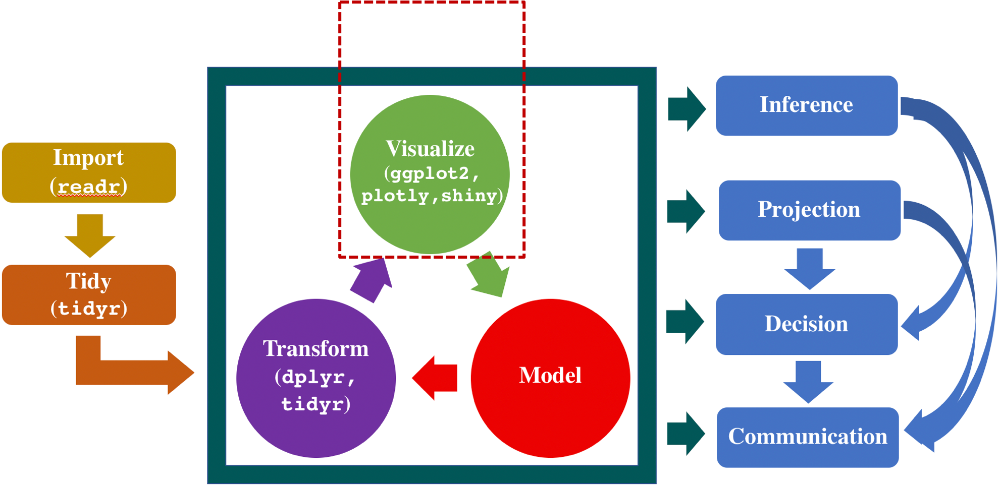

# Interactive Visualization {#plotly}

## An Introduction

As the volume and complexity of infectious disease data increases, public health professionals must synthesize highly disparate data to facilitate communication with the public and inform decisions regarding measures to protect the public’s health. Interactive data visualization allows users the freedom to explore data fully.  Here are some key advantages of using interactive data visualization software:

* Hovering over any data point to see the data behind it;
* Identifying causes and trends more quickly;
* Adding multiple highlights and change view subsets of the data by editing options below each graph;
* Auto-refreshing your visuals to show the most recent data.

So far, your primary tool for creating these data visualizations has been “ggplots”. In the past few years, interactive tools for visualization of disease outbreaks has been improving markedly. In this chapter, we will introduce the R `plotly` package, which allows you to make more professional and interactive graphics, share them on websites, and customize them as you wish. 

```{r process3, out.width = "80%", echo=FALSE, fig.align = "center", fig.cap="A typical data science process."}

```

Plotly is an R package for creating interactive, publication-quality graphs. Some of the charts you can do are Basic charts, Statistical charts, Scientific charts, Financial charts, Maps, 3D charts, Subplots, Transforms, Animations. Plotly is built on top of visualization library D3.js, HTML, and CSS. Here are some benefits of using plotly. 

* Plotly is compatible with several languages/ tools: R, Python, MATLAB, Perl, Julia, Arduino.
* Using plotly, we can easily share interactive plots online with multiple people.
* Plotly can also be used by people with no technical background for creating interactive plots by uploading the data and using plotly GUI.
* Plotly is compatible with ggplots in R and Python.
* Plotly allows embedding interactive plots in websites using iframes or HTML.
* The syntax for creating interactive plots using plotly is straightforward as well.

**Suggested references:** 

* https://plotly-r.com/overview.html
* https://plot.ly/r
* https://plot.ly/r/reference/
* Read the book @Sievert2020: [Interactive web-based data visualization with R, plotly, and shiny](https://plotly-r.com).
* Read the [Cheatsheet](https://images.plot.ly/plotly-documentation/images/plotly_js_cheat_sheet.pdf?_ga=2.148726517.312656595.1565006727-1010438718.1562929967) from https://images.plot.ly/.


Before we begin, please get ready by installing the `plotly` R package by any of the following methods.

**Install `Plotly`**

You can download the package by using written code below:

```{r, eval = FALSE, results='hide', warning=FALSE, message=FALSE}
install.packages("plotly")
```

**Install from Github**

Alternatively, you can install the latest development version of plotly from GitHub via the `devtools` R package:

```{r, eval = FALSE, warning=FALSE, message=FALSE}
devtools::install_github("ropensci/plotly")
```

## Creating Plotly Objects

To create a plotly object, you start with a call to `plotly()` and pass the data. Next, you decide which graphical representation you want to use: points, lines, bar charts, etc. Then, you customize labels, colors, titles, fonts, etc.
Here is a typical code structure:

```{r, eval = FALSE, warning=FALSE, message=FALSE}
plot_ly(data) %>% 
add_* (x, y, type, mode, color, size) %>% 
layout(title, xaxis = list(title, titlefont), 
       yaxis = list(title, titlefont))
```

In the above code, `layout()` is used to add/modify part(s) of the graph’s layout. There are a family of `add_*()` functions, such as `add_histogram()`, `add_trace()`, `add_lines()`, `add_pie()`, that you can define how to render data into geometric objects. These functions add a graphical layer to a plot. A layer can be considered as a group of graphical elements that can be sufficiently described using only five components: 

* data, 
* aesthetic mappings (e.g., assigning clarity to color), 
* a geometric representation (e.g., rectangles, circles, etc.), 
* statistical transformations (e.g., sum, mean, etc.), 
* and positional adjustments (e.g., dodge, stack, etc.). 

Here are some arguments that are typically used in the `add_*()` function:

* `x`: values for x-axis;
* `y`: values for y-axis;
* `type`: to specify the plot that you want to create like “histogram”, “bar”, “scatter”, etc.
* `mode`: format in which you want data to be represented in the plot, and possible values are “markers”, “lines, “points”;
* `color`: values of same length as `x`, `y` and `z` that represents the color of data points or lines in plot.
* `size`: values for same length as `x`, `y` and `z` that represents the size of data points or lines in plot.


### Using `plot_ly()` to create a plotly object

Before you try this example, please make sure to install `plotly`, `dplyr` and `lubridate` packages. The `lubridate` is an R package of choice for working with variables that store dates' values.

```{r, message=FALSE}
library(lubridate)
library(dplyr)
library(plotly)
```

The county-level dataset is used to create the bar chart below. You can download the `county.top10` dataset from the `slid` R package. This data contains the top 10 counties with the largest number of infected cases on 2020/12/11.

```{r, eval = FALSE, warning=FALSE, message=FALSE}
library(devtools)
install_github('covid19-dashboard-us/slid')
```

```{r eval=TRUE}
library(slid)
data(county.top10)
county.top10
```

Now let's use the `plot_ly()` to initialize a plotly object.

```{r bar0, message = FALSE, warning=FALSE, fig.align = "center", fig.cap="Bar chart of the infected count."}
plot_ly(data = county.top10) %>% 
  add_trace(y = ~Infection, x = ~County, type = 'bar', 
            name = 'Infection')
```

After running the code, you will see a modebar showing in the top right-hand side of your plotly graph on mouse hover. There are sevel buttons appearing in the modebar. Here are a few things that you can try in the interactive plots:

* Hovering your mouse over the plot to view associated attributes;
* Selecting a particular region on the plot using your mouse to zoom;
* Resetting the axis;
* Zooming in and zooming out.

Next, you can use `layout()` to modify the layout of a plotly visualization and specify more complex plot arrangements. 

```{r bar1, message = FALSE, fig.align = "center", fig.cap="Modified bargraph of the infected count."}
plot_ly(data = county.top10) %>% 
  add_trace(y = ~Infection, x = ~County, type = 'bar', 
            name = 'Infection') %>%
  layout(xaxis = list(title = "County"), 
         yaxis = list(title ="Infected Count"),
         title = "Total Infected Cases on 2020-12-11")
```

You can also add text labels and annotations to a plotly project in R using `add_text()`. 

```{r bar2, message = FALSE, fig.align = "center", fig.cap="Bargraph of the infected count and death count."}
plot_ly(data = county.top10) %>% 
  add_bars(y = ~Infection, x = ~County, name = 'Infection') %>% 
  add_text(
    text = ~scales::comma(Infection), y = ~Infection, x = ~County,
    textposition = "top middle", showlegend = FALSE,
    cliponaxis = FALSE
  ) %>%
  add_bars(y = ~Death, x = ~County, name = 'Death', 
           color = I("red")) %>% 
    add_text(
    text = ~Death, y = ~Death, x = ~County,
    textposition = "top middle",  showlegend = FALSE,
    cliponaxis = FALSE
  ) %>%
  layout(xaxis = list(title = "County"), 
         yaxis = list(title = "Number of Cases"),
         title = "Total Infected/Death Cases on 2020-12-11")
```

### Use `dplyr` verbs to modify data

To visualize the states that the counties with the most infected cases locate in, we can use the `dplyr` verbs to modify data and calculate counts and use `add_bars` to add a new bar chart.

```{r bar4, message = FALSE, fig.align = "center", fig.cap="Bargraph of the infected count by adding bars."}
county.top10 %>%
  group_by(State) %>%
  summarise(n = n()) %>%
  plot_ly() %>% 
  add_bars(x = ~State, y = ~n)
```

Next, suppose we are interested in the distribution of the logarithm of the daily new infected cases from 2020-11-12 to 2020-12-11 from all the states in the US. We can use the `state.long` data in the `slid` R package, and plot the histogram of log(daily new infected cases) using `add_histogram`. 

```{r bar3, message = FALSE, fig.align = "center", fig.cap="Histogram of the log(daily new infected cases)."}
# Prepare the daily new Infected for each state in the period 
# from 2020-11-12 to 2020-12-11
slid::state.long %>%
dplyr::filter(DATE <= '2020-12-11' & DATE > '2020-11-11') %>%
group_by(State) %>% # Group by State
# Create daily new from cum. Infected count
mutate(Y.Infected = c(Infected[-length(Infected)] - Infected[-1], 0)) %>% 
  plot_ly() %>%
  add_histogram(x = ~log(Y.Infected+1))
```

### Using `ggplotly()` to create a `plotly` object

The `ggplotly()` function from the `plotly` package has the ability to translate `ggplot2` to plotly. This functionality can be really helpful for quickly adding interactivity to your existing ggplot2 workflow. 

We consider the `state.long` dataset, which includes the variables, cumulative infected cases (`Infected`). Chapter \@ref(ggplot2) shows how to draw a simple scatterplot using the reported data on December 11, 2020. Figure \@ref(fig:ggplotly1) shows a translated scatterplot from `ggplot2` to `plotly`.

```{r ggplotly1, out.width='100%', fig.align='center', fig.cap="A translated scatterplot from ggplot2 to to plotly."}
df <- slid::state.long %>% dplyr::filter(DATE == '2020-12-11') 

p <- ggplot(df, aes(log(Infected), log(Death))) +              
            geom_point() + 
  geom_point(aes(color = Region)) 
# Translate ggplot2 to plotly
ggplotly(p)
```


## Scatterplots and Line Plots

The `plot_ly()` function initiates an object where one or multiple traces can be added to it via functions `add_trace()` or `add_*()`. In `add_trace()`, the layer's type can be specified using the `type` argument. For example, some most commonly used types include `'scatter'`, `'bar'`, `'box'`, `'histogram'`, `'heatmap'`, etc. Some `add_*()` functions are specific cases of a trace type. If the type is not specified when adding a layer, a sensible default will be set. 

We focus on `type = 'scatter'`, which works well in displaying lines and points, such as the time series of infected cases or the number of people vaccinated during the pandemic. 

### Make a scatterplot 

We use the `state.long` data to draw a basic scatterplot with log(Death) vs log(Infected).

```{r, message = FALSE, warning = FALSE}
library(slid)
data(state.long)

plot_ly(data = state.long %>% 
          filter(DATE == as.Date('2020-12-11'))) %>% 
  add_trace(x = ~log(Infected), y = ~log(Death), text = ~State, 
            type = 'scatter', mode = 'markers')
```

### Markers 

We now describe how to change the point colors, and shapes of markers generated using plotly.

* `color`: values mapped to relevant fill-color’ attribute(s);

    + `I()`: avoid mapping a data value to colors and specify the color manually (e.g., `color = I("red")`).
    + variable: 
        + numeric: generate one trace with a filled color determined by the variable value and a color bar as a guide;
        + factor: generate multiple traces with different colors, one for each factor level;

* `symbol`: can be specified similarly as `color`

    + by factor value;
    + `I()` to set a fixed color.
    
* `size`: for scatterplots, unless otherwise specified via the `sizemode`, the size argument controls the area of markers and must be a numeric variable. The `size` argument controls the minimum and maximum size of circles in pixels.

Below, we customize the scatterplot and change the size and color of the markers. 
```{r, message = FALSE, warning = FALSE}
data(state.long)
plot_ly(data = state.long %>% 
          filter(DATE == as.Date('2020-12-11'))) %>% 
  add_trace(x = ~log(Infected), y = ~log(Death), text = ~State, 
            type = 'scatter', mode = 'markers', 
            # change the size and color of the markers
            size = ~pop, color = ~Region, 
            marker = list(opacity = 0.5, symbol = 'circle', 
                          sizemode = 'diameter')) 
```


### A single time series plot

We draw a time series of the cumulative infected count for Cook county, IL. 

```{r countyts3, out.width='100%', fig.align='center', fig.cap="Time series plot of the cumulative infected count for Cook County, IL."}
# Load data
library(slid)
data(county.top10.long)

# Start plotly from here
plot_ly() %>%
  # add Cook County’s time series using mode: lines+markers
  add_trace(data = county.top10.long %>% 
    filter(wday(Date) == 1 & type == 'Observed' & County == 'Cook'), 
    x = ~Date, y = ~Count, type = 'scatter', mode = 'lines+markers',
    showlegend = TRUE, name = 'mode:lines+markers', 
    text = 'Cook, Illinois')
```

### Hover text and template

You can add summary statistics or additional information to your plot in the form of tooltips that appear when viewers hover their mouse over areas of your project. There are two main approaches to controlling the tooltip: `hoverinfo` and `hovertemplate`. The default value of `hoverinfo` is `x+y+text+name`, meaning that plotly.js will use the relevant values of `x`, `y`, `text`, and `name` to populate the tooltip text. 

```{r eval=TRUE}
# Start plotly from here
plot_ly() %>%
  # add Cook County’s time series using mode: lines+markers
  add_trace(data = county.top10.long %>% 
    filter(wday(Date) == 1 & type == 'Observed' & County == 'Cook'), 
    x = ~Date, y = ~Count, type = 'scatter', mode = 'lines+markers',
    showlegend = TRUE, name = 'mode:lines+markers', 
    text = 'Cook, Illinois', hoverinfo = "x+y+text")
```

To customize the tooltip on your plot, you can use `hovertemplate`, a template string used to render the information that appears on the hover box. See Chapter 25 of @Sievert2020 for more details on how to design and control the tooltips.

```{r eval=TRUE}
# Prepare hover text and formatting
label.template <-  paste('County, State: %{text}<br>',
                         'Date: %{x}<br>',
                         'Infected Cases: %{y}')
# Start plotly from here
plot_ly() %>%
  # add Cook County’s time series using mode: lines+markers
  add_trace(data = county.top10.long %>% 
    filter(wday(Date) == 1 & type == 'Observed' & County == 'Cook'), 
    x = ~Date, y = ~Count, type = 'scatter', mode = 'lines+markers',
    showlegend = TRUE, name = 'mode:lines+markers', 
    text = 'Cook, Illinois', hovertemplate = label.template)
```

### Multiple time series plots

1. Using different options in the `mode` argument

Figure \@ref(fig:countyts4) shows different types of time series plots for the cumulative infected count for three counties by changing the `mode` argument.

```{r countyts4, out.width='100%', fig.align='center', fig.cap="Time series plot of the cumulative infected count for three counties."}
# Start plotly from here
plot_ly() %>%
  # add Cook County’s time series using mode: lines+markers
  add_trace(data = county.top10.long %>% 
    filter(wday(Date) == 1 & type == 'Observed' & County == 'Cook'), 
    x = ~Date, y = ~Count, type = 'scatter', mode = 'lines+markers',
    showlegend = TRUE, name = 'mode:lines+markers', 
    text = 'Cook, Illinois', hovertemplate = label.template) %>%
  # add LosAngeles county’s time series using mode: lines
  add_trace(data = county.top10.long %>% 
    filter(wday(Date) == 1 & type == 'Observed' & County == 'LosAngeles'), 
    x = ~Date, y = ~Count, type = 'scatter', mode = 'lines',
    showlegend = TRUE, name = 'mode:lines', 
    text = 'Los Angeles, California', hovertemplate = label.template) %>%
  # add Miami-Dada county’s time series using mode: markers
  add_trace(data = county.top10.long %>% 
    filter(wday(Date) == 1 & type == 'Observed' & County == 'Miami-Dade'), 
    x = ~Date, y = ~Count, type = 'scatter', mode = 'markers',
    showlegend = TRUE, name = 'mode:markers', 
    text = 'Miami-Dade, Florida', hovertemplate = label.template)
```

2. Mapping the value of a variable to color
        
```{r, message = FALSE, warning = FALSE}
plot_ly() %>%
  add_trace(data = county.top10.long %>% 
            filter(wday(Date) == 1 & type == 'Observed'), 
            x = ~Date, y = ~Count, type = 'scatter', 
            mode = 'lines+markers', 
            color = ~County,
            showlegend = TRUE)
```

3. Controlling the color scale

We can use the `colors` argument to control the color scale:

*  “colorbrewer2.org” palette name (e.g., “YlOrRd” or "Blues”);
*  a vector of colors to interpolate in hexadecimal “#RRGGBB” format;
*  a color interpolation function like `colorRamp()`.

For example, you can define your own color palette:
        
```{r, message = FALSE, warning = FALSE}
mycol <- c("#5B1A18", "#F21A00", "#D67236", "#F1BB7B", "#D8B70A", 
           "#A2A475", "#81A88D", "#78B7C5", "#3B9AB2", "#7294D4",
           "#C6CDF7", "#E6A0C4")
plot_ly() %>%
  add_trace(data = county.top10.long %>% 
            filter(wday(Date) == 1 & type == 'Observed'), 
            x = ~Date, y = ~Count, type = 'scatter', 
            mode = 'lines+markers', color = ~factor(County), 
            colors = mycol, showlegend = TRUE)
```


### More features about the lines 

We can also alter the thickness of the lines in your time series plot, and make them dashed or dotted using default types or self-defined method. In the following code, we change the line type by the value of variable `type` by `linetype = ~type`.

```{r, message=FALSE}
plot_ly() %>%
  add_trace(data = county.top10.long %>% 
              filter(County == 'Cook'), 
            x = ~Date, y = ~Count, type = 'scatter', 
            mode = 'lines', linetype = ~type, 
            showlegend = TRUE, text = 'Cook, Illinois', 
            hovertemplate = label.template)
```

### Add ribbons 

You can use the `add_ribbons()` function to draw a filled area plot, for example, the confidence band or prediction intervals. Its main arguments are:
* `data`: the data
* `x`: `x` values
* `ymin`: the lower bound of the ribbon
* `ymax`: the upper bound of the ribbon

The following code adds the 80% prediction intervals for the cumulative infected cases for Cook County, Illinois. 

```{r,  message = FALSE}
plot_ly(data = county.top10.long %>% 
          filter(County == 'Cook')) %>%
  add_trace(x = ~Date, y = ~Count, type = 'scatter', 
            mode = 'lines', linetype = ~type, 
            showlegend = TRUE, text = 'Cook, Illinois', 
            hovertemplate = label.template) %>% 
  add_ribbons(x = ~Date, ymin = ~Count_lb, ymax = ~Count_ub,
                  color = I("#74A089"), opacity = 0.75, 
              name = "80% prediction intervals")
```

## Pie Charts

We then demonstrate how to make static and interactive pie charts in R. To draw the pie chart, we download the `features.state` from the `slid` R package, and the dataset contains four variables: State, Region, Division and pop. We are interested in the composition of the population in each region. 

### Draw static pie charts using ggplot2

In the following, we will try ggplot2 to draw the pie chart. Before you start to draw the plot, you will need to prepare the data first.

```{r}
# Prepare the data
features.region <- features.state %>% 
  group_by(Region) %>% 
  summarize(tpop = sum(pop))
df <- features.region %>%
  arrange(desc(Region)) %>%
  mutate(prop = round(tpop / sum(features.region$tpop), 4) *100) %>%
  mutate(lab.pos = cumsum(prop)- 0.5*prop )
```

Next, we will apply the `geom_bar` and `coord_polar` functions together with `ggplot` to display the pie chart; see Figure \@ref(fig:pie0).

```{r pie0, out.width = "50%", echo=FALSE, fig.align = "center", fig.cap="A simple ggplot pie chart for population in different regions."}
# Draw the pie chart using ggplot
mycols <- c("#0073C2FF", "#EFC000FF", "#868686FF", "#CD534CFF")
ggplot(df, aes(x = "", y = prop, fill = Region)) +
  geom_bar(width = 1, stat = "identity", color = "white") +
  coord_polar("y", start = 0)+
  geom_text(aes(y = lab.pos, label = paste(prop, "%", sep = "")), color = "white")+
  scale_fill_manual(values = mycols) +
  theme_void()
```

### Draw interactive pie charts

Now, we will try to use the plotly to make the pie chart, and you will see that the function `add_pie()` can be implemented easily without data preparition. 

```{r pie1, out.width = "50%", echo=FALSE, fig.align = "center", fig.cap="An interactive pie chart for population in different regions."}
library(slid)
data(features.state)
fig1 <- plot_ly(features.state) %>% 
  add_pie(labels = ~Region, values = ~pop)
fig1
```

Next, we are interested in finding the composition of the cumulative infected/death cases in each region using `add_pie`. We can create pie chart subplots by using the domain attribute. It is important to note that the `x` array sets the horizontal position while the `y` array sets the vertical. For example, `x=[0,0.5]`, `y=[0, 0.5]` mean the bottom left position of the plot.

```{r pie2, out.width = "75%", echo=FALSE, fig.align = "center", fig.cap="Pie charts with subplots: left plot is for infected count, and right plot is for the death count."}
fig2 <- plot_ly(data = state.long) %>% 
  filter(DATE == as.Date('2020-12-11')) 

fig2 <- fig2 %>% 
  # add the first pie chart
  add_pie(labels = ~Region, values = ~Infected,
          name = "Region", 
          domain = list(x = c(0, 0.4), y = c(0.4, 1))) %>% 
  # add the second pie chart
  add_pie(labels = ~Region, values = ~Death,
          name = "Region", 
          domain = list(x = c(0.6, 1), y = c(0.4, 1))) %>% 
  # change the title and other features of the layout
  layout(title = "Pie Charts with Subplots: Infected/Death Count", 
         showlegend = F,
         xaxis = list(showgrid = F, zeroline = F, 
                      showticklabels = F),
         yaxis = list(showgrid = F, zeroline = F, 
                      showticklabels = F))
fig2
```


## Animation

Animated plots are a great way to display the dynamics of the underlying data. Both `plot_ly()` and `ggplotly()` support keyframe animations through the frame argument/aesthetic. They also support an ids argument/aesthetic to ensure smooth transitions between objects with the same id. This section provides a walk-through for creating an animated plots using the plotly R package.

### An animation of the evolution of infected vs. death count

Figure \@ref(fig:animate1) creates an animation of the evolution in the relationship between the state-level logarithm of cumulative infected count and the logarithm of cumulative death count evolved over time. For simple illustration purpose, we only show the evoluation in December of 2020. The data `state.long` from `slid` package provides a daily time series for 48 mainland states and the District of Columbia in the US. Below, we first prepare the data:  

```{r, message=FALSE, warning=FALSE}
#install_github('covid19-dashboard-us/slid')
library(slid)
data(state.long)
state.long.DEC <- state.long %>%
  dplyr::filter(DATE > as.Date("2020-11-30")) %>%
                  mutate(log.Infected = log(Infected + 1)) %>%
                  mutate(log.Death = log(Death + 1)) 
```

Next, we load the required packages. 

```{r, echo=FALSE, message=FALSE, warning=FALSE}
# Load the required packages:
library(ggplot2)
library(plotly)
```

Animations can be created by either using the frame argument in `plot_ly()` or the frame `ggplot2` aesthetic in `ggplotly()`. Animated plots can be generated with the `frame = ` and `ids = ` arguments in the `geom_point()` function when using `ggplot` and `ggplotly()`. In this case, the data `state.long` is recorded on a daily basis, so we will assign the `DATE` variable to `frame`; each point in the scatterplot represents a state, so we will assign the `State` variable to `ids`, which ensures a smooth transition from date to date for the lower 48 states and the District of Columbia in the US:

```{r animate1, fig.show='animate', message=FALSE, warning=FALSE, fig.cap="Your first animated plot between logarithms of the death count and infected count."}
gg <- ggplot(state.long.DEC, aes(log.Infected, log.Death, color = Region)) +
  geom_point(aes(size = pop, frame = as.numeric(DATE), ids = State)) 
anim1 <- ggplotly(gg)
anim1
```

As long as `frame = ` is provided, an animation is produced with play/pause button(s) and a slider component for controlling the animation. By default, animations populate a play button and slider component for controlling the state of the animation. You can pause an animation by clicking on a relevant location on the slider bar. These components can be removed or customized via the `animation_button()` and `animation_slider()` functions. 

You can control the play button and slider component transition between frames according to rules specified by `animation_opts()`. Moreover, various animation options, like the amount of time between frames, the smooth transition duration, and the type of transition easing may be altered via the `animation_opts()` function, too. Here are some animation configuration options in the function `animation_opts()`:

* `p`: a plotly object;
* `frame`:  the amount of time between frames (this amount should include the `transition`);
* `transition` frame: the duration of the smooth transition between frames;
* `easing`: the type of transition easing;
* `redraw = TRUE`: trigger a redraw of the plot at the completion of the transition or not;
* `mode`: describe how a new animate call interacts with currently-running animations.

The detailed options in the above arguments can be found from [here](https://github.com/plotly/plotly.js/blob/master/src/plots/animation_attributes.js).

Figure \@ref(fig:animate2) illustrates a similar plot as in Figure \@ref(fig:animate1) with a slightly different aesthetic style, and it also doubles the amount of time between frames, uses elastic transition easing, places the animation buttons closer to the slider.

```{r animate2, fig.show='animate', message=FALSE, warning=FALSE, fig.cap="Modified animation with frame = 1000 and elastic easing."}
base <- state.long.DEC %>%
  plot_ly(x = ~log.Infected, y = ~log.Death, size = ~pop, 
          text = ~State, hoverinfo = "x+y+text") %>%
  layout(xaxis = list(type = "log"))

anim2 <- base %>%
  add_markers(color = ~Region, frame = ~DATE, alpha = 0.8, 
              span = I(2), ids = ~State, colors = "Set1") %>%
  animation_opts(frame = 1000, easing = "elastic", redraw = FALSE) %>%
  animation_button(
    x = 1, xanchor = "right", y = 0, yanchor = "bottom"
  ) %>%
  animation_slider(
    currentvalue = list(type = "date", font = list(color="red"))
  )
anim2
```

* The speed at which the animation progresses is controlled by the `frame` argument, with the default value being 500 milliseconds. In this example, we increase it to 1000 milliseconds, resulting in slower transitions between frames.

* We can change the way of transition from frame to frame via the `easing` argument, here `easing = "elastic"` causes the points to bounce when a new frame occurs. See the options of `easing` from [here](https://github.com/plotly/plotly.js/blob/master/src/plots/animation_attributes.js).

* The `redraw = FALSE` argument can improve laggy animations' performance by not entirely redrawing the plot at each transition. However, in this example, it doesn’t make much difference.

### An animation of the state-level time series plot of infected count

We now would like to show the state-level time series plot of the infected count. We then show the animation by `Region`. Since there is no meaningful relationship between objects in different frames of Figure \@ref(fig:animate3), the smooth transition duration is set to 0. This helps avoid any confusion that there is a meaningful connection between the smooth transitions. Note that these options control both animations triggered by the play button or via the slider.

```{r animate3, fig.show='animate', message=FALSE, warning=FALSE, fig.cap="Animation of time series plot of infected count by region."}
mycol <- c("#5B1A18", "#F21A00", "#D67236", "#F1BB7B", "#D8B70A",
           "#A2A475", "#81A88D", "#78B7C5", "#3B9AB2", "#7294D4",
           "#C6CDF7", "#E6A0C4")

base <- state.long %>% 
  mutate(log.Infected = log(Infected + 1)) %>%
  plot_ly(x = ~DATE, y = ~log.Infected, frame = ~Region,
          text = ~State, hoverinfo = "text") %>%
  add_lines(color = ~factor(State), 
            colors = mycol, showlegend = FALSE)

anim3 <- base %>% 
  layout(xaxis = list(type = "date", range=c('2020-01-22', '2020-12-11'))) %>% 
  animation_opts(1000, easing = "elastic", redraw = FALSE, transition = 0)
anim3
```

## Saving HTML

After polishing the figure, we need to save the figure and animation for later use. We can save any widget made from any `htmlwidgets` package (e.g., plotly, leaflet, etc) as a standalone HTML file via the `saveWidget()` function. By default, it produces a completely self-contained HTML file, and all the necessary JavaScript and CSS dependency files are bundled inside the HTML file. 

### Save as a standalone HTML file

```{r save1, eval=F, fig.align='center'}
# Save plotly object into a standalone html file
library(htmlwidgets)
saveWidget(fig1, "pie1.html", selfcontained = T)
saveWidget(anim1, "anim1.html", selfcontained = T)
```

### Save as non-selfcontained HTML file

Sometimes, you may want to embed numerous widgets in a larger HTML document and save all the dependency files externally into a single directory. You can do this by setting `selfcontained = FALSE` and specifying a fixed libdir in `saveWidget()`. 

```{r save2, eval=F, fig.align='center'}
# Save plotly object into a non-selfcontained html file
library(htmlwidgets)
saveWidget(fig2, "pie2.html", selfcontained = F, libdir = "lib")
saveWidget(anim2, "anim2.html", selfcontained = F, libdir = "lib")
```

## Exercises

1. We will explore the basic functions of `plot_ly` using `state.long`. Install the Github R package `slid`.

```{r, eval=FALSE}
library(slid)
data(state.long)
```

   a. Create a bar graph for the top ten states with the largest new number of infected cases on December 11, 2020.

   b. Create a time series plot for the logarithm of the cumulative infected cases for Iowa. 

   c. Create a time series plot for the logarithm of the cumulative infected cases for the top ten states with the largest new number of infected cases on December 11, 2020. 

   d. Create a pie chart for the daily new infected cases on December 11, 2020, for different regions.
   
   e. Save the above plots as an HTML file, and save all the dependency files externally into a single directory using `htmlwidgets::saveWidget()` with `selfcontained = FALSE`.
  
2. Redraw the above plots in (a), (b) and (c) for the death count using the `ggplotly()` function. Save the above plots each as an HTML file, and save all the dependency files externally into a single directory using `htmlwidgets::saveWidget()` with `selfcontained = FALSE`.
  
3. During the COVID-19 pandemic, we are interested in how many tests are coming back positive. The `state.long` data set comprises state-level cumulative tests. We want to create an animation to demonstrate the weekly test positivity rate for each state based on a 7-day moving average. It is calculated by dividing the state's new positive counts in the past seven days by the state's new tests in the past seven days. The `PosTest.state.rda` and `Test.state.rda` are the daily reported positive test and daily total test data collected from COVIDTracking Project, and it can be downloaded from the Github `slid` R package.

   a. Load the the datasets to your working directory: 
  
```{r, eval=FALSE}
library(slid)
data(Test.state)
data(PosTest.state)
```
  change them from the wide form to the long form, and combine them into one dataset.
    
   b. Add a new column of the weekly test positivity rate. 
   
   c. Create an animated time series plot for Iowa's weekly test positivity rate in the past month (30 days) starting from December 1 to December 11, 2020. For example, if I pause on December 7, it should show a time series of Iowa's weekly test positivity rate from November 8 to December 7. 
   
   d. Save your animation in part c as a standalone HTML file and a non-selfcontained HTML file.
  
  
  
