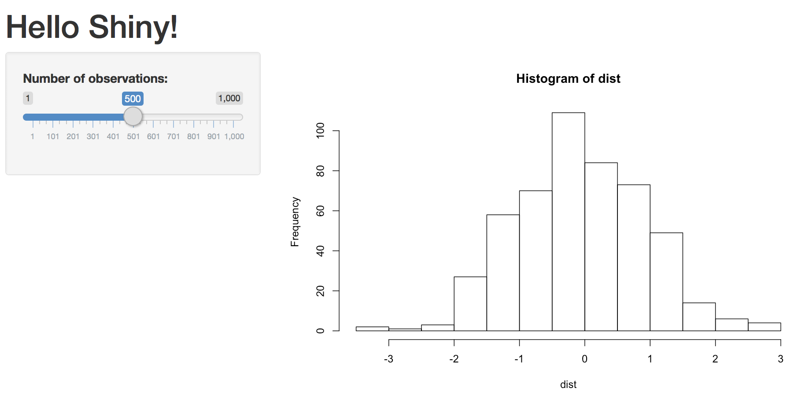
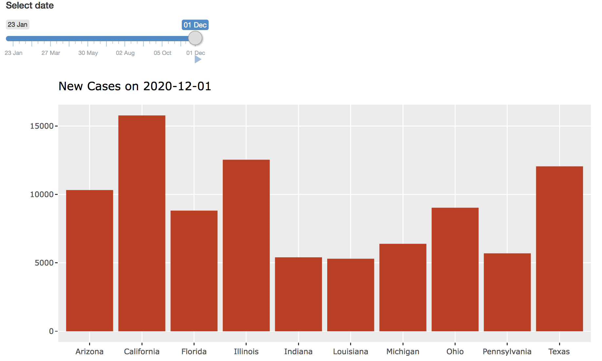
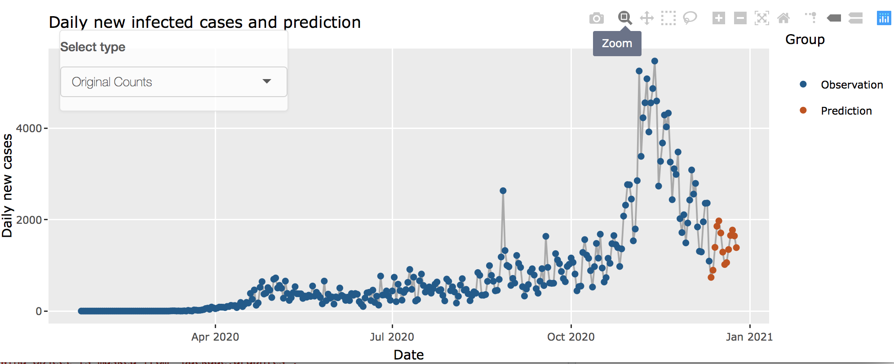
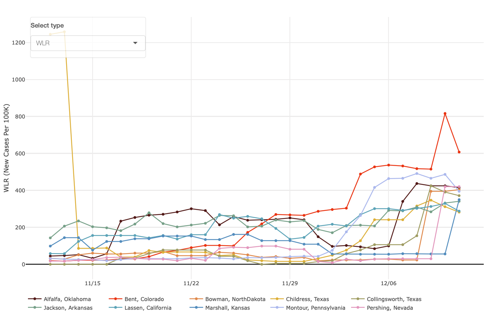

# R Shiny {#shiny}

In infectious disease data learning, interactive visualization makes complex data digestible and useful for users. Shiny offers the ability to develop a graphical user interface (GUI) that can be run locally or deployed online. It has the potential to greatly simplify users' access to
interactive, web-based visualizations. For example, it with multiple views or panels, enabling the users to review their data from different perspectives. In addition, Shiny is also beneficial to show and communicate updated findings to a broad audience.

In this chapter, we focus on linking plotly graphs with shiny, an open source R package that provides an elegant and powerful web framework for building web applications using R. Shiny helps you turn your analyses into interactive web applications without requiring HTML, CSS, or JavaScript knowledge.

**Installation**

Shiny is available on CRAN, so you can install it in the usual way from your R console:
```{r, eval=F}
install.packages("shiny")
```


## Embedding plotly in Shiny

A shiny app has two main parts:

1. The user interface, `ui`, defines how inputs and output widgets are displayed on the page. The `fluidPage()` function offers a nice and quick way get a grid-based responsive layout, but it's also worth noting the UI is completely customizable, and packages such as shinydashboard make it easy to leverage more sophisticated layout frameworks.

2. The server function, server, defines a mapping from input values to output widgets. More specifically, the shiny server is an R function between input values on the client and outputs generated on the web server.


```{r shiny1, out.width = "50%", echo=FALSE, fig.align = "center", fig.cap="An illustration of Shiny Structure."}
knitr::include_graphics("figures/shiny.png")
```


**ui.R**
```{r, eval=F}
library(shiny)

# Define UI for miles per gallon application
shinyUI(pageWithSidebar(

  # Application title
  headerPanel("Hello Shiny!"),

  sidebarPanel(),

  mainPanel()
))
```

**server.R**
```{r, eval= F}
library(shiny)

# Define server logic required to plot variables against mpg
shinyServer(function(input, output) {

})
```


Finally, to execute the shiny app, there are two ways.

1. You can run `runApp('appname')` in a R file, usually named as `apps.R`, that shares the same directory with a folder, which is under the name `'appname'`, and contains `UI.R` and `server.R` mentioned above.  

2. You can define the server function as `server` and UI function as `ui` in the same R file, and run `shinyApp(ui, server)`, as follows.

```{r, eval=F}
library(shiny)

# Define UI 
ui <- shinyUI(pageWithSidebar(
      # ... Program here
  ))

# Define server logic
server <- shinyServer(function(input, output) {
     # ... Program here
})

shinyApp(ui = ui , server = server)
```

In practice, we prefer the first method over the second to manage multiple shiny apps.

### Your first shiny app

A Shiny application is simply a directory containing a user-interface definition, a server script, and any additional data, scripts, or other resources required to support the application.

To get started building the application, create a new empty directory wherever you’d like, then create empty `ui.R` and `server.R` files within in.

The user interface is defined in a source file named **ui.R**:

```{r, eval=F}
library(shiny)

# Define UI for application that plots random distributions 
shinyUI(pageWithSidebar(

  # Application title
  headerPanel("Hello Shiny!"),

  # Sidebar with a slider input for number of observations
  sidebarPanel(
    sliderInput("obs", 
                "Number of observations:", 
                min = 1,
                max = 1000, 
                value = 500)
  ),

  # Show a plot of the generated distribution
  mainPanel(
    plotOutput("distPlot")
  )
))
```

The server-side of the application is shown below. At one level, it's very simple–a random distribution with the requested number of observations is generated, and then plotted as a histogram. However, you'll also notice that the function which returns the plot is wrapped in a call to renderPlot. See the source file named **server.R** below.

```{r, eval=F}
library(shiny)

# Define server logic required to generate and plot a random 
# distribution
shinyServer(function(input, output) {

  # Expression that generates a plot of the distribution. 
  # The expression is wrapped in a call to renderPlot
  # to indicate that:
  #
  #  1) It is "reactive" and therefore should be automatically 
  #     re-executed when inputs change
  #  2) Its output type is a plot 
  #
  output$distPlot <- renderPlot({

    # generate an rnorm distribution and plot it
    dist <- rnorm(input$obs)
    hist(dist)
  })
})
```

If everything is working correctly you’ll see the application appear in your browser looking something like this:




### Useful input widgets

Shiny also comes pre-packaged with a handful of other useful input widgets. Although many shiny apps use them straight "out-of-the-box", input widgets can easily be stylized with CSS and/or SASS, and even custom input widgets can be integrated.

* `selectInput()` or `selectizeInput()` for dropdown menus.
* `numericInput()` for a single number.
* `sliderInput()` for a numeric range.
* `textInput()` for a character string.
* `dateInput()` for a single date.
* `dateRangeInput()` for a range of dates.
* `fileInput()` for uploading files.
* `checkboxInput()`, or `checkboxGroupInput()` or `radioButtons()` for choosing a list of options.

Going forward our focus is to link multiple graphs in shiny through direct manipulation, so we focus less on using these input widgets, and more on using plotly and static R graphics as inputs to other output widgets. 

## Rendering plotly Inside Shiny

The `renderPlotly()` function renders anything that the plotly_build() function understands, including `plot_ly()`, `ggplotly()`, and *ggplot2* objects. It also renders `NULL` as an empty HTML div, which is handy for certain cases where it doesn’t make sense to render a graph. 

```{r, eval=F}
library(tidyr)
library(wesanderson)
library(shiny)
library(dplyr)
library(slid) 
#library(devtools)
#install_github('https://github.com/covid19-dashboard-us/slid')
```

**Example 1.**

**ui.R**
```{r, eval=F}

shinyUI(fluidPage(
  sliderInput("date.update",
      label = h5("Select date"),
      min = as.Date("2020-01-23"),
      max = as.Date("2020-12-01"),
      value = as.Date("2020-12-01"),
      timeFormat = "%d %b",
      animate = animationOptions(interval = 2000, loop = FALSE)
  ),
  
  # Show a plot of the generated distribution
  mainPanel(
   plotlyOutput("state_daily_bc", height = "100%", width = "150%")
  )
))
```

**server.R**
```{r, eval=F}

state.daily.bc <- function(date.update){
  # load daily new case data for each state
  dat.sd = slid::dat.sd
  # select the top 10 states with highest daily new
  df.sd <- dat.sd[ind.sd[1:10],]
  df.sd <- df.sd %>% 
    dplyr::select(State, format(date.update, 'X%Y.%m.%d')) %>% 
    mutate(Date <- format(date.update, '%m/%d'))
  df.sd$State <- as.character(df.sd$State)
  names(df.sd) <- c('State', 'DailyCases', 'Date')
  plot.title <- paste0("New Cases on ", as.character(date.update))
  
  bc.sd <-
    ggplot(df.sd, aes(State, DailyCases)) + 
    labs(title = plot.title) +
    xlab('') +
    ylab('') +
    geom_bar(stat = 'identity', fill = "#C93312") 
  return(bc.sd)	
}

shinyServer(function(input, output) {
  output$state_daily_bc <- renderPlotly({
    ts <- state.daily.bc(input$date.update)
  })
})
```

If everything is working correctly you’ll see the application appear in your browser looking something like this:




**Example 2.**

**ui.R**
```{r, eval=F}

shinyUI(fluidPage(
	div(class = "outer",
	tags$head(includeCSS("styles.css")),
	plotlyOutput("us_case_ts", height = "100%", width = "100%"),
	absolutePanel(id = "control", class = "panel panel-default",
                top = 60, left = 70, width = 255, fixed=TRUE,
                draggable = TRUE, height = "auto", 
	              style = "opacity: 0.8",
    selectInput("plot_type",
      label = h5("Select type"),
      choices = c("Original Counts" = "counts", 
                  "Log Counts" = "logcounts")
    )# end of selectInput1
  )
  ) # end of div
) # end of tab
)
```

**server.R**
```{r, eval=F}

cols <- c("#045a8d", "#cc4c02")
us.case.ts <- function(date.update, plot.type) {
  # Cum infected cases in Iowa: Observation and Prediction
  dfplot = slid::dfplot
  
  if (plot.type == 'counts'){
   ts <-
     ggplot(dfplot, aes(Date, DailyCases, colour = Group)) +
     ## Plot observed
     geom_line(colour = 'darkgray')  +
     geom_point()  +
     scale_color_manual(values = c("Observation" = cols[1], 
                                   "Prediction" = cols[2])) +
     ## Change labs
     labs(title = 'Daily new infected cases and prediction')  +  
     xlab('Date') +
     ylab('Daily new cases')
   
  } else if (plot.type == 'logcounts'){
    ts <-
      ggplot(dfplot, aes(Date, logDailyCases, colour = Group) ) +
      ## Plot observed
      geom_line(colour = 'darkgray')  +
      geom_point()  +
      scale_color_manual(values = c("Observation" = cols[1], 
                                    "Prediction" = cols[2])) +
      ## Change labs
      labs(title = 'Logarithm of daily new infected count 
           and prediction') +  
      xlab('Date') +
      ylab('Log (Daily new cases)')
    
  }
  return(ts)	
}

shinyServer(function(input, output) {
  output$us_case_ts <- renderPlotly({
    ts <- us.case.ts(date.update = date.update, 
                     plot.type = input$plot_type)
  })
})

```

If everything is working correctly you’ll see the application appear in your browser looking something like this:



Remark: There are currently four different modes for mouse click+drag behavior (i.e., `dragmode`) in plotly.js: zoom, pan, rectangular selection, and lasso selection. 


**Example 3.**

**ui.R**
```{r, eval = F}
shinyUI(fluidPage(
	div(class="outer",
	tags$head(includeCSS("styles.css")),
	plotlyOutput("county_risk_ts", height="100%", width="100%"),
	absolutePanel(id = "control", class = "panel panel-default",
	  top = 60, left = 70, width = 255, fixed=TRUE,
	  draggable = TRUE, height = "auto", style = "opacity: 0.8",
	  selectInput("plot_type",
	    label = h5("Select type"),
	    choices = c("WLR" = "wlr", "IR" = "localrisk", 
	                "SIR" = "smr")
	  ) # end of selectInput
	) # end of absolutePanel
	) # end of div
))

```

** server.R **
```{r, eval = F}
date.update <- as.Date('2020-12-12')
mycol <- c("#5B1A18", "#F21A00", "#D67236", "#F1BB7B", 
           "#D8B70A", "#A2A475", "#81A88D", "#78B7C5", 
           "#3B9AB2", "#7294D4", "#C6CDF7", "#E6A0C4")
ts.plotly = function(df, type = 'scatter', mode = 'lines+markers', 
	group = group, mycol, showlegend = TRUE, visible = T, 
	xaxis = xaxis, yaxis = yaxis, legend = legend) {
		
	ts <- plot_ly(df) %>%
		add_trace(x = ~x, y = ~y, type = type, mode = mode, 
			color = ~group, colors = mycol, 
			showlegend = showlegend, 
			visible = visible) %>%
		layout(xaxis = xaxis, yaxis = yaxis, 
		       legend = legend)
  return(ts)
}

county.risk.ts = function(date.update, type = 'localrisk'){
  date.all = date.update - (1:30)
  date.lag = date.all - 7
  County.pop0 <- slid::pop.county
  County.pop <- County.pop0 %>% 
    filter((!(State %in% c("Alaska","Hawaii"))))
  County.pop <- County.pop %>% 
    filter((!(ID %in% c(36005, 36047, 36081, 36085))))
  County.pop$ID[County.pop$ID == 46102] = 46113
  dat <- slid::I.county
  dat <- dat %>% 
    filter((!(State %in% c("Alaska", "Hawaii"))))
  var.names <- paste0("X", as.character(date.all), sep = "")
  var.names <- gsub("\\-", "\\.", var.names)
  var.lag <- paste0("X", as.character(date.lag), sep = "")
  var.lag <- gsub("\\-", "\\.", var.lag)
  tmp <- as.matrix((dat[, var.names] - dat[, var.lag])/7)
  dat <- dat[, c("ID", "County", "State", var.names)]
  smr.c <- sum(County.pop$population)/as.matrix(colSums(dat[,-(1:3)]))


  I0 <- LogI0 <- LocRisk0 <- SMR0 <- dat
  # I0[,-(1:3)] <- as.matrix(dat[,-(1:3)])
  LogI0[,-(1:3)] <- as.matrix(log(dat[,-(1:3)]+1))
  LocRisk0[,-(1:3)] <- sweep(as.matrix(dat[,-(1:3)]), 1, 
          County.pop$population[match(dat$ID, County.pop$ID)], 
          "/") * 1000
  SMR0[,-(1:3)] <- sweep(LocRisk0[,-(1:3)],2,smr.c/10,"*")
  WLR0 <- sweep(tmp, 1, 
       County.pop$population[match(dat$ID, County.pop$ID)], 
       "/") * 1e5

  county.dat <- data.frame(Date = date.all)
  CountyState <- paste(as.character(dat$County), 
                       as.character(dat$State), sep = ",")

  LogI <- cbind(county.dat,round(t(LogI0[,-(1:3)]),2))
  names(LogI) <- c("Date", CountyState)

  LocRisk <- cbind(county.dat,round(t(LocRisk0[,-(1:3)]),2))
  names(LocRisk) <- c("Date", CountyState)

  SMR <- cbind(county.dat,t(SMR0[,-(1:3)]))
  names(SMR) <- c("Date", CountyState)

  WLR <- cbind(county.dat, round(t(WLR0), 2))
  names(WLR) <- c("Date", CountyState)

  xaxis.fr <- list(title = "", showline = FALSE, 
                   showticklabels = TRUE, showgrid = TRUE, 
                   type = 'date', tickformat = '%m/%d')
  legend.fr <- list(orientation = 'h', x = 0, y = -0.05, 
                    autosize = F, width = 250, height = 200)

  if (type == 'localrisk'){
    ind.county = order(LocRisk0[,var.names[1]], decreasing = TRUE)
    df.fr <- LocRisk %>%
      select(c(1, 1 + ind.county[1:10])) %>%
      gather(key = "County.State", value = "LogI", -Date)
    names(df.fr) <- c("x","group","y")
    yaxis.fr <- list(title = "Local Risk (Cases per Thousand)")
    ts.fr <- ts.plotly(df.fr, type = 'scatter', 
                       mode = 'lines+markers',
                       group = group, mycol, 
                       showlegend = TRUE, visible = T,
                       xaxis = xaxis.fr, yaxis = yaxis.fr, 
                       legend = legend.fr)
  }else if (type == 'smr'){
    ind.county = order(SMR0[,var.names[1]], decreasing = TRUE)
    df.fr <- SMR %>%
      select(c(1, 1 + ind.county[1:10])) %>%
      gather(key = "County.State", value = "LogI", -Date)
    names(df.fr) <- c("x","group","y")
    yaxis.fr <- list(title = "SMR (%)")
    ts.fr <- ts.plotly(df.fr, type = 'scatter', 
                       mode = 'lines+markers',
                       group = group, mycol, showlegend = TRUE, 
                       visible = T, xaxis = xaxis.fr, 
                       yaxis = yaxis.fr, legend = legend.fr)
  }else if (type == 'logcount'){
    ind.county = order(dat[,var.names[1]], decreasing = TRUE)
    df.fr <- LogI %>%
      select(c(1,1+ind.county[1:10])) %>%
      gather(key = "County.State", value = "LogI", -Date)
    names(df.fr) = c("x","group","y")
    yaxis.fr <- list(title = "Log Counts")
    ts.fr <- ts.plotly(df.fr, type = 'scatter', 
                       mode = 'lines+markers',
                       group = group, mycol, 
                       showlegend = TRUE, visible = T,
                       xaxis = xaxis.fr, yaxis = yaxis.fr, 
                       legend = legend.fr)
  }else if (type == 'wlr'){
    ind.county <- order(WLR0[, var.names[1]], decreasing = TRUE)
    df.fr <- WLR %>%
      select(c(1, 1 + ind.county[1:10])) %>%
      gather(key = "CountyState", value = "WLR", -Date)
    names(df.fr) <- c("x", "group", "y")
    yaxis.fr <- list(title = "WLR (New Cases Per 100K)")
    ts.fr <- ts.plotly(df.fr, type = 'scatter', 
                       mode = 'lines+markers',
                       group = group, mycol, 
                       showlegend = TRUE, visible = T,
                       xaxis = xaxis.fr, yaxis = yaxis.fr, 
                       legend = legend.fr)
  }
  return(ts.fr)
}

shinyServer(function(input, output) {
  output$county_risk_ts <- renderPlotly({
    ts <- county.risk.ts(date.update, type = input$plot_type)
  })
})

```

If everything is working correctly you’ll see the application appear in your browser looking something like this:




