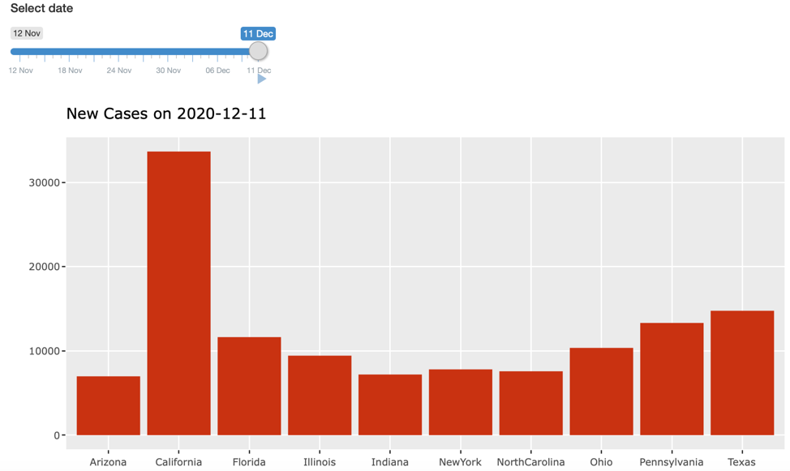

# R Shiny {#shiny}

In infectious disease data learning, users can understand and use complex data thanks to interactive visualization. Shiny allows you to create a graphical user interface (GUI) that can be used locally or remotely. It has a lot of potential for making interactive, web-based visualizations much more accessible to users. For example, it provides multiple views or panels, allowing users to examine their data from various angles. Shiny is also useful for displaying and communicating updated findings to a large audience.

In this chapter, we will look at how to connect Plotly graphs to shiny, an open-source R package that provides an elegant and powerful web framework for creating R-based web applications. Shiny allows you to turn your data into interactive web applications without having to know HTML, CSS, or JavaScript.

**Installation**

Shiny is available on CRAN, so you can install it in the usual way from your R console:
```{r, eval=F}
install.packages("shiny")
```


## An Introduction to Shiny

A shiny app has two main parts:

1. The user interface, or ui, determines how input and output widgets appear on a page. The UI can be customized, and packages like "shinydashboard" make it simple to use more advanced layout frameworks.

2. The server function, server, establishes a link between input and output widgets. More specifically, the shiny server is a R function that connects client input values to webserver outputs.

```{r shiny1, out.width = "50%", echo=FALSE, fig.align = "center", fig.cap="An illustration of Shiny Structure."}
knitr::include_graphics("figures/shiny.png")
```


**ui.R**

```{r, eval=F}
library(shiny)

# Define UI for miles per gallon application
shinyUI(pageWithSidebar(

  # Application title
  headerPanel("Hello Shiny!"),

  sidebarPanel(),

  mainPanel()
))
```

**server.R**

```{r, eval= F}
library(shiny)

# Define server logic required to plot variables against mpg
shinyServer(function(input, output) {

})
```


Finally, to execute the shiny app, there are two ways.

1. You can run `runApp('appname')` in an R file, usually named as `apps.R`, that shares the same directory with a folder, which is under the name `'appname'`, and contains `UI.R` and `server.R` mentioned above.  

2. You can define the server function as `server` and UI function as `ui` in the same R file, and run `shinyApp(ui, server)` as follows.

```{r, eval=F}
library(shiny)

# Define UI 
ui <- shinyUI(pageWithSidebar(
      # ... Program here
  ))

# Define server logic
server <- shinyServer(function(input, output) {
     # ... Program here
})

shinyApp(ui = ui , server = server)
```

In practice, we prefer the first method over the second to manage multiple shiny apps. 

### Your first shiny app

A Shiny application is simply a directory that contains a user-interface definition, a server script, and any additional data, scripts, or other resources that are needed to support the application.

To begin developing the app, create a new empty directory wherever you want, then create empty ui.R and server.R files within it.

The user interface is defined in the **ui.R** source file:

```{r, eval=F}
library(shiny)

# Define UI for application that plots random distributions 
shinyUI(pageWithSidebar(

  # Application title
  headerPanel("Hello Shiny!"),

  # Sidebar with a slider input for number of observations
  sidebarPanel(
    sliderInput("obs", 
                "Number of observations:", 
                min = 1,
                max = 1000, 
                value = 500)
  ),

  # Show a plot of the generated distribution
  mainPanel(
    plotOutput("distPlot")
  )
))
```

The application's server-side is depicted below. It's very straightforward: a random distribution with the desired number of observations is generated, and the histogram is plotted. You may also notice that the function that returns the plot is wrapped in a renderPlot call. See the source file named **server.R** below.

```{r, eval=F}
library(shiny)

# Define server logic required to generate and plot a random 
# distribution
shinyServer(function(input, output) {

  # Expression that generates a plot of the distribution. 
  # The expression is wrapped in a call to renderPlot
  # to indicate that:
  #
  #  1) It is "reactive" and therefore should be automatically 
  #     re-executed when inputs change
  #  2) Its output type is a plot 
  #
  output$distPlot <- renderPlot({

    # generate an rnorm distribution and plot it
    dist <- rnorm(input$obs)
    hist(dist)
  })
})
```

If everything is working properly, the application should look something like this in your browser:


### Create a new shiny app in RStudio

In RStudio, you can create a new directory and an `app.R` file containing a basic app in one step by clicking File -> New File -> Shiny Web App, then providing “Application Name” and select “Application Type”.


### Share your app

RStudio offers three ways to host your Shiny app as a web page: 

1. Create a free or professional account at http://shinyapps.io, a cloud-based service from RStudio, to host your shiny apps. 

2. Click the Publish icon in the RStudio IDE (>=0.99) or run:

```{r eval=F}
rsconnect::deployApp("<path to directory>")
```

3. Shiny Server is a companion program to Shiny that builds a web server designed to host Shiny apps. It’s free, open-source, and available from GitHub.

## Useful Input Widgets

Shiny also includes a number of other useful input widgets, or web elements, with which your users can interact. Your users can use widgets to send messages to the Shiny app. Shiny widgets ask your user for a value. When a user modifies a widget, the value modifies as well.

Input widgets can be easily stylized with CSS and/or SASS, and even custom input widgets can be integrated, despite the fact that many shiny apps use them "out of the box." From https://shiny.rstudio.com/, we can explore and select the appropriate input widgets for your interactive visualization.  


* `selectInput()` or `selectizeInput()` for dropdown menus.
* `numericInput()` for a single number.
* `sliderInput()` for a numeric range.
* `textInput()` for a character string.
* `dateInput()` for a single date.
* `dateRangeInput()` for a range of dates.
* `fileInput()` for uploading files.
* `checkboxInput()`, or `checkboxGroupInput()` or `radioButtons()` for choosing a list of options.

In the future, we will concentrate on using plotly and static R graphics as inputs to other output widgets, rather than using these input widgets to link multiple graphs in shiny through direct manipulation.

## Displaying Reactive Output

You can create reactive output with a two step process.

1. Add an R object to your user interface.

2. Tell Shiny how to build the object in the server function. The object will be reactive if the code that builds it calls a widget value.

**Step 1: Add an R object to the UI**

Shiny provides a family of functions that turn R objects into output for your user interface. Each function creates a specific type of output. Output function	Creates

* `dataTableOutput`: DataTable
* `htmlOutput`: raw HTML
* `imageOutput`: image
* `plotOutput`: plot
* `tableOutput`: table
* `textOutput`: text
* `uiOutput`: raw HTML
* `verbatimTextOutput`: text

You can add output to the user interface in the same way that you added HTML elements and widgets. Place the output function inside `sidebarPanel` or `mainPanel` in the `ui`.

**Step 2: Provide R code to build the object.**

Placing a function in `ui` tells Shiny where to display your object. Next, you need to tell Shiny how to build the object.

We do this by providing the R code that builds the object in the server function.

In the Shiny process, the server function creates a list-like object called output that contains all of the code needed to update the R objects in your app. In the list, each R object must have its own entry.

You can make an entry by defining a new output element in the server function, as shown below. The name of the element should be the same as the name of the reactive element you created in the ui.

You do not need to explicitly state in the server function's last line of code that it should return output. R uses reference class semantics to update output automatically.

The output of one of Shiny's `render*` functions should be included in each entry to output. These functions take a R expression and perform some basic pre-processing on it. The render* function that corresponds to the type of reactive object you're creating is used. The render function generates the following:

* `renderDataTable`: DataTable
* `renderImage`: images (saved as a link to a source file)
* `renderPlot`: plots
* `renderPrint`: any printed output
* `renderTable`: data frame, matrix, other table like structures
* `renderText`: character strings
* `renderUI`: a Shiny tag object or HTML

Each `render*` function takes a single argument: an R expression surrounded by `{}` and it can be as simple as a single line of text or as complex as a function call with many lines of code.

This R expression can be thought of as a set of instructions that you give Shiny to remember. When you first launch your app, Shiny will run the instructions, and then it will run them again every time your object needs to be updated.

[The Shiny Cheatsheet](https://shiny.rstudio.com/images/shiny-cheatsheet.pdf) provides nice summary of the  `render*()` and `*Output()` functions.


## Rendering Plotly Inside Shiny

The `renderPlotly()` function renders anything that the plotly_build() function understands, including `plot_ly()`, `ggplotly()`, and *ggplot2* objects. It also renders `NULL` as an empty HTML div, which is handy for certain cases where it doesn’t make sense to render a graph. 

```{r, eval=F}
library(tidyr)
library(wesanderson)
library(shiny)
library(dplyr)
library(slid) 
#library(devtools)
#install_github('https://github.com/covid19-dashboard-us/slid')
```

**Example 1. Top 10 states with the highest daily new infected count**

**ui.R**
```{r, eval=F}

shinyUI(fluidPage(
  sliderInput("date.update",
      label = h5("Select date"),
      min = as.Date("2020-11-12"),
      max = as.Date("2020-12-11"),
      value = as.Date("2020-12-11"),
      timeFormat = "%d %b",
      animate = animationOptions(interval = 2000, loop = FALSE)
  ),
  
  # Show a plot of the generated distribution
  mainPanel(
   plotlyOutput("state_daily_bc", height = "100%", width = "150%")
  )
))
```

**server.R**

```{r, eval=F}
state.daily.bc <- function(date.update){
  # load daily new case data for each state
  dat.sd = slid::dat.sd
  # select the top 10 states with highest daily new
  df.sd <- dat.sd[ind.sd[1:10],]
  df.sd <- df.sd %>% 
    dplyr::select(State, format(date.update, 'X%Y.%m.%d')) %>% 
    mutate(Date <- format(date.update, '%m/%d'))
  df.sd$State <- as.character(df.sd$State)
  names(df.sd) <- c('State', 'DailyCases', 'Date')
  plot.title <- paste0("New Cases on ", as.character(date.update))
  
  bc.sd <-
    ggplot(df.sd, aes(State, DailyCases)) + 
    labs(title = plot.title) +
    xlab('') +
    ylab('') +
    geom_bar(stat = 'identity', fill = "#C93312") 
  return(bc.sd)	
}

shinyServer(function(input, output) {
  output$state_daily_bc <- renderPlotly({
    ts <- state.daily.bc(input$date.update)
  })
})
```

If everything is working correctly you’ll see the application appear in your browser looking something like this:




**Example 2.**

**ui.R**
```{r, eval=F}

shinyUI(fluidPage(
	div(class = "outer",
	tags$head(includeCSS("styles.css")),
	plotlyOutput("us_case_ts", height = "100%", width = "100%"),
	absolutePanel(id = "control", class = "panel panel-default",
                top = 60, left = 70, width = 255, fixed=TRUE,
                draggable = TRUE, height = "auto", 
	              style = "opacity: 0.8",
    selectInput("plot_type",
      label = h5("Select type"),
      choices = c("Original Counts" = "counts", 
                  "Log Counts" = "logcounts")
    )# end of selectInput1
  )
  ) # end of div
) # end of tab
)
```

**server.R**
```{r, eval=F}

cols <- c("#045a8d", "#cc4c02")
us.case.ts <- function(date.update, plot.type) {
  # Cum infected cases in Iowa: Observation and Prediction
  dfplot = slid::dfplot
  
  if (plot.type == 'counts'){
   ts <-
     ggplot(dfplot, aes(Date, DailyCases, colour = Group)) +
     ## Plot observed
     geom_line(colour = 'darkgray')  +
     geom_point()  +
     scale_color_manual(values = c("Observation" = cols[1], 
                                   "Prediction" = cols[2])) +
     ## Change labs
     labs(title = 'Daily new infected cases and prediction')  +  
     xlab('Date') +
     ylab('Daily new cases')
   
  } else if (plot.type == 'logcounts'){
    ts <-
      ggplot(dfplot, aes(Date, logDailyCases, colour = Group) ) +
      ## Plot observed
      geom_line(colour = 'darkgray')  +
      geom_point()  +
      scale_color_manual(values = c("Observation" = cols[1], 
                                    "Prediction" = cols[2])) +
      ## Change labs
      labs(title = 'Logarithm of daily new infected count 
           and prediction') +  
      xlab('Date') +
      ylab('Log (Daily new cases)')
    
  }
  return(ts)	
}

shinyServer(function(input, output) {
  output$us_case_ts <- renderPlotly({
    ts <- us.case.ts(date.update = date.update, 
                     plot.type = input$plot_type)
  })
})

```

If everything is working correctly you’ll see the application appear in your browser looking something like this:


Remark: In plotly.js, there are four different mouse click+drag behavior modes (i.e., `dragmode`): zoom, pan, rectangular selection, and lasso selection.


**Example 3.**

**ui.R**
```{r, eval = F}
shinyUI(fluidPage(
	div(class="outer",
	tags$head(includeCSS("styles.css")),
	plotlyOutput("county_risk_ts", height="100%", width="100%"),
	absolutePanel(id = "control", class = "panel panel-default",
	  top = 60, left = 70, width = 255, fixed=TRUE,
	  draggable = TRUE, height = "auto", style = "opacity: 0.8",
	  selectInput("plot_type",
	    label = h5("Select type"),
	    choices = c("WLR" = "wlr", "IR" = "localrisk", 
	                "SIR" = "smr")
	  ) # end of selectInput
	) # end of absolutePanel
	) # end of div
))

```

** server.R **
```{r, eval = F}
date.update <- as.Date('2020-12-12')
mycol <- c("#5B1A18", "#F21A00", "#D67236", "#F1BB7B", 
           "#D8B70A", "#A2A475", "#81A88D", "#78B7C5", 
           "#3B9AB2", "#7294D4", "#C6CDF7", "#E6A0C4")
ts.plotly = function(df, type = 'scatter', mode = 'lines+markers', 
	group = group, mycol, showlegend = TRUE, visible = T, 
	xaxis = xaxis, yaxis = yaxis, legend = legend) {
		
	ts <- plot_ly(df) %>%
		add_trace(x = ~x, y = ~y, type = type, mode = mode, 
			color = ~group, colors = mycol, 
			showlegend = showlegend, 
			visible = visible) %>%
		layout(xaxis = xaxis, yaxis = yaxis, 
		       legend = legend)
  return(ts)
}

county.risk.ts = function(date.update, type = 'localrisk'){
  date.all = date.update - (1:30)
  date.lag = date.all - 7
  County.pop0 <- slid::pop.county
  County.pop <- County.pop0 %>% 
    filter((!(State %in% c("Alaska","Hawaii"))))
  County.pop <- County.pop %>% 
    filter((!(ID %in% c(36005, 36047, 36081, 36085))))
  County.pop$ID[County.pop$ID == 46102] = 46113
  dat <- slid::I.county
  dat <- dat %>% 
    filter((!(State %in% c("Alaska", "Hawaii"))))
  var.names <- paste0("X", as.character(date.all), sep = "")
  var.names <- gsub("\\-", "\\.", var.names)
  var.lag <- paste0("X", as.character(date.lag), sep = "")
  var.lag <- gsub("\\-", "\\.", var.lag)
  tmp <- as.matrix((dat[, var.names] - dat[, var.lag])/7)
  dat <- dat[, c("ID", "County", "State", var.names)]
  smr.c <- sum(County.pop$population)/as.matrix(colSums(dat[,-(1:3)]))

  I0 <- LogI0 <- LocRisk0 <- SMR0 <- dat
  # I0[,-(1:3)] <- as.matrix(dat[,-(1:3)])
  LogI0[,-(1:3)] <- as.matrix(log(dat[,-(1:3)]+1))
  LocRisk0[,-(1:3)] <- sweep(as.matrix(dat[,-(1:3)]), 1, 
          County.pop$population[match(dat$ID, County.pop$ID)], 
          "/") * 1000
  SMR0[,-(1:3)] <- sweep(LocRisk0[,-(1:3)],2,smr.c/10,"*")
  WLR0 <- sweep(tmp, 1, 
       County.pop$population[match(dat$ID, County.pop$ID)], 
       "/") * 1e5

  county.dat <- data.frame(Date = date.all)
  CountyState <- paste(as.character(dat$County), 
                       as.character(dat$State), sep = ",")

  LogI <- cbind(county.dat,round(t(LogI0[,-(1:3)]),2))
  names(LogI) <- c("Date", CountyState)

  LocRisk <- cbind(county.dat,round(t(LocRisk0[,-(1:3)]),2))
  names(LocRisk) <- c("Date", CountyState)

  SMR <- cbind(county.dat,t(SMR0[,-(1:3)]))
  names(SMR) <- c("Date", CountyState)

  WLR <- cbind(county.dat, round(t(WLR0), 2))
  names(WLR) <- c("Date", CountyState)

  xaxis.fr <- list(title = "", showline = FALSE, 
                   showticklabels = TRUE, showgrid = TRUE, 
                   type = 'date', tickformat = '%m/%d')
  legend.fr <- list(orientation = 'h', x = 0, y = -0.05, 
                    autosize = F, width = 250, height = 200)

  if (type == 'localrisk'){
    ind.county = order(LocRisk0[,var.names[1]], decreasing = TRUE)
    df.fr <- LocRisk %>%
      select(c(1, 1 + ind.county[1:10])) %>%
      gather(key = "County.State", value = "LogI", -Date)
    names(df.fr) <- c("x","group","y")
    yaxis.fr <- list(title = "Local Risk (Cases per Thousand)")
    ts.fr <- ts.plotly(df.fr, type = 'scatter', 
                       mode = 'lines+markers',
                       group = group, mycol, 
                       showlegend = TRUE, visible = T,
                       xaxis = xaxis.fr, yaxis = yaxis.fr, 
                       legend = legend.fr)
  }else if (type == 'smr'){
    ind.county = order(SMR0[,var.names[1]], decreasing = TRUE)
    df.fr <- SMR %>%
      select(c(1, 1 + ind.county[1:10])) %>%
      gather(key = "County.State", value = "LogI", -Date)
    names(df.fr) <- c("x","group","y")
    yaxis.fr <- list(title = "SMR (%)")
    ts.fr <- ts.plotly(df.fr, type = 'scatter', 
                       mode = 'lines+markers',
                       group = group, mycol, showlegend = TRUE, 
                       visible = T, xaxis = xaxis.fr, 
                       yaxis = yaxis.fr, legend = legend.fr)
  }else if (type == 'logcount'){
    ind.county = order(dat[,var.names[1]], decreasing = TRUE)
    df.fr <- LogI %>%
      select(c(1, 1 + ind.county[1:10])) %>%
      gather(key = "County.State", value = "LogI", -Date)
    names(df.fr) = c("x", "group", "y")
    yaxis.fr <- list(title = "Log Counts")
    ts.fr <- ts.plotly(df.fr, type = 'scatter', 
                       mode = 'lines+markers',
                       group = group, mycol, 
                       showlegend = TRUE, visible = T,
                       xaxis = xaxis.fr, yaxis = yaxis.fr, 
                       legend = legend.fr)
  }else if (type == 'wlr'){
    ind.county <- order(WLR0[, var.names[1]], decreasing = TRUE)
    df.fr <- WLR %>%
      select(c(1, 1 + ind.county[1:10])) %>%
      gather(key = "CountyState", value = "WLR", -Date)
    names(df.fr) <- c("x", "group", "y")
    yaxis.fr <- list(title = "WLR (New Cases Per 100K)")
    ts.fr <- ts.plotly(df.fr, type = 'scatter', 
                       mode = 'lines+markers',
                       group = group, mycol, 
                       showlegend = TRUE, visible = T,
                       xaxis = xaxis.fr, yaxis = yaxis.fr, 
                       legend = legend.fr)
  }
  return(ts.fr)
}

shinyServer(function(input, output) {
  output$county_risk_ts <- renderPlotly({
    ts <- county.risk.ts(date.update, type = input$plot_type)
  })
})

```

If everything is working correctly you’ll see the application appear in your browser looking something like this:


