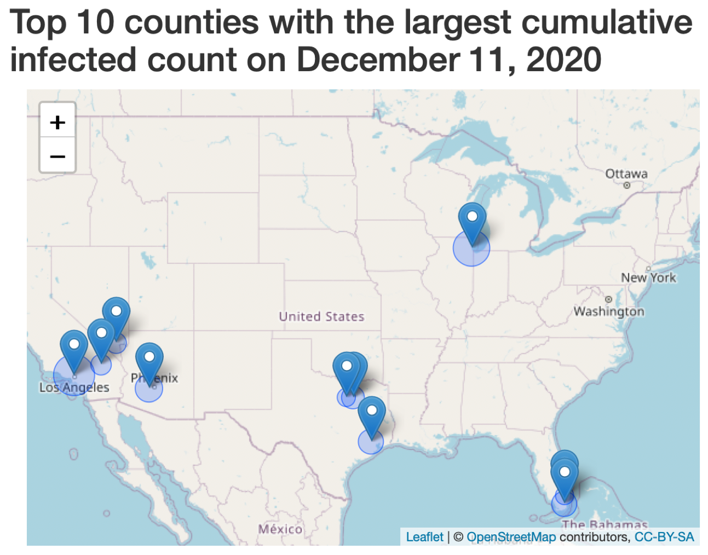

# Interactive Geospatial Visualization {#map}

In the last two decades, many spatial and spatiotemporal methods for early outbreak detection, cluster detection, risk area and factor identification, and disease transmission pattern evaluation have been developed, boosting the study of *spatial epidemiology*. By definition, the focus of *spatial epidemiology* is the study of the geographical or spatial distribution of health outcomes. It is sometimes interchangeably known as disease mapping. Usually, it has the incidence of disease or prevalence of disease as its main focus. It is a commonplace to consider a geographic dimension included within a research design in infectious disease studies. This may involve initial visualization of the distribution and some simple summary measures. The growing development of the open-source community has aided the application of *spatial epidemiology* methods, with R, a programming language and free software environment for statistical computing and graphics, being the most widely used and popular.

For the display of COVID-19 data, interactive geospatial visualization is used by websites ranging from the New York Times and the Washington Post to GitHub and Flickr. In this chapter, we focus on the interactive geospatial visualization of the data. 

## An Introduction to Leaflet

One of the most popular open-source JavaScript libraries for interactive maps is "leaflet." GIS specialists such as OpenStreetMap, Mapbox, and CartoDB use it frequently. This R package makes integrating and controlling map objects in R simple.

### More References

* Recommended Reading: 

1. [Leaflet for R](https://rstudio.github.io/leaflet/)
2. [Making maps with R](https://geocompr.robinlovelace.net/adv-map.html)
3. [Data Visualization Series IV: Create Interactive Map in R](https://rstudio-pubs-static.s3.amazonaws.com/307862_b8c8460272dc4a2a9023d033d5f3ec34.html)

* Use the [Leaflet Cheat Sheet](https://ugoproto.github.io/ugo_r_doc/pdf/leaflet-cheat-sheet.pdf) for inspiration.

* More Examples of Shiny with Leaflet:
1. [Using Leaflet with Shiny](https://rstudio.github.io/leaflet/shiny.html)
2. [COVID-19 US Dashboard](https://covid19.stat.iastate.edu/index.html)

### Features and installation

Unlike static visualization packages like "ggplot2" or "ggmap," "leaflet" maps are fully interactive and can include features like interactive panning and zooming pop-up tooltips and labels, and highlighting and selecting regions.
**Features**

* Use the JavaScript library "Leaflet" and the "htmlwidgets" package to create and customize interactive maps. 

* Compose maps using arbitrary combinations of:
    + Map tiles
    + Markers
    + Polygons
    + Lines
    + Popups
    + GeoJSON
* The maps created can be used directly from the R console, “RStudio,” Shiny apps, and R Markdown documents.
* Render spatial objects from the `sp` and `sf` packages, as well as data frames with latitude and longitude columns, with ease.
* Use map bounds and mouse events to drive “Shiny” logic.
* Enhance map features using plugins from the "leaflet" plugins repository

**Installation**

To install this R package, run this command at your R prompt:

```{r, eval=F}
install.packages("leaflet")
# to install the development version from Github, run
devtools::install_github("rstudio/leaflet")
```

Once installed, you can use this package at the R console, within R Markdown documents, and Shiny applications.

### Basic Usage

Similar to “ggplot2”, leaflet maps are built using layers. We can create a Leaflet map with these basic steps:

Step 1. Create a base map widget by calling `leaflet()`;

Step 2. Customize the map widget by using layer functions (addTiles(), addMarkers(), etc.) to add features to the map

Step 3. Print the map widget to display it and save it.

Here is a base example. Suppose we would like to show the Eiffel Tower on a street map, we can run the following: 

```{r message=FALSE, warning=FALSE}
library(leaflet)

m <- leaflet() %>%
  addTiles() %>%  # Add default OpenStreetMap map tiles
  addMarkers(lng = 2.2945, lat = 48.8584, popup = "The Eiffel Tower")
m  # Print the map
```

## The Data Object

The data parameter in both the `leaflet()` and map layer functions is designed to receive spatial data in one of several formats from:

* the base R
    + lng-lat matrix
    + data frame with lng-lat matrix

* the `sp` package:
    + `SpatialPolygons`, `SpatialPolygonsDataFrame`, `Polygons`, and `Polygon` objects;
    + SpatialLines, SpatialLinesDataFrame, Lines, and Line objects;

* the `map` package
     + the data frame returned from `map()`
     
The `data` argument is used to pass spatial data to functions that need it; for example, if `data` is a `SpatialPolygonsDataFrame` object, then calling `addPolygons` on that map widget will add the polygons from the `SpatialPolygonsDataFrame`.

* Specifying latitude/longitude in the base R

By providing `lng` and `lat` arguments to the layer function, we can always explicitly identify latitude/longitude columns.

Alternatively, we can provide a data frame that consists of the latitude/longitude information. For example, in the `addCircles()` below, we directly pass a data frame, `df`, with variables `Lat` and `Long` in the data frame:

```{r}
# add some circles to a map
df <- data.frame(Lat = rexp(10) + 40, Long = rnorm(10) - 92)
leaflet(df) %>% 
  addTiles() %>%
  addCircles(data = df, lat = ~Lat, lng = ~Long)
```

* The `sp` Package

The first general R package to provide classes and methods for spatial data is called `sp`, which provides classes and methods to create points, lines, polygons, and grids and to operate on them. For example, we can generate the polygons objects using the function `Polygon()`, and we can also generate `SpatialPolygons` objects using lists of `Polygon`.

```{r message=FALSE, warning=FALSE}
library(sp)
library(rgeos)
x1 <- c(3, 3, 6, 12, 3)
x2 <- c(6, 3, 2, 6, 6)
y1 <- c(6, 3, 2, 6)
y2 <- c(2, 3, 2, 2)
Poly1 <- Polygon(cbind(x1, x2))
Poly2 <- Polygon(cbind(y1, y2))
Polys1 <- Polygons(list(Poly1), "s1")
Polys2 <- Polygons(list(Poly2), "s2")
SPolys <- SpatialPolygons(list(Polys1, Polys2), 1:2)
```

To draw this in leaflet, we can use `addPolygons()`:

```{r message=FALSE, warning=FALSE}
leaflet(height = "300px") %>% addPolygons(data = SPolys)
```


* The `maps` Package

The R `maps` package contains many outlines of continents, countries, states, and counties. For example, 

* World: world, world.cities, lakes
* USA: states, county, state, usa

and you can check `help(package='maps')` for a whole list. We can specify `map(fill = TRUE)` for polygons, `FALSE` for polylines. The code below shows how to obtain and plot the geospatial object of the states in the US.

```{r message=FALSE, warning=FALSE}
library(maps)
mapStates <- map("state", fill = TRUE, plot = FALSE)
leaflet(data = mapStates) %>% 
addTiles() %>%
addPolygons(fillColor = topo.colors(10), opacity = 0.5, stroke = FALSE)
```


## Choropleth map

A **choropleth map** is a map that colors or patterns a set of pre-defined areas in proportion to a statistical variable that represents an aggregate summary of a geographic characteristic within each area, such as population, different numbers, or disease rates.

Let us start by loading data from JSON into `sp` objects using the `geojsonio` package to create a choropleth map. This will make manipulating geographic features and their properties in R much easier.

```{r eval=FALSE, message=FALSE, warning=FALSE}
library(geojsonio)
urlRemote  <- "https://raw.githubusercontent.com/"
pathGithub <- "PublicaMundi/MappingAPI/master/data/geojson/"
fileName   <- "us-states.json"
states0 <- geojson_read(x = paste0(urlRemote, pathGithub, fileName), 
                        what = "sp")
class(states0)
```

In Chapter \@ref(dplyr), we have seen an example of merging the `states0` data with `state.long` in the `slid` R package, and the combined data is saved as `states1` in the `slid` package. In the following, we will work with `states1` directly. Now, let's load the required R packages and data to our working directory. 

```{r, message = FALSE, warning = FALSE}
library(geojsonio)
library(leaflet)
library(dplyr)
library(slid)
data(state.long)
data(states1)
# Remove the following regions due to lack of data
states1 <- states1 %>% 
  subset(!name %in% c('Alaska', 'Hawaii', 'Puerto Rico'))
```

### Create a base map

First, we will create a basic states map. The easiest way to add tiles is by calling `addTiles()` with no arguments:

```{r, eval=T}
dmap <- leaflet(states1) %>%
      setView(-96, 37.8, 4, zoom = 4) %>%
      addTiles()
```      

Here, the `setView` function sets the view of the map (center and zoom level) with the following arguments:

* `lng`: the longitude of the map center;
* `lat`: the latitude of the map center;
* `zoom`: the zoom level.

Besides the `setView()` function, there are other methods to manipulate the map widget, for example:

* `fitBounds(map, lng1, lat1, lng2, lat2)`: sets the bounds of a map
* `setMaxBounds(map, lng1, lat1, lng2, lat2)`: restricts the map view to the given bounds
* `clearBounds(map)`: clears the bounds of a map, which are automatically determined, if available, from the latitudes and longitudes of the map elements (otherwise the full world view is used)

Next, if we use the function `addPolygons` with no additional arguments, then we will obtain the uniform polygons with default styling without any customization.

```{r, eval=T}     
dmap %>% addPolygons()
```

### Color the map

Next, we design the color palette for the map. The function `colorFactor()` converts numeric or factor/character data values to colors using a palette that can be provided in a variety of formats. Two often-used arguments are

* `palette`:	the colors or color function that values will be mapped to;
* `domain`:	the possible values that can be mapped.

```{r, eval=T}
pal.state.factor <- colorFactor(
  palette = "YlOrRd",
  domain = states1$Division
)
```

Now, let us color the states according to the division that they belong to. In this case, you can map the value of the division to colors using `fillColor = ~pal.state.factor(Division)`. We can also customize the map, change the color, line type of the state boundary, and other style properties.

```{r, eval=T}     
dmap %>% addPolygons(
        fillColor = ~pal.state.factor(Division),
        weight = 1, opacity = 1,
        color = "white", dashArray = "3",
        fillOpacity = 0.9, layerId = ~name_ns)
```

### Interactive map

On the interactive choropleth map, it is possible to zoom and hover a state to get more details about it. The next step will be to highlight the polygons as the mouse passes over them. The highlight argument in the `addPolygon()` function makes this simple.

We will generate the highlight labels using the `sprintf()` function, a wrapper for the C library function with the same name. `sprintf()` returns a character vector with a formatted mix of text and variable values.

```{r, eval=T}
labels_cases <- sprintf(
        "<strong>%s</strong><br/>Population: %g M<br>
        Cumulative Cases: %g<br>Death: %g<br>
        Infected Cases per Thousand: %g",
        states1$name, round(states1$pop / (1e6), 2), 
        states1$Infected, 
        states1$Death, states1$Infect_risk * 1000) %>% 
  lapply(htmltools::HTML)

labels_cases[[1]]
```

In the above `sprintf()` function, each `%` is referred to as a slot, which is basically a placeholder for a variable that will be formatted. The letter `s` indicates that the formatted variable is specified as a string. `%g` indicates the formatted variable uses compact decimal or scientific notation. 

The labelOptions argument of the `addPolygons` function allows you to customize marker labels. To emphasize the currently moused-over polygon, we will use the `highlightOptions` function. The `labelOptions` argument can be populated using the `labelOptions()` function. Now let us display the state names and values to the user. 

```{r, eval=T}     
dmap <- dmap %>% addPolygons(
        fillColor = ~pal.state.factor(Division),
        weight = 1, opacity = 1,
        color = "white", dashArray = "3",
        fillOpacity = 0.9, layerId = ~name_ns,
        # Options to highlight a shape on hover
        highlight = highlightOptions(
          weight = 5, color = "#666",
          dashArray = NULL, fillOpacity = 0.9,
          bringToFront = TRUE), label = labels_cases,
        labelOptions = labelOptions(
          style = list("font-weight" = "normal", padding = "3px 8px"),
          textsize = "15px", direction = "auto"))
dmap
```

When you hover the mouse over a state, the label is displayed. The `bringToFront = TRUE` in the `highlightOptions` function is used to prevent the active polygon's thicker, white border from being hidden behind the borders of other polygons higher in the z-order.

Finally, let us add the legend using the function `addLegend()`.

```{r, eval=T}    
dmap <- dmap %>% addLegend(pal = pal.state.factor, values = ~Division, 
                opacity = 0.7, title = NULL,
                position = "bottomright")
dmap
```

## Legend

### Classification schemes

The map legend can be used to list the features on the map and what they represent. Symbols in the legend should be the same as they are in the body of the map. The following types of spatial attribute data exist:

* Nominal: attributes are nominal if they are given names or titles to differentiate one entity from another, such as the name of a place, whether urban or rural.

* Ordinal: attributes are ordinal if their values take on natural order; for instance, the risk level of a disease may be classified with Level 1 representing the lowest risk, level 2 second-lowest, and so on).

* Numeric: examples of numeric data include temperature, population density, male-to-female ratio, the number of infected cases. Numeric values may vary on a discrete (e.g., integer) or continuous scale.

According to @pfeiffer2008spatial, the continuous attribute data can be divided into six basic classification schemes:

1. Natural groupings of data values: Classes are defined based on what appear to be natural groupings of data values. Breakpoints that are known to be relevant to a particular application, such as fractions and multiples of mobility levels or risk thresholds, may be used to define the breaks.

2. Quantile breaks: The data is divided into a set of classes, each with an equal number of observations. Quintile (five-category) classifications, for example, are ideal for displaying data that is linearly distributed.

3. Breaks with equal intervals: The attribute value's range is calculated and divided into evenly spaced intervals. This method is useful for mapping data that is uniformly distributed or if the user of the map is familiar with the data ranges (e.g., herd sizes or temperature bands).

4. Standard deviation classifications: This method uses the number of standard deviations above and below the mean to calculate the distance between the observation and the mean. It's best for data that's normally distributed.

5. Arithmetic progressions: At an arithmetic (additive) rate, the widths of category intervals increase in size. If the first category is one unit wide and the width is increased by one unit, the second category becomes two units wide, the third three units wide, and so on (1, 3, 6, ...). This method is particularly useful when dealing with data from **skewed** distributions.

6. Geometric progressions: The widths of the category intervals are multiplicatively increased at a geometric rate. For example, if the first category's interval width is two units, the second category will be $2 times 2 = 4$ units wide, the third $2 times 2 times 2 = 8$ units wide, and so on. This method can also be used to analyze data from **skewed** distributions.


### Mapping variables to colors

We demonstrate how to apply the above classification schemes to map values to colors. 

For simplicity, we wrap the above code into a function and run it with different palettes, data, labels, variables mapped to fill color, etc.

```{r}
map.state <- function(dat, fill.var, labels, pal, ID = 'name_ns'){
  dmap <- leaflet(dat) %>%
    setView(-96, 37.8, 4, zoom = 4) %>%
    addTiles() %>%
    addPolygons(
      fillColor = ~pal(dat@data %>% pull(fill.var)),
      weight = 1, opacity = 1, color = "white",
      dashArray = "3", fillOpacity = 0.9,
      layerId = ~dat@data %>% pull(ID),
      highlight = highlightOptions(
        weight = 5, color = "#666", dashArray = NULL,
        fillOpacity = 0.9, bringToFront = TRUE),
      label = labels,
      labelOptions = labelOptions(
        style = list("font-weight" = "normal", padding = "3px 8px"),
        textsize = "15px", direction = "auto")) %>%
    addLegend(pal = pal, values = ~dat@data %>% 
                pull(fill.var), opacity = 0.7, title = NULL,
              position = "bottomright")
  dmap
}
```

The family of `color*()` can be used to generate palette functions easily. There are currently three color functions for dealing with continuous input: `colorNumeric`, `colorBin`, and `colorQuantile`; and one for categorical input, `colorFactor`. Each function has two required arguments:

* `palette`: specifies the colors to map the data to;
* `domain`: specifies the range of input values.

1. `colorNumeric`

```{r}
pal.state.numeric <- colorNumeric(
  palette = "YlOrRd",
  domain = states1$Infected
)

map.state(dat = states1, fill.var = 'Infected', labels = labels_cases, 
          pal = pal.state.numeric, ID = 'name_ns')
```

2. `colorQuantile`

```{r}
pal.state.quantile <- colorQuantile(
  palette = "YlOrRd", domain = states1$Infected, n = 8)
map.state(dat = states1, fill.var = 'Infected', labels = labels_cases, 
          pal = pal.state.quantile, ID = 'name_ns')

```

3. `colorBin`

```{r}
bins.state<- c(0, 1e4, 5e4, 1e5, 5e5, 1e6, 5e6)
pal.state.bins <- colorBin("YlOrRd", domain = states1$Infected, 
                           bins = bins.state)

map.state(dat = states1, fill.var = 'Infected', 
          labels = labels_cases, 
          pal = pal.state.bins, ID = 'name_ns')
```

4. `colorFactor`

```{r}
pal.state.factor <- colorFactor("YlOrRd", domain = states1$Region)

map.state(dat = states1, fill.var = 'Region', 
          labels = labels_cases, 
          pal = pal.state.factor, ID = 'name_ns')
```

## An Example of County-level Map

We are interested in the infection rate at the county level, and would like to draw a county-level choropleth map to illustrate the spatial variation from county to county. 

First, let us prepare the data. 

```{r, eval = FALSE}
urlRemote  <- "https://raw.githubusercontent.com/"
pathGithub <- "plotly/datasets/master/"
fileName   <- "geojson-counties-fips.json"
counties0 <- geojson_read(x = paste0(urlRemote, pathGithub, fileName), 
                          what = "sp")
```

Next, we combine the county-level data with the state-level data.

```{r, eval = FALSE}
counties1 <- counties0
counties1@data <- left_join(counties1@data, states1@data %>% 
select(id, name, density, name_ns, Region, Division, pop, DATE), 
by = c('STATE' = 'id'))

names(counties1)[8] <- 'state_name'
names(counties1)[10] <- 'state_name_ns'
counties1$id <- as.integer(counties1$id)
counties1@data <- left_join(counties1@data, pop.county %>% 
select(ID, population), by = c("id" = "ID"))
counties1@data <- left_join(counties1@data, I.county %>% 
select(ID, X2020.12.11), by = c("id" = "ID"))
counties1@data <- left_join(counties1@data, D.county %>% 
select(ID, X2020.12.11), by = c("id" = "ID"))
names(counties1@data)[16:17] <- c('Infected', 'Death')
names(counties1@data)[13] <- 'pop_state'
counties1@data <- counties1@data %>% 
mutate(Infect_risk = Infected/population)
counties1[counties1$id == 46113, 'population'] <- 14309 
```

The final dataset `counties1` can also be downloaded from the `slid` package directly. First, let us load the data, color palette and scheme, and the highlight label.

```{r, eval= TRUE}
# Load the data directly
data(counties1)
data(states1)
counties1 <- counties1 %>% 
  subset(!state_name %in% c('Alaska', 'Hawaii', 'Puerto Rico'))
states1 <- states1 %>% 
  subset(!name %in% c('Alaska', 'Hawaii', 'Puerto Rico'))

# Prepare the color palette and scheme
col2 <- colorRampPalette(c("#053061", "#2166AC", "#4393C3", 
                           "#92C5DE","#D1E5F0", "#FFFFFF", 
                           "#FDDBC7", "#F4A582", "#D6604D", 
                           "#B2182B", "#67001F"))

pal.county.quantile <- colorQuantile(
  palette = col2(200), domain = counties1$Infect_risk, n = 8)

# Prepare the highlight label
labels_cases.county <- sprintf(
  "<strong>%s</strong>, <strong>%s</strong>
  <br/>Infection Rate: %g <br>
  Population: %g K <br>
  Infected Cases on 2020-12-11: %g<br>
  Death Cases on 2020-12-11: %g",
  counties1$NAME, counties1$state_name, 
  round(counties1$Infect_risk, 3), 
  counties1$population / 1000,
  counties1$Infected, counties1$Death
) %>% lapply(htmltools::HTML)
```

Next, we will draw the county-level map. In Leaflet, **map panes** group layers together implicitly, which allows web browsers to work with multiple layers at once, saving time over working with layers individually. The **z-index** CSS property is used in map panes to always show some layers on top of others. The following is the default order:

* TileLayers and GridLayers
* Paths, like lines, polylines, circles, or GeoJSON layers.
* Marker shadows
* Marker icons
* Popups

You can use the function `addMapPane` to customize map panes for a leaflet map to control layer order, and you can specify:

* `name`: the name of the new pane.
* `zIndex`: the zIndex of the pane. Panes with a higher index are rendered first, followed by panes with a lower index.

By setting the pane argument in leafletOptions, you can use this pane to render overlays (points, lines, and polygons). This will allow you to control the layer order; for example, points will always be on top of polygons, and states will always be on top of counties.

```{r, eval= TRUE}
# Draw the county-level map
dmap2 <- leaflet() %>%
  setView(-96, 37.8, zoom = 4) %>%
  addTiles() %>%
  # Add additional panes to control layer order
  # Display borders (zIndex: 420) above the polygons (zIndex: 410)
  addMapPane("polygons", zIndex = 410) %>% 
  addMapPane("borders", zIndex = 420) %>%
  # Add state polygons (borders pane)
  addPolygons(
    data = states1, fill = FALSE, weight = 1,
    color = "gray", fillOpacity = 0,
    options = pathOptions(pane = "borders")
  ) %>%
  # Add county polygons (polygons pane)
  addPolygons(
    data = counties1,
    fillColor = ~pal.county.quantile(Infect_risk),
    weight = 1, opacity = 1, color = "white",
    dashArray = "3", fillOpacity = 0.9,
    highlight = highlightOptions(
      weight = 5, color = "#666",
      dashArray = NULL, fillOpacity = 0.9,
      bringToFront = TRUE),
    label = labels_cases.county,
    layerId = ~id,
    labelOptions = labelOptions(
      style = list("font-weight" = "normal", padding = "3px 8px"),
      textsize = "15px", direction = "auto"),
    options = pathOptions(pane = "polygons")) %>%
  addLegend(data = counties1, pal = pal.county.quantile, 
            values = ~Infect_risk, opacity = 0.7, title = NULL,
            position = "bottomright")

dmap2
```

## Spot Maps

A **spot map** is a map that depicts the geographic location of people who share a common characteristic, such as the number of infectious disease cases. Spot maps are typically used to visualize clusters or outbreaks with a small number of cases.

Next, we draw a spot map and highlight the top 10 counties with the largest cumulative infected count on December 11, 2020. 

First, let us prepare the data required. 

```{r, eval=T, message=FALSE}
data(features.county)
names(features.county)
data(county.top10.long)
names(county.top10.long)

# Combine the datasets with useful variables
location.county <- features.county %>% 
  dplyr:: select(ID, Longitude, Latitude) 
county.top10.today <- county.top10.long %>% 
  select(ID, County, State, Date, Count) %>%
  filter(Date == "2020-12-11")

df <- left_join(county.top10.today, location.county, key = "ID")
df
```

We start to draw a base map.

```{r, eval=T}
dmap3 <- leaflet() %>%
  setView(-96, 37.8, zoom = 4) %>%
  addTiles() 
dmap3
```


### Adding circles

We can add circles to the map to highlight the top ten counties in the data using `addCircles()`. Circles are similar to circle markers; the only difference is that circles have their radii specified in meters, while circle markers are specified in pixels. As a result, the size of circles will change as the user zooms in and out, while circle markers remain a constant size on the screen regardless of zoom level. 

```{r, eval=T}
dmap3 <- dmap3 %>%
  addCircles(data = df, lng = ~Longitude, lat = ~Latitude, weight = 1,
             radius = ~sqrt(Count)*200, popup = ~County
             )
dmap3
```

Each point can have text added to it using either a popup (appears only on click) or a label (appears either on hover or statically). We will describe the details below. 

### Add popups

**Popups** are small boxes that contain HTML outputs such as texts or hyperlinks and point to a specific point or location on the map.

Popups are frequently used so that they appear when markers or shapes are clicked. The Leaflet package's marker and shape functions take a popup argument, where we can pass in HTML commands to easily attach a simple popup.

For instance, we can label each county with the name of the county and state, and the reported cumulative infected cases.

```{r, eval=T}
labels_cases.county <- sprintf(
  "<strong>%s</strong>, <strong>%s</strong>
  <br/> Cum. Infected Cases on 2020-12-11: %g <br>",
  df$County, df$State, df$Count) %>% 
  lapply(htmltools::HTML)
```

Using `lapply(htmltools::HTML)`, one can pass the information to Leaflet, so it knows to treat each label as HTML instead of as plain text.

If we only want the information to appear when we click on the point, we should instead use `popup = ~labels_cases.county` like the following:

```{r, eval=T}
dmap3 %>% 
  addMarkers(data = df, lng = ~Longitude, lat = ~Latitude, 
             popup = ~labels_cases.county)
```

### Add labels

A **label** is textual or HTML content that is attached to markers and shapes and is visible at all times or when the mouse is moved over it. You don't have to click a marker/polygon to see the label, unlike popups.

```{r, eval=T}
dmap3 %>% 
  addMarkers(data = df, lng = ~Longitude, lat = ~Latitude, 
             label = ~labels_cases.county)
```


## Integrating Leaflet with R Shiny 

For integrating with Shiny applications, the Leaflet package includes powerful and convenient features.

Most Shiny output widgets are integrated into an app by including a render function in the server function and including an output for the widget in the UI definition. You can call `leafletOutput` in the UI and assign a `renderLeaflet` call to the output on the server side to return a Leaflet map object for Leaflet maps.

```{r, eval=F}
shinyServer(function (input, output) {
  output$map <- renderLeaflet({})
})
```

**server.R**

```{r, eval=F}
shinyServer(function (input, output) {
  # Prepare data
  location.county <- slid::features.county %>% 
    dplyr:: select(ID, Longitude, Latitude) 
  county.top10.today <- slid::county.top10.long %>% 
    select(ID, County, State, Date, Count) %>%
    filter(Date == "2020-12-11")
  df <- left_join(county.top10.today, location.county, key = "ID")
  # Prepare popup label
  labels_cases.county <- sprintf(
    "<strong>%s</strong>, <strong>%s</strong>
    <br/> Cum. Infected Cases on 2020-12-11: %g <br>",
    df$County, df$State, 
    df$Count
  ) %>% lapply(htmltools::HTML)
  # Draw a spot map with popup
  output$map <- renderLeaflet({
    leaflet() %>%
      setView(-96, 37.8, zoom = 4) %>%
      addTiles() %>%
      addCircles(data = df, lng = ~Longitude, lat = ~Latitude, weight = 1,
                 radius = ~sqrt(Count)*200, popup = ~County) %>% 
      addMarkers(data = df, lng = ~Longitude, lat = ~Latitude, 
                 popup = ~labels_cases.county)
  })
})
```

**ui.R**

```{r, eval=F}
library(shiny)
library(dplyr)
library(leaflet)
shinyUI(
  # Use a fluid layout
  fluidPage(
    # Give the page a title
    titlePanel(
      HTML(
        paste("Top 10 counties with the largest cumulative", '<br/>', 
              "infected count on December 11, 2020")
      )),
    mainPanel(leafletOutput("map"))
))
```

If everything is working correctly, you will see the application appear in your browser looking something like this:



## Exercises

1. Create polygons based on the given coordinates:

  a. Let
     
```{r}
x1 <- c(6, 8, 8, 6, 6)
x2 <- c(6, 6, 4, 4, 6)
```

  b. Let
     
```{r}
y1 <- c(5, 6, 8, 10, 5)
y2 <- c(8, 3, 2, 8, 8)
```

  c.  Draw the two polygons in (a) and (b) on the same map.
     
2. The Washington Monument is located at longitude -77.0353 and latitude 38.8895.

  a. Draw base map and set the default view to and set zoom level 15;
     
  b. Add a popup “Washington Monument” to your base map;
     
  c. Add a label “Washington Monument” to your base map;
     
3. We will use the state level COVID-19 data (`I.state`) available in the `slid` package, and the geospatial information from:

```{r eval=F}
library(geojsonio)
urlRemote  <- "https://raw.githubusercontent.com/"
pathGithub <- "PublicaMundi/MappingAPI/master/data/geojson/"
fileName   <- "us-states.json"
geojson_read(x = paste0(urlRemote, pathGithub, fileName), 
                        what = "sp")
```
    
  a. Calculate the weekly risk of each state and create a `weekly_risk` variable, which contains the number of newly infected cases in the past weeks (December 5, 2020, to December 11, 2020) for each state divided by its population.
     
  b. Draw a choropleth map to display the weekly risk for each state. You can change the opacity and the weight of the borderlines according to your aesthetic preferences. Use `colorBin` to color the states.
     
  c. Generate the highlighted label with the state name and the value of `weekly_risk`, and population, and display the label when the mouse moves over to the state.
     
  d. Save your leaflet map as an HTML file.


4. We will use the county level COVID-19 data (`I.county`) available in the `slid` package, and the geospatial information from:

```{r eval=F}
urlRemote  <- "https://raw.githubusercontent.com/"
pathGithub <- "plotly/datasets/master/"
fileName   <- "geojson-counties-fips.json"
geojson_read(x = paste0(urlRemote, pathGithub, fileName), 
                          what = "sp")
```
    
  a. Calculate the weekly risk of each county and create a `weekly_risk` variable, which contains the number of newly infected cases in the past weeks (December 5, 2020, to December 11, 2020) for each county divided by its population.
     
  b. Draw a choropleth map to display the weekly risk for each county. You can change the opacity and the weight of the borderlines according to your aesthetic preferences. Use `colorQuantile` to color the counties.
     
  c. Generate the highlighted label with the county, state name and the value of `weekly_risk`, and population, and display the label when the mouse moves over to the county.
     
  d. Draw a spot map and highlight the top 10 counties with the highest weekly risk in the past week (December 5, 2020, to December 11, 2020). 
     
  e. Save each of the above leaflet maps as an HTML file.


