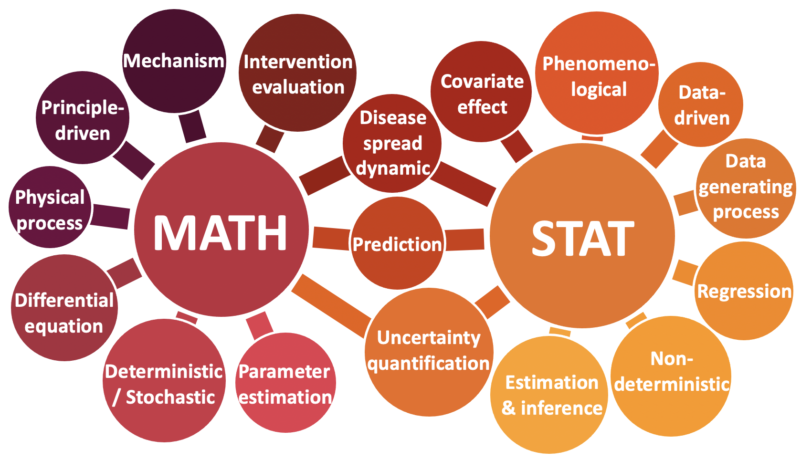

# Epidemic Modeling {#modeling}

## An Introduction to Epidemic Modeling

The oldest known disease transmission model dates back to Daniel Bernoulli, who first used a probability-based model in 1766 to evaluate the effectiveness of smallpox inoculation, the process of introducing smallpox into the skin to cause a more mild illness than if the virus acquired by the usual respiratory route, but one that induces immunity; see @dietz2002daniel. This precursor to modern-day vaccination was not without risk, and Bernoulli used his model to evaluate the likelihood of death following inoculation against the gain in life expectancy from evading infection. William Farr was perhaps the first to attempt to calibrate (or fit) a model of disease transmission when he noted the similarity between the time series of smallpox incidence and the normal distribution. In 1889, En’ko investigated heterogeneity in measles transmission, using models to explain the possible mechanisms that give rise to variable epidemic sizes; see @en1989course. In 1927, Kermack and McKendrick expanded on existing models to develop the foundation of the modern-day susceptible-infected-recovered mass-action model using differential equations; see @kermack1927contribution. These models, and many others, have formed the basis of modern disease modeling, which has been a crucial tool in improving understanding of best practices for infectious disease control. By combining mathematical or statistical formalism with epidemiological data and an understanding of biological mechanisms, infectious disease models enable the evaluation of the effect of public health interventions like vaccines, projection of future disease burden in various contexts, and answering fundamental questions, such as why some people are uninfected in an outbreak.

In epidemic modeling, there are mainly three types of models, including (i) mechanistic models, (ii) phenomenological models, and (iii) hybrid models. In the following, we will give a brief introduction to each type of models. 

## Mechanistic Models

Mechanistic models explicitly try to model the mechanisms of interaction among system components. These models make explicit hypotheses about the biological mechanisms that drive infection dynamics.

### Compartment Modeling

A compartment model is characterized by a set of mathematical equations to represent how individuals move from one compartment to another or interact among compartments. A majority of the compartment models in epidemiology are based on the Susceptible-infected-removed (SIR) model @kermack1927contribution and its variants to conceptualize the dynamic changes of the population. 

The conventional SIR model divides a population into three compartments: the susceptible class (S) indicates those who can become infected, the infected class (I) represents those who are infectious, and the removed class (R) corresponds to those with permanent infection-acquired immunity. Due to its simplicity with a small number of parameters, the SIR model has become popular and has been widely applied to track and forecast the trajectory of epidemic disease. For example, @miranda2019real calibrated the parameters of the SIR model for each season separately using the Nelder-Mead optimization algorithm to predict weekly influenza-like-illness (ILI) incidence. @chen2021model considered the SIR model for Canadian COVID-19 data. The estimates and bounds of model parameters were extracted by minimizing the squared prediction error of daily infection numbers. Based on those values, the prediction bounds for S, I, R, and daily infection numbers can be obtained. However, the SIR model often oversimplifies complex processes of disease. 

For many epidemic diseases, if an exposed period (infected but not yet infectious) is long enough or significant, its absence in the model could affect predictions @brauer2008compartmental. The SEIR model additionally includes an exposed (E) compartment for the latent period. The SEIR has been applied to malaria transmission by formulating a system of equations for both human and mosquito population @mojeeb2017simple and Ebola hemorrhagic fever by considering vaccination as a control strategy [@durojaye2017mathematical]. @roda2020difficult considered both SIR and SEIR models and  predicted the COVID-19 epidemic. Although a Poisson or negative binomial distribution is a common choice for count data, its probability model was approximated by normal distribution as newly confirmed cases grow quickly. Using uniform priors for model parameters, the affine invariant ensemble Markov Chain Monte Carlo algorithm was implemented for posterior distributions of the model parameters to lessen the impact of nonidentifiability in the model.


### Agent-based Methods
 
Agent-based models, also known as individual-based models, are a powerful simulation modeling technique with interacting autonomous agents. Agents are artificial decision-making entities and programmed to interact with other agents and the environment in specific ways. In the epidemic modeling, agents could stay either at the state of susceptibility, the state of infected, or any pre-defined states. Then, these agents interact with each other based on a specific environment, which is usually defined through a social contact network. Agents can transfer from a state to another. A typical agent-based model consists of three key elements: (1) a population generated based on the demographic characteristics of the studied population, (2) a social contact network among the agents (individuals) in the population, and (3) a disease model, which translates the edge weights in the social contact network into infection probability [@hoertel2020stochastic]. By simulating a set of simple agents' interactions, they can generate complex global patterns (behaviors) and visualize main properties from a global perspective. 

A good example of using this approach for COVID-19 is by a team from Imperial College London @krr2020non who applied an agent-based modeling approach to the UK data. The authors predicted the spread of COVID-19 after including many Non-Pharmaceutical Interventions. @hoertel2020stochastic considers a stochastic agent-based model of the SARS-CoV-2 epidemic to predict the number of COVID-19 cases in France. A team of researchers from various universities proposed a Global Epidemic and Mobility Model ([GLEAM](https://covid19.gleamproject.org/})) which employed an agent-based model to analyze the spatiotemporal spread of COVID-19 in the continental US.

Agent-based models use more detailed descriptions of disease states and/or individual characteristics and behavior, which are not easily simplified into a compartmental form. It allows for exploring complex systems and capturing relationships among individuals and heterogeneity in their attributes [@rahmandad2008heterogeneity]. Besides, it can model experiments that may be impossible or unethical to conduct in the real world, guiding public health interventions.

Agent-based models require intensive computational burdens, constraining sensitivity analysis. Data on contact networks and the distribution of individual attributes are hard to obtain and highly uncertain, requiring extensive sensitivity analysis to ensure robust results.

## Phenomenological Models

Phenomenological models, sometimes also referred to as statistical models, attempt to characterize and forecast the observed effects of epidemics without incorporating biological mechanisms and postulating conjectures that explain the observed phenomena.

### Time Series Analysis

In time series analysis, we focus on using the past observations of a random variable to captures the underlying patterns and predict the future values. Within time series forecasting, *exponential smoothing* and *autoregressive integrated moving average (ARIMA) models* are the two most widely used approaches. Given a time series data, exponential smoothing models are based on a description of the trend and seasonality, while ARIMA models focus on describing the autocorrelations.

#### Exponential Smoothing (ETS)

Exponential smoothing was proposed by @Brown:59, @Holt:57, and @Winters:60 in the late 1950s. Traditional moving average method considers equal weights for the past observations, whereas exponential functions are used to assign exponentially decreasing weights as the observations get older in exponential smoothing. Therefore, the forecasts produced by exponential smoothing methods can be considered as weighted averages of past observations. 

Since the simple exponential smoothing framework usually can generate reliable forecasts quickly, the simple ETS method is suitable for forecasting data with no clear trend or seasonal pattern.
    
* **Holt's Linear Trend Method**: To allow the forecasting of data with a trend, @Holt:57 proposed a linear trend method based on the simple exponential smoothing. This method involves three equations, including (i) a forecast equation, (ii) a smoothing equation for the level, and (iii) a smoothing equation for the trend. As a result, the $h$-step-ahead forecast equals to the sum of the last estimated level and $h$ times the last estimated trend value, and thus the forecasts are linear to $h$. The constant trend estimated by the Holt's linear usually makes the long term forecast either indefinitely increasing or decreasing into the future. 

* **Damped Trend Method**: Due to the limitation of constant trend, @Gardner:Mckenzie:85 proposed a “damped” method which includes a parameter that can “dampens” the trend to a flat line in the future. As pointed out in @Hyndman:Athanasopoulos:2nd, the “damped” method is one of the most popular time-series methods for forecasting.

* **Holt-Winters' Seasonal Method**: By considering a systematic trend or a seasonal component, @Holt:57 and @Winters:60 extended Holt's method to the Holt-Winters' Seasonal Method which can analysis the time series with seasonality. Instead of the three equations in Holt's Linear Trend Method, the Holt-Winters seasonal method comprises one more smoothing equation for seasonal component.

#### AutoRegressive Integrated Moving Average (ARIMA) model 

provides another approach to time series forecasting, and it combines the autoregression (AR) and moving average (MA) model. In an ARIMA model, linear correlations among the time-series are assumed, then the ARIMA model exploits these linear dependencies to extract local patterns and remove high-frequency noise from the data.

The ARIMA approach has three clear benefits. First of all, the interpretability level of the ARIMA model is very high. Therefore, researchers are able to gain a deep understanding of the relationship between the current and the past situations, and explore the influence of some exogenous variables. Secondly, the ARIMA model has an automated way to maximize prediction accuracy which can perform model selection efficiently. Thirdly, the ARIMA models have high accommodative ability due to the simplicity of model updates based on recent events. However, one drawback of the ARIMA models is that they cannot deal with nonlinear patterns or relationships.

### Machine learning methods

Machine learning methods are attractive in the COVID-19 prediction with their great flexibility to capture disease spread patterns. There are two major categories of machine learning methods in the prediction of COVID-19. The first kind of methods are based on epidemic models and trained by machine learning algorithms. Specifically, @zou2020epidemic proposes a variant of the SEIR model accounting for the untested/unreported cases of COVID-19, and the model is estimated by the standard gradient-based optimizer. @arik2020interpretable integrates machine learning into compartmental disease modeling. It uses learning mechanisms, such as masked supervision from partial observations and partial teacher-forcing to minimize error propagation, to improve model estimation with limited training data. The second kind of method is based on conventional machine learning methods. @sujath2020machine applied linear regression, multilayer perceptron, and vector autoregression method for predicting COVID-19 cases in India gathered from the website of Kaggle. In @arora2020prediction, recurrent neural network (RNN) based long-short term memory (LSTM) is used to predict the number of COVID-19  reported cases for the state-level data in India. 


## Epidemic Modeling: Mathematical and Statistical Perspectives

Epidemic modeling has three main aims [@Daley:Gani:01]: (1) to understand better the mechanisms by which diseases spread; (2) to identify which factors contribute to the spread of the epidemic, and therefore how we may control it; (3) to predict the future course of the epidemic. Although there are many epidemic modeling methods, mathematical and statistical models have played important roles in COVID-19studies. As illustrated in Figure \@ref(fig:mathstat), mathematical and statistical approaches are complementary, but their starting points are different, and the corresponding models tend to incorporate different details.

```{r mathstat, out.width = "65%", echo = FALSE, fig.align = "center", fig.cap = "Mathematical and statistical perspectives on epidemic modeling."}

```

As mentioned above, the fundamental concept of infectious disease epidemiology is investigating how the diseases spread. Mathematical models are undeniably useful in understanding the dynamics of infectious disease spread (e.g., when the peak will occur and whether resurgence will happen) and the effects of control measures [@Keeling:Rohani:08]. An essential type of mathematical model is the class of mechanistic models such as the  Susceptible - Infectious - Removed (SIR) compartmental model or the Susceptible - Exposed - Infectious - Recovered model (SEIR) as illustrated in Figure \@ref(fig:SEIR); see details in @Brauer:etal:08 and @Lawson:etal:16. Mechanistic models make explicit hypotheses about the biological mechanisms that drive the dynamics of infection, and they function well if the aim is to evaluate the effectiveness of hypothetical NPIs in controlling disease spread [@lessler2016mechanistic]. 

```{r SEIR, out.width = "75%", echo = FALSE, fig.align = "center", fig.cap = "An illustration of SIR and SEIR models."}
knitr::include_graphics("figures/SEIR1.pdf")
```

In the literature, statistical modeling has given the scientific field many successes in analyzing data and getting information about the mechanisms producing the data. Statistical modeling is a powerful tool for extracting information about the disease spread in epidemic studies [@Held:etal:20]. Statistics starts with data, and statistical modeling allows data to speak for themselves. There are two cultures in statistical modeling [@Breiman:01]: the data modeling culture and the algorithmic modeling culture. The first one assumes that the data are generated by a given stochastic data model, and it is usually designed for inference about the relationships between variables whilst also catering to prediction. Algorithmic models treat the data mechanism as unknown and are usually designed to make the most accurate predictions possible.

When analyzing the spread of infectious diseases, other factors, such as demographic characteristics, socioeconomic status, and control policies, may also be responsible for temporal or spatial patterns. For example, the spread of the disease varies considerably across different geographical regions. Local area - features, like socioeconomic factors and demographic conditions, can dramatically influence the course of the epidemic. These data are usually supplemented with the population information at the county level. Moreover, the capacity of the health care system, and control measures, such as government - mandated social distancing, also have a significant impact on the spread of the epidemic. Regression is a widely used statistical modeling method in epidemic studies because it produces a combination of the variables with weights indicating the impact of the variable [@jewell2003statistics]. It can help determine which factors matter most, which can be ignored, and how those factors interact with each other. The benefit of regression analysis is that it can be used to understand different patterns in data. These insights may often be very valuable in understanding which factors contribute to the spread of COVID-19.

Predicting the spread speed and severity of COVID-19 is crucial to resource management, developing strategies to deal with the epidemic, and ultimately assisting in prevention efforts. Mathematical models are able to mimic the way disease spreads and can be used to project or simulate future transmission scenarios under various assumptions. Statistical models are more oriented towards predictions [@Held:etal:20]. In fact, predictions are at the heart of statistical modeling. For example, time series analysis, one commonly used statistical forecasting approach, works by taking a series of historical observations and extrapolating the patterns into the future. Machine learning makes predictions based on known properties learned from the training data. However, purely statistical models only describe the observed data and give little information about the mechanism since they do not account for how transmission occurs. Therefore, they are generally not well - suited for long - term predictions, and a few weeks is usually close to being the ultimate prediction limit. Another advantage of statistical modeling is its ability to quantify uncertainty in the prediction, especially at an early phase of an epidemic with limited data. For example, statistical models can provide a prediction interval to understand the uncertainty surrounding the forecast [@brockwell2002introduction]. See more discussions in the following section.  

In summary, mathematical models are usually constructed in a more principle - driven manner, while statistical models are more data driven. Although both mathematical and statistical models can be used to study the effect of NPIs and make predictions, the implementation details are different, and an understanding of the corresponding limitations is crucial. For maximal effectiveness, researchers working to advance epidemic modeling will need to appreciate and exploit the complementary strengths of mathematical and statistical models.


