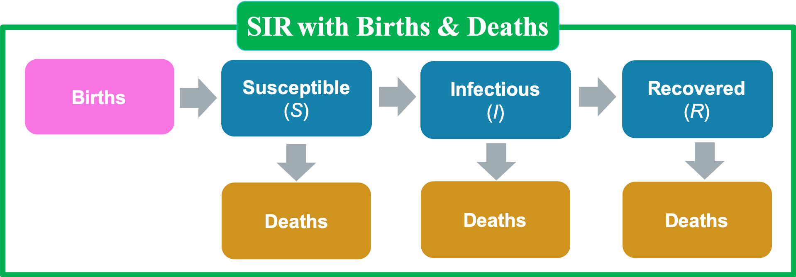

# Compartment Models {#compartment}

Mathematical models of infectious disease dynamics have a rich history that dates back more than 100 years. Mathematically simple formulations that describe the transition of individuals in a population between ‘compartments’ that capture the infection status of individuals leads to surprisingly significant insight. Their elegance and simplicity allow the ease of expansion to more complexities through, for example, the addition of compartments. Expanding these models is often straight forward but the apparent simplicity can mask subtle, but important, model structure and parameterization choices. Furthermore, while there are many wonderful texts focused on infectious disease modeling, there exist several complexities that are rarely discussed in sufficient detail for a novice disease modeler. 

We formulate our descriptions of disease transmission as compartmental models, with the population under study being divided into compartments.

At time $t$, denote

* $S(t)$: the number of susceptible people;
* $E(t)$: the number of infected but not yet infectious people;
* $I(t)$: the number of infectious people;
* $R(t)$: the number of recovered people.

## A Simple SIS Model (A Model for Diseases with No Immunity)

In many diseases, infectives return to the susceptible class on recovery because the disease confers no immunity. Such models are appropriate for most diseases transmitted by bacterial or helminth agents, and most sexually transmitted diseases (including gonorrhea, but not such diseases as AIDS, from which there is no recovery).

```{r SIS, out.width = "50%", echo = FALSE, fig.align = "center", fig.cap = "A simple SIS model."}
knitr::include_graphics("figures/SIS.png")
```

In an SIS model, the total population size $N = S(t) + I(t)$. The simplest SIS model, due to Kermack and McKendrick, is

\begin{eqnarray*}
\frac{dS(t)}{dt}& = & - \beta I(t)\frac{S(t)}{N} + \gamma I(t), \\
\frac{dI(t)}{dt}& = &\beta I(t)\frac{S(t)}{N} - \gamma I(t)
\end{eqnarray*}

where $\beta$ is the effective contact rate, and
\[
\beta \propto \left(\frac{\mathrm{infection}}{\mathrm{contact}} \right) \times \left(\frac{\mathrm{contact}}{\mathrm{time}}\right). 
\]

**Assumptions of SIS models**

(i) The rate of new infections is given by mass action incidence.
(ii) Infectives leave the infective class at rate $\gamma I$ per unit time and return to the susceptible class.
(iii) There is no entry into or departure from the population.
(iv) There are no disease deaths, and the total population size is a constant $N$.


## An SIR Model 


```{r SIR, out.width = "75%", echo = FALSE, fig.align = "center", fig.cap = "An SIR model."}
knitr::include_graphics("figures/SIR.png")
```

Consider the SIR model in a population of size $N$, and note $N = S(t) + I(t) + R(t)$: 

\begin{eqnarray*}
\frac{dS(t)}{dt}& = & - \beta I(t)\frac{S(t)}{N}, \\
\frac{dI(t)}{dt}& = &\beta I(t)\frac{S(t)}{N} - \gamma I(t), \\
\frac{dR(t)}{dt}& = &\gamma I(t), 
\end{eqnarray*}

where $\beta$ is the effective contact rate, and
\[
  \beta \propto \left(\frac{\mathrm{infection}}{\mathrm{contact}} \right) \times \left(\frac{\mathrm{contact}}{\mathrm{time}}\right),  
\]
i.e., (probability of transmission given a contact between a susceptible and an infectious individual) $\times$ (average rate of contact between susceptible and infected individuals);  $\gamma$ is the removal rate, and $\gamma^{-1}$ is the average infectious period. The logic of the transmission term is that $\beta$ is the contact rate among hosts times the probability of infection given a contact.

Let $s = S / N$, $i = I / N$ and $r = R / N$. Dividing the equations for $S$, $I$ and $R$ by $N$ we get the deterministic SIR epidemic model for this process in the form:

\begin{eqnarray*}
\frac{ds(t)}{dt}& = & - \beta i(t)s(t), \\
\frac{di(t)}{dt}& = &\beta i(t)s(t) - \gamma i(t), \\
\frac{dr(t)}{dt}& = &\gamma i(t). 
\end{eqnarray*}

**Assumptions of SIR models**
  
SIR models for diseases assume that infectives recover with immunity against reinfection.

* Constant (closed) population size: $N$;
* Constant rates (e.g., transmission, removal rates);
* No demography (i.e., births and deaths);
* Well - mixed population: any infected individual has a probability of contacting any susceptible individual that is reasonably well approximated by the average.


```{r}
## Load deSolve package
library(deSolve)
## Create an SIR function
sir <- function(time, state, parameters) {
  
  with(as.list(c(state, parameters)), {
    
    dS <- -beta * S * I
    dI <-  beta * S * I - gamma * I
    dR <- gamma * I
    
    return(list(c(dS, dI, dR)))
  })
}
```

Below, we consider a simulation example with $s(0)=0.999$, $i(0)=0.001$, $r(0)=0.0$, $\beta=0.3$ and $\gamma=0.1$.

```{r, eval=T}
# Set parameters
# Proportion in each compartment: Susceptible 0.999, 
# Infected 0.001, Recovered 0
init <- c(S = 0.999, I = 0.001, R = 0.0)
# beta: infection parameter; gamma: recovery parameter
parameters <- c(beta = 0.3, gamma = 0.1)
# Time frame
times <- seq(0, 300, by = 1)

# Solve using ode 
# (General Solver for Ordinary Differential Equations)
out <- ode(y = init, times = times, func = sir, parms = parameters)
# Change to data frame
out <- as.data.frame(out)
# Show data
head(out, 5)
```

Figure \@ref(fig:sim1) shows the evolution of the prevalence rate. 

```{r sim1, eval=T, out.width = "100%", echo=FALSE, fig.align = "center", fig.cap="Simulation example 1."}
library(ggplot2)
p1 <- ggplot(out) + 
  geom_line(aes(time, S, color = "S")) +
  geom_line(aes(time, I, color = "I")) + 
  geom_line(aes(time, R, color = "R")) + 
  labs(x ="time", y = "Prevalence", 
       title = 'SIR Model: Simulation 1') +
  scale_color_manual(name="Compartment",
                     values = c("S" = "darkblue",
                                "I" = "red",
                                "R" = "green"))

p2 <- ggplot(out) + 
  geom_line(aes(time, I, color = "I"))+ 
  labs(x ="time", y = "Infection Rate", 
       title = 'SIR Model: Simulation 1') +
  scale_color_manual(name="Compartment",
                     values = c("I" = "red"))

library(patchwork)
p1 + p2
```

Next, we consider another simulation example with $s(0)=0.999$, $i(0)=0.001$, $r(0)=0.0$, $\beta=0.075$ and $\gamma=0.1$.

```{r, eval=T}
# Set parameters
# Proportion in each compartment: Susceptible 0.999, 
# Infected 0.001, Recovered 0
init <- c(S = 0.999, I = 0.001, R = 0.0)
# beta: infection parameter; gamma: recovery parameter
parameters <- c(beta = 0.075, gamma = 0.1)
# Time frame
times <- seq(0, 300, by = 1)

# Solve using ode 
# (General Solver for Ordinary Differential Equations)
out <- ode(y = init, times = times, func = sir, parms = parameters)
# Change to data frame
out <- as.data.frame(out)
```

Figure \@ref(fig:sim2) shows the evolution of the prevalence rate. 

```{r sim2, echo=F, out.width = "100%", echo=FALSE, fig.align = "center", fig.cap="Simulation example 1."}
## Draw plot
library(ggplot2)
p1 <- ggplot(out) + 
  geom_line(aes(time, S, color = "S")) +
  geom_line(aes(time, I, color = "I")) + 
  geom_line(aes(time, R, color = "R")) + 
  labs(x ="time", y = "Prevalence", 
       title = 'SIR Model: Simulation 2') +
  scale_color_manual(name="Compartment",
                     values = c("S" = "darkblue",
                                "I" = "red",
                                "R" = "green"))

p2 <- ggplot(out) + 
  geom_line(aes(time, I, color = "I"))+ 
  labs(x ="time", y = "Infection Rate", 
       title = 'SIR Model: Simulation 2') +
  scale_color_manual(name="Compartment",
                     values = c("I" = "red"))

library(patchwork)
p1 + p2
```


### An SIR model with births and deaths

We have omitted births and deaths in our description of epidemic models because the time scale of an epidemic is generally much shorter than the demographic time scale. In effect, we have used a time scale on which the number of births and deaths in unit time is negligible. However, there are diseases that are endemic in many parts of the world and that cause millions of deaths each year. To model a disease that may be endemic, we need to think on a longer time scale and include births and deaths. 

```{r SIRbd, out.width = "75%", echo = FALSE, fig.align = "center", fig.cap = "An SIR model with birth and death."}

```

We consider the following SIR model with births and deaths:

\begin{eqnarray*}
\frac{dS(t)}{dt}& = &\mu\{N - S(t)\} - \beta I(t)\frac{S(t)}{N}, \\
\frac{dI(t)}{dt}& = &\beta I(t)\frac{S(t)}{N} - (\mu + \gamma)I(t), \\
\frac{dR(t)}{dt}& = &\gamma I(t) - \mu R(t), 
\end{eqnarray*}

where $\beta$ is the effective contact rate, and
\[
  \beta \propto \left(\frac{\mathrm{infection}}{\mathrm{contact}} \right) \times \left(\frac{\mathrm{contact}}{\mathrm{time}}\right),  
\]
i.e., (probability of transmission given a contact between a susceptible and an infectious individual) $\times$ (average rate of contact between susceptible and infected individuals).

* $\mu$ is the birth/death rate;

* $\gamma$ is the removal rate, and $\gamma^{-1}$ is the average infectious period.

At the early stage of an SIR outbreak, when $S(t) \approx N$, the number of infected individuals $I(t)$ is approximated by
\[
I(t) \approx I_0 \exp \{(\beta - \gamma - \mu) t\} = I_0 \exp \{(R_0 - 1)(\gamma + \mu)t\}, 
\]
where $R_0 = \beta/(\gamma + \mu)$ is the *basic reproduction number*, $I_0$ is the number of infectious people at time $0$, $\gamma^{-1}$ is the infectious period and $\mu^{-1}$ is the host lifespan. 

An epidemic occurs if the number of infected individuals increases, 
\[
\beta I \frac{S}{N} - (\mu + \gamma)I>0 \Rightarrow \beta - (\mu + \gamma)>0 \Rightarrow  R_0>1.
\]

## SIR parameter estimation

1. Feature match

At the early stage of an SIR outbreak, when $S(t) \approx N$, the number of infected individuals $I(t)$ is approximated by
\[
I(t) \approx I_0 \exp \{(\beta - \gamma - \mu) t\} = I_0 \exp \{(R_0 - 1)(\gamma + \mu)t\},
\]
where $R_0$ is the *basic reproduction number*, $I_0$ is the number of infectious people at time $0$, $\gamma^{-1}$ is the infectious period and $\mu^{-1}$ is the host lifespan. Taking logs of both sides, we get
\[
\log(I_t)\approx \log(I_0)+(R_0-1)(\gamma+\mu)t,
\]
which implies that we can obtain a quick estimate of $R_0$ by a simple linear regression. 

2. Least squares

The method of least squares gives us a way to quantify the discrepancy between the data and a model's predictions. We can then search over all possible values of a model's parameters to find the parameters that minimize this discrepancy. 

Let $\mu = 0$, for a given $(\beta, \gamma)$, we denote $I(t;\beta, \gamma) =  I(t)$ and 
\[
  (\widehat{\beta}, \widehat{\gamma}) = \arg\min_{(\beta, \gamma)}\sum_{j = 1}^{n} \{I(t_j;\beta, \gamma) - Y_j\}^2, 
\]
where $Y_j$ is the number of observed infected people at time $t_j$.

3. Maximum likelihood

Let $Y_j$ be the observed number of infected case. We can assume 
\[
  Y_j \sim \textrm{Poisson}\{pI(t_j;\beta, \gamma, \mu)\}, 
\]
where the parameter $p$ reflects a combination of sampling efficiency and the detectability of infections.

## Implementation of parameter estimation in R

Example code for implementing SIR to model the outbreak of measles in Niamey can be found in https://kingaa.github.io/short-course/parest/odes.html. We mainly show how to use R to find the parameters in SIR model by minimizing the sum of squared errors. Here is the data of the  outbreak of measles in Niamey: http://kingaa.github.io/clim-dis/parest/niamey.csv.

### Example 1. Outbreak of measles in Niamey

```{r, message = FALSE, warning = FALSE}
library(dplyr)
library(plotly)
library(slid)
niamey <- 
  read.csv("http://kingaa.github.io/clim-dis/parest/niamey.csv")
head(niamey,5)
plot_ly(data = niamey) %>% 
  add_trace(x = ~biweek, y = ~measles, color = ~community, 
            type = 'scatter', mode = 'lines+markers')
```

#### Least squares method

The R package “pomp” provides facilities for dealing with the important special case of deterministic dynamics. The “pomp” package was developed for data analysis with partially observed Markov process (POMP) models; see details from https://cran.r-project.org/web/packages/pomp/index.html.

```{r, message = FALSE, warning = FALSE}
library(pomp)
niameyA <- pomp(
  data = subset(niamey, community == "A", select = - community), 
  times = "biweek", t0 = 0, 
  skeleton = vectorfield(
    Csnippet("
      DS = - Beta*S*I/N;
      DI = Beta*S*I/N - gamma*I;
      DR = gamma*I;")), 
  rinit = Csnippet("
      S = S_0;
      I = I_0;
      R = N - S_0 - I_0;"), 
  statenames = c("S", "I", "R"), 
  paramnames = c("Beta", "gamma", "N", "S_0", "I_0"))

```

In the above `pomp()` function, `Csnippet` is for some C code snippets used to accelerate cumputations, and another two important arguments are:

* `times`: The times corresponding to the observations. times must be a strictly increasing numeric vector. If data is a data-frame, times should be the name of the column of observation times.
* `t0`: The zero-time. This must be no later than the time of the first observation, `times[1]`.


1. Grid search method

If we assume all the other parameters are known, one simple option to find optimal $\beta$ would be grid searching a value that minimizes the sum of squared error (SSE), which is the difference between the fitted infection curve with given $\beta$ compared to the true observations. 

For measles, the exposed infectious period is about two weeks, and persons who have had measles in the past have lifelong immunity. So we can safely assume that $\gamma = 1$. In addition, we assume that the initial numbers of susceptibles ($S(0)$), infectives $I(0)$, and population ($N$) are 10000, 10, and 50000, respectively.

```{r sse, eval=T, out.width = "100%", echo=FALSE, fig.align = "center", fig.cap="The sum of squared errors function of beta."}
sse <- function (params) {
  x <- trajectory(niameyA, params = params)
  discrep <- x["I", , ] - obs(niameyA)
  sum(discrep^2)
}
# assume gamma = 1 is known
# grid search for beta
f1 <- function (beta) {
  params <- c(Beta = beta, gamma = 1, N = 50000, 
              S_0 = 10000, I_0 = 10)
  sse(params)
}
beta <- seq(from = 0, to = 40, by = 0.5)
SSE <- sapply(beta, f1)

plot(beta, SSE, type = 'l')
beta.hat1 <- beta[which.min(SSE)]
abline(v = beta.hat1, lty = 2)
```

Next, we plugin the estimated $\hat{\beta}$ to the process and visualize the fitted curve for $I(t)$ compared to the observed path.

```{r measles1, eval=T, out.width = "100%", echo=FALSE, fig.align = "center", fig.cap="The observed and estimated measles count based on the grid search."}
coef(niameyA) <- c(Beta = beta.hat1, gamma = 1, 
                   N = 50000, S_0 = 10000, I_0 = 10)
# obtain the fitted trajectory 
x1 <- trajectory(niameyA, format = "data.frame")
x1
# combine the fitted and observed trajectory of I(t)
sir.fit.df <- left_join(as.data.frame(niameyA), x1, by = 'biweek')
# display the fitted and observed I(t)
plot_ly(data = sir.fit.df) %>% 
  add_trace(x = ~biweek, y = ~measles, type = 'scatter', 
            mode = 'lines+markers', name = 'data') %>% 
  add_trace(x = ~biweek, y = ~I, type = 'scatter', 
            mode = 'lines+markers', name = 'fitted')
```

2. Optimization algorithm

However, this grid-search approach won't perform well when we have more than one parameter. For example, we would like to assume that $N = 50000$, $S_0 = 10000$, but $\beta$, $\gamma$ and $I_0$ are all unknown, and we would like to estimate them simultaneously. In that case, we can use the `optim` function instead of the grid search method.

```{r measles2, message = FALSE, warning=FALSE, eval=T, out.width = "100%", echo=FALSE, fig.align = "center", fig.cap="The observed and estimated measles count based on ptimization algorithm."}
# General-purpose optimization
f2 <- function (par) {
  params <- c(Beta = par[1], gamma = par[2], 
              N = 50000, S_0 = 10000, I_0 = par[3])
  sse(params)
}
fit2 <- optim(fn = f2, par = c(8, 1, 10))
fit2
beta.hat2 <- fit2$par[1]
gamma.hat2 <- fit2$par[2]
I_0.hat2 <- fit2$par[3]
coef(niameyA) <- c(Beta = beta.hat2, gamma = gamma.hat2, 
                   N = 50000, S_0 = 10000, I_0 = I_0.hat2)
x2 <- trajectory(niameyA, format = "data.frame")
sir.fit.df <- left_join(as.data.frame(niameyA), x2, by = 'biweek')

plot_ly(data = sir.fit.df) %>% 
  add_trace(x = ~biweek, y = ~measles, type = 'scatter', 
            mode = 'lines+markers', name = 'data') %>% 
  add_trace(x = ~biweek, y = ~I, type = 'scatter', 
            mode = 'lines+markers', name = 'fitted')

```

#### Maximum likelihood approach 

Another way to fit the model is using maximum likelihood approach. Note that the model can be simplified a little bit by defining $b = \beta/N$. We assume $S_0 = 10000$, $I_0 = 10$, $\gamma = 1$, and $p=0.2$.

```{r ml, eval=T, out.width = "100%", echo=FALSE, fig.align = "center", fig.cap="The log likelihood function of b."}
niameyA2 <- pomp(
  data = subset(niamey, community == "A", select = -community),
  times = "biweek", t0 = 0,
  skeleton = vectorfield(
    Csnippet("
      double incidence;
      incidence = b*S*I;
      DS = -incidence;
      DI = incidence - gamma*I;")),
  rinit=Csnippet("
      S = S_0;
      I = I_0;"),
  paramnames = c("b", "gamma", "S_0", "I_0"),
  statenames = c("S", "I"))

# Poisson distribution
loglik.poisson <- function (params) {
  x <- trajectory(niameyA2, params=params)
  sum(dpois(x=obs(niameyA2), 
            lambda=params["p"]*x["I",,],
            log=TRUE))
}

f3 <- function (b) {
  params <- c(S_0 = 10000, I_0 = 10, gamma = 1, 
              b = b, p=0.2)
  loglik.poisson(params)
}

b <- seq(from = 0, to = 0.001, by = 0.00002)
ll <- sapply(b, f3)

plot(b, ll, type='l', ylab = expression(log(L)))
b.hat <- b[which.max(ll)]
abline(v = b.hat, lty = 2)
```

Next, we plugin the maximum likelihood estimator $\hat{b}$ to the process and visualize the fitted curve for $I(t)$ compared to the observed path.

```{r measles3, message = FALSE, warning=FALSE, eval=T, out.width = "100%", echo=FALSE, fig.align = "center", fig.cap="The observed and estimated measles count based on maximum likelihood estimator."}
coef(niameyA2) <- c(S_0 = 10000, I_0 = 10, 
                    gamma = 1, b = b.hat, p = 0.2)
x <- trajectory(niameyA2, format = "data.frame")
sir.fit.df <- left_join(as.data.frame(niameyA2), 
                        x, by = 'biweek')

plot_ly(data = sir.fit.df) %>% 
  add_trace(x = ~biweek, y = ~measles, type = 'scatter', 
            mode = 'lines+markers', name = 'data') %>% 
  add_trace(x = ~biweek, y = ~I, type = 'scatter', 
            mode = 'lines+markers', name = 'fitted')
```

Besides a gaussian distribution, it is also possible to choose other random compenent, for example, a poisson distribution.

### Example 2. COVID-19 data

In the COVID-19 case, the situation becomes slightly more complicated due to the unsatisfying data quality in terms of active cases and recovered cases. Therefore, we modify the algorithm to find the parameters that minimize the distance between the curve of fitted active cases ($I$) plus removed compartment $R$ and the reported cumulative positive COVID-19 cases time series. 

If we use the data observed since the beginning of the pandemic, it is reasonable to set the initial value $I_{0}$ to be 1, and focusing on the estimation of other parameters. However, if we choose a different training period, for example, the most recent 60 days, the initial value of active cases $I_{0}$ may be unobserved or calculated inaccurately. Therefore, the initial value can also be treated as a parameter and estimated based on collected data. In this case, an optimizing function such as `optim()` might be preferred than the grid search. 

Here is an example of implementing the SIR model to fit the spread of COVID-19 in Orange County, California.

```{r, message = FALSE, warning = FALSE}
data("I.county")
data("pop.county")
# the row storing the data for Orange County, CA
i <- which(I.county$County == 'Orange' & 
             I.county$State == 'California') 
N0 <- pop.county %>% 
  filter(County == 'Orange County' & State == 'California') %>% 
  pull(population)
est.h <- 60
pred.h <- 12
date.start <- as.Date('2020-10-01')
# training period
dates.train <- date.start + 0:(est.h - 1) 
# prediction period
dates.test <- date.start + est.h + 0:(pred.h - 1) 
dates.all <- date.start + 0:(est.h + pred.h - 1)
P.train <- data.frame(Date = 0:(est.h - 1), 
                      P_cases = as.numeric(I.county[i, 
                      paste0('X', as.character(dates.train, 
                             format = '%Y.%m.%d'))]))
P.all <- data.frame(Date = 0:(est.h + pred.h - 1), 
                    P_cases = as.numeric(I.county[i, 
                    paste0('X', as.character(dates.all, 
                           format = '%Y.%m.%d'))]))
```

Now we define a `pomp` object encoding the model and the data and a loss function `SSE` that evaluate the loss function value based on the simulated trajectories with given parameters.

```{r}
process.tmp <- pomp(
  data = P.train, 
  times = "Date", t0 = 0, 
  skeleton = vectorfield(
    Csnippet("
               DS = - Beta*S*I/N;
               DI = Beta*S*I/N - gamma*I;
               DR = gamma*I;")), 
  rinit = Csnippet("
                   S = S_0;
                   I = I_0;
                   R = N - S_0 - I_0;"), 
  statenames = c("S", "I", "R"), 
  paramnames = c("Beta", "gamma", "N", "S_0", "I_0"))

sse <- function (params) {
  x <- trajectory(process.tmp, params = params)
  discrep <- x["I", , ] + x["R", , ] - obs(process.tmp)
  sum(discrep^2)
}
```

Next, we can find the parameters that minimize the SSE using `optim` function.

```{r}
# set initial value of the process
S0 <- N0 - P.train$P_cases[1]
# assume that the removal rate is known  
R.rate <- 0.05
f1 <- function (par) {
  params <- c(Beta = par[2], gamma = R.rate, N = N0, 
              S_0 = S0, I_0 = par[1])
  sse(params)
}
# initial value for parameters
beta0 <- 0.07
I0 <- 1000

# we estimate I0 and beta0
fit1 <- optim(fn = f1, par = c(I0, beta0))
I0.hat1 <- fit1$par[1]
beta.hat1 <- fit1$par[2]
```

Figure \@ref(fig:covid19) shows the the reported, estimated and predicted reported cumulative number of positive cases of COVID-19 in Orange County, California.

```{r covid19, message = FALSE, warning=FALSE, eval=T, out.width = "100%", echo=FALSE, fig.align = "center", fig.cap="The reported, estimated and predicted reported cumulative number of positive cases of COVID-19."}
process.tmp1 <- process.tmp
pomp::coef(process.tmp1) <- c(Beta = beta.hat1, gamma = R.rate, 
                              N = N0, S_0 = S0, I_0 = I0.hat1)
# we estimate the cases in each compartment
x1 <- trajectory(process.tmp1, times = 0:(est.h + pred.h - 1), 
                 format = "data.frame")
# we estimate the reported cases
valid.df <- data.frame(Date = dates.all, 
                       P_cases = P.all$P_cases, 
                       SIR_P = x1$I + x1$R, 
                       type = c(rep('fitted', est.h), 
                                rep('predicted', pred.h)))
# Visualization of fitting
plot_ly(data = valid.df) %>% 
  add_trace(x = ~Date, y = ~P_cases, type = 'scatter', 
            mode = 'lines+markers', name = 'infected cases') %>%
  add_trace(x = ~Date, y = ~SIR_P, symbol = ~type, 
            mode = 'lines+markers')
```

## Basic Reproduction Number

A key concept is the *basic reproduction number* ($R_0$), which is defined as the expected number of secondary cases produced by a single (typical) infection in a completely susceptible population. 

It is important to note that $R_0$ is a dimensionless number and not a rate, and
\[
  R_0 \propto \left(\frac{\mathrm{infection}}{\mathrm{contact}} \right) \times \left(\frac{\mathrm{contact}}{\mathrm{time}}\right) \times \left(\frac{\mathrm{time}}{\mathrm{infection}}\right).
\]

* If $R_0 < 1$ the disease dies out, while if $R_0 > 1$ the disease becomes endemic. 

* For the SIR model, when $S(t) \approx N$, $R_0 = \frac{\beta}{\gamma + \mu}$.

* For the SEIR model, when $S(t) \approx N$, $R_0 = \frac{\sigma}{\sigma + \mu} \times \frac{\beta}{\gamma + \mu}$.

* If $R_0 < 1$, each existing infection causes less than one new infection. In this case, the disease will decline and eventually die out.

* If $R_0 = 1$, each existing infection causes one new infection. The disease will stay alive and stable, but there won’t be an outbreak or an epidemic.

* If $R_0 > 1$, each existing infection causes more than one new infection. The disease will be transmitted between people, and there may be an outbreak or epidemic.


**COVID-19 $R_0$**
  
  * The $R_0$ for SAS-Cov-2 is a median of 5.7, according to a study published online in Emerging Infectious Diseases. That’s about double an earlier R0 estimate of 2.2 to 2.7

* Here, 5.7 means that one person with COVID-19can potentially transmit the coronavirus to 5 to 6 people, rather than the 2 to 3 researchers originally thought.

* With an $R_0$ of 5.7, at least 82\% of the population needs to be immune to COVID-19to stop its transmission through vaccination and herd immunity.

### SEIR Model

* Consider the SIR model in a population of size $N$, and note that $N = S(t) + I(t) + R(t)$.

\begin{eqnarray*}
\frac{dS(t)}{dt}& = &\mu\{N - S(t)\} - \beta I(t)\frac{S(t)}{N} + \omega R, \\
\frac{dE(t)}{dt}& = &\beta I(t)\frac{S(t)}{N} - (\mu + \sigma)E(t), \\
\frac{dI(t)}{dt}& = &\sigma E(t) - (\mu + \gamma)I(t), \\
\frac{dR(t)}{dt}& = &\gamma I(t) - (\mu + \omega) R(t), 
\end{eqnarray*}

* $\omega^{-1}$ is the average duration of immunity;
* $\sigma^{-1}$ is the average latent period.


## Herd Immunity

In order to prevent a disease from becoming endemic it is necessary to reduce the basic reproduction number $R_0$ below one. This may sometimes be achieved by immunization. 

* If a fraction $p$ of the newborn members per unit time of the population is successfully immunized, the effect is to replace $N$ by $N(1 - p)$, and thus to reduce the basic reproduction number to $R_0(1 - p)$. The requirement $R_0(1 - p) < 1$ gives $1 - p < 1/R_0$, or
\[
  p > 1 - \frac{1}{R_0}.
\]

* A population is said to have **herd immunity** if a large enough fraction has been
immunized to assure that the disease cannot become endemic. 

* The only disease for which this has actually been achieved worldwide is smallpox for which $R_0$ is approximately 5, so that 80% immunization does provide herd immunity, and rinderpest, a cattle disease.

* For measles, epidemiological data in the United States indicate that $R_0$ for rural populations ranges from 5.4 to 6.3, requiring vaccination of 81.5% to 84.1% of the population. In urban areas $R_0$ ranges from 8.3 to 13.0, requiring vaccination of 88.0% to 92.3% percent of the population.

## Exercises

1. We have estimated the parameters by minimizing the SSE between model-predicted number of cases and observed data $(\text{prediction} - \text{data})^2$. What would happen if we would like to minimize the squared error on the log scale i.e., $(\log(\text{prediction}) - \log(\text{data}))^2$? What would happen if we would like minimize the square-root scale, i.e., $(\sqrt{\text{prediction}} - \sqrt{\text{data}})^2$? Try to fit the model with different definitions of loss function using the niamey data example. What’s the “correct” scale to choose?

```{r, eval = FALSE, echo = FALSE, warning = FALSE}
niameyA <- pomp(
  data = subset(niamey, community == "A", select = - community), 
  times = "biweek", t0 = 0, 
  skeleton = vectorfield(
    Csnippet("
      DS = - Beta*S*I/N;
      DI = Beta*S*I/N - gamma*I;
      DR = gamma*I;")), 
  rinit = Csnippet("
      S = S_0;
      I = I_0;
      R = N - S_0 - I_0;"), 
  statenames = c("S", "I", "R"), 
  paramnames = c("Beta", "gamma", "N", "S_0", "I_0"))

sse <- function (params) {
  x <- trajectory(niameyA, params = params)
  discrep <- x["I", , ] - obs(niameyA)
  sum(discrep^2)
}
sse.log <- function (params) {
  x <- trajectory(niameyA, params = params)
  discrep <- log(x["I", , ]) - log(obs(niameyA))
  sum(discrep^2)
}

sse.sqrt <- function (params) {
  x <- trajectory(niameyA, params = params)
  discrep <- sqrt(x["I", , ]) - sqrt(obs(niameyA))
  sum(discrep^2)
}
f2 <- function (par) {
  params <- c(Beta = par[1], gamma = par[2], 
              N = 50000, S_0 = 10000, I_0 = par[3])
  sse(params)
}

f2.log <- function (par) {
  params <- c(Beta = par[1], gamma = par[2], 
              N = 50000, S_0 = 10000, I_0 = par[3])
  sse.log(params)
}
f2.sqrt <- function (par) {
  params <- c(Beta = par[1], gamma = par[2], 
              N = 50000, S_0 = 10000, I_0 = par[3])
  sse.sqrt(params)
}

fit2 <- optim(fn = f2, par = c(8, 1, 10))
fit2
beta.hat2 <- fit2$par[1]
gamma.hat2 <- fit2$par[2]
I_0.hat2 <- fit2$par[3]
x2 <- trajectory(niameyA,params=c(Beta = beta.hat2, gamma = gamma.hat2, 
                   N = 50000, S_0 = 10000, I_0 = I_0.hat2), format = "data.frame")
sir.fit.df <- left_join(as.data.frame(niameyA), x2, by = 'biweek')

fit2.log <- optim(fn = f2.log, par = c(8, 1, 10))
fit2.log
beta.hat2.log <- fit2.log$par[1]
gamma.hat2.log <- fit2.log$par[2]
I_0.hat2.log <- fit2.log$par[3]
x2.log <- trajectory(niameyA, params=c(Beta = beta.hat2.log, gamma = gamma.hat2.log, 
                   N = 50000, S_0 = 10000, I_0 = I_0.hat2.log), format = "data.frame")
sir.fit.df <- left_join(sir.fit.df, x2.log, by = 'biweek', suffix = c("", ".log"))

fit2.sqrt <- optim(fn = f2.sqrt, par = c(8, 1, 10))
fit2.sqrt
beta.hat2.sqrt <- fit2.sqrt$par[1]
gamma.hat2.sqrt <- fit2.sqrt$par[2]
I_0.hat2.sqrt <- fit2.sqrt$par[3]
x2.sqrt <- trajectory(niameyA, params=c(Beta = beta.hat2.sqrt, gamma = gamma.hat2.sqrt, 
                   N = 50000, S_0 = 10000, I_0 = I_0.hat2.sqrt), format = "data.frame")
sir.fit.df <- left_join(sir.fit.df, x2.sqrt, by = 'biweek', suffix = c("", ".sqrt"))

plot_ly(data = sir.fit.df) %>% 
  add_trace(x = ~biweek, y = ~measles, type = 'scatter', 
            mode = 'lines+markers', name = 'data') %>% 
  add_trace(x = ~biweek, y = ~I, type = 'scatter', 
            mode = 'lines+markers', name = TeX("$(\\text{prediction} - \\text{data})^2$")) %>%
  add_trace(x = ~biweek, y = ~I.log, type = 'scatter', 
            mode = 'lines+markers', name = TeX("$(\\log(\\text{prediction}) - \\log(\\text{data}))^2$")) %>%
  add_trace(x = ~biweek, y = ~I.sqrt, type = 'scatter', 
            mode = 'lines+markers', name = TeX("$(\\sqrt{\\text{prediction}} - \\sqrt{\\text{data}})^2$")) %>% 
  config(mathjax = 'cdn')
  
```

2. Change the optimization algorithm used by optim via the method argument. Investigate the effect on your parameter estimates. Try to use other optimizers, such as `nlm`, `nlminb`, `constrOptim`, or the `nloptr` package, etc. 

```{r, echo = FALSE, eval = FALSE, warning = FALSE, message = FALSE}
# for example:
tmp1 <- optim(fn = f2, par = c(8, 1, 10), method = "Nelder-Mead") # default method: "Nelder-Mead"
tmp1
tmp2 <- optim(fn = f2, par = c(8, 1, 10), method = 'L-BFGS', lower=c(0,0,0))
tmp2
# (For this example, not all method will succeed. It might be due to the fact that SIR model has some natural constraints and the process cannot take all possible combination of parameters.)
# tmp3 <- nlm(f = f2, p = c(8, 1, 10))
# tmp3
tmp4 <- nlminb(start = c(8, 1, 10), objective = f2, lower=c(0,0,0), control = list(rel.tol = 1e-5))
tmp4
tmp5 <- constrOptim(theta = c(8, 1, 10), f = f2, grad=NULL, ui = diag(1,3), ci=c(0,0,0))
tmp5
```

3. Suppose, alternatively, that the errors are log-normal with constant variance. Under what definition of SSE will least-squares and maximum likelihood give the same parameter estimates?


4. Simulate and visualize the dynamics using SIR model with births and deaths. Consider `time=seq(0,20,by=1/52)` in years, `N=100000`, `t_0 = 0`, `S_0=100000/12`, `I_0=100` and two sets of parameters: (a) $\mu = 1/50$, $\gamma = 365/13$, $\beta = 400$ and (b) $\mu = 1/50$, $\gamma = 365/5$, $\beta = 1000$. 

```{r, echo = FALSE, eval = FALSE}
# The code comes from https://kingaa.github.io/short-course/parest/odes.html#exercise-seir-model
open.sir.ode <- Csnippet("
  DS = -Beta*S*I/N+mu*(N-S);
  DI = Beta*S*I/N-gamma*I-mu*I;
  DR = gamma*I-mu*R;
")

init2 <- Csnippet("
  S = S_0;
  I = I_0;
  R = N-S_0-I_0;
")

pomp(data=data.frame(time=seq(0, 20, by=1/52), cases=NA),
     times="time", t0=0,
     skeleton=vectorfield(open.sir.ode),
     rinit=init2,
     statenames=c("S","I","R"),
     paramnames=c("Beta","gamma","mu","S_0","I_0","N")
) -> open.sir 

params1 <- c(mu=1/50, Beta=400, gamma=365/13,
  N=100000, S_0=100000/12, I_0=100)
params2 <- c(mu=1/50, Beta=1000, gamma=365/5,
  N=100000, S_0=100000/12, I_0=100)
x1 <- trajectory(open.sir, params=params1, format="d") 
x2 <- trajectory(open.sir, params=params2, format="d") 
plot_ly() %>% 
  add_trace(data = x1, x = ~time, y = ~I, type = 'scatter', 
            mode = 'lines', name = 'set 1') %>%
  add_trace(data = x2, x = ~time, y = ~I, type = 'scatter', 
            mode = 'lines', name = 'set 2')
```

5. Under the assumptions of this model, the average host lifespan is $1/\mu$. Explore how host lifespan affects the dynamics by integrating the differential equations for lifespans of 20 and 200 years. Consider `time=seq(0, 20, by=1/52)`, `N=100000`, `t_0 = 0`, `S_0=100000/12`, `I_0=100` and parameters: $\gamma = 365/13$, $\beta = 400$. 

```{r, echo = FALSE, eval = FALSE}
params3 <- c(mu=1/20, Beta=400, gamma=365/13,
  N=100000, S_0=100000/12, I_0=100)
params4 <- c(mu=1/200, Beta=400, gamma=365/13,
  N=100000, S_0=100000/12, I_0=100)
x3 <- trajectory(open.sir, params=params3, format="d") 
x4 <- trajectory(open.sir, params=params4, format="d") 
plot_ly() %>% 
  add_trace(data = x3, x = ~time, y = ~I, type = 'scatter', 
            mode = 'lines', name = '20 years') %>%
  add_trace(data = x4, x = ~time, y = ~I, type = 'scatter', 
            mode = 'lines', name='200 years')

```


6: Compare the dynamics of SIR and SEIR models for the parameters $\mu = 1/50$, $\gamma = 365/13$, $\beta = 400$ and assuming that, for example, $E(0)=100$, the latent period has duration 8 days, and immunity lasts for 10 years in the SEIR model.

```{r, echo = FALSE, eval = FALSE}
open.seir.ode <- Csnippet("
  DS = -Beta*S*I/N + mu*(N-S) + omega*R;
  DE = Beta*S*I/N - (mu+sigma)*E;
  DI = sigma*E-(mu+gamma)*I;
  DR = gamma*I-(mu+omega)*R;
")
init3 <- Csnippet("
  S = S_0;
  E = E_0;
  I = I_0;
  R = N-S_0-E_0-I_0;
")
pomp(data=data.frame(time=seq(0,20,by=1/52),cases=NA),
     times="time", t0=0,
     skeleton=vectorfield(open.seir.ode),
     rinit=init3,
     statenames=c("S","E","I","R"),
     paramnames=c("Beta","gamma","mu","omega","sigma","S_0","E_0","I_0","N")
) -> open.seir 
params5 <- c(mu=1/50, Beta=400, gamma=365/13, omega=1/10, sigma=365/8,
  N=100000, S_0=100000/12, I_0=100, E_0=100)
x5 <- trajectory(open.seir, params=params5, format="d") 
plot_ly() %>% 
  add_trace(data = x1, x = ~time, y = ~I, type = 'scatter', 
            mode = 'lines', name = 'SIR') %>%
  add_trace(data = x5, x = ~time, y = ~I, type = 'scatter', 
            mode = 'lines', name = 'SEIR')
```


