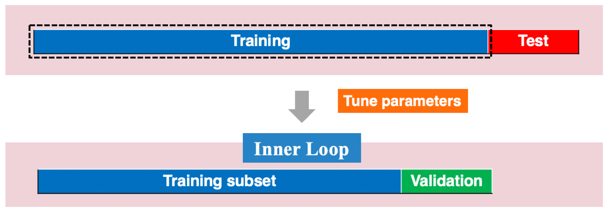
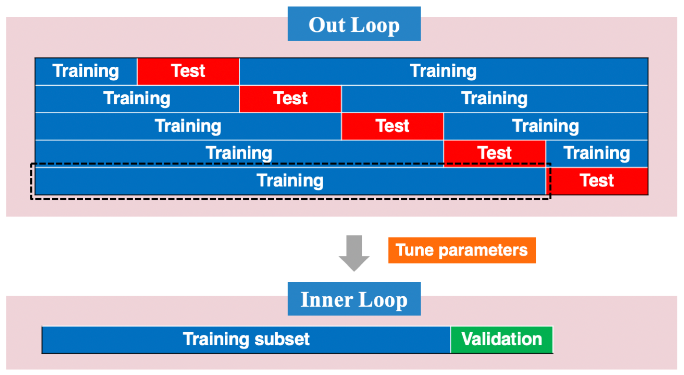
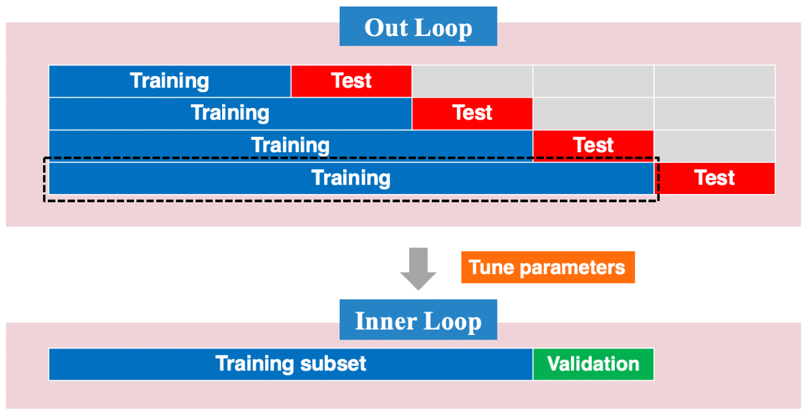
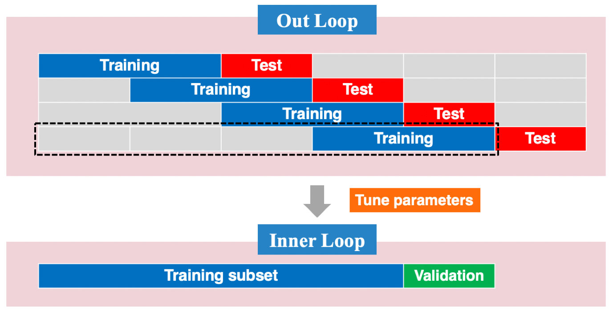

# Time Series Analysis of Infectious Disease Data {#timeseries}

Several quantities are of interest in epidemic forecasting, such as the timing of and incidence in the peak week, cumulative incidence, and weekly incidence. The policy/decision-makers are also interested in evaluating outbreak size and duration, and employing the epidemic curve to identify the mode of transmission of the disease and measure its prevalence of the disease. 

Forecasting goals can also be classified as long-term or short-term forecasts. Long-term disease forecasts can predict COVID-19 peak or severity, while short-term forecasts can be used to guide resource allocation in the short term by local agencies or to anticipate the case burden by hospitals in the coming week; see @altieri2020curating. The projection can be made at different resolution levels, for example, national, regional or local. National-level or state-level long-term forecasts are of interest to policymakers regulating intervention strategies and deciding how much funding to allocate for resources. Prediction models with a finer resolution are needed to assess the local risk of COVID-19. Knowing more about the vulnerable communities and the reasons for those communities that are more likely to be infected are crucial for the policy and decision-makers to assist in prevention efforts [@altieri2020curating].
 
We provide a predictive analysis of the spread of COVID-19, using the dataset made publicly available online by the Johns Hopkins University. Our main objective is to provide future predictions of the number of infected people for different countries. We use two well-known methods for prediction: time series analysis and neural network. 

## Datasets and R Packages

**Data** 

The dataset from JHU contains the cumulative number of cases reported daily for different countries. We base our analysis on the state-level time series. For each state, we consider the time-series $y_n$ starting from the day when the first case was reported. Given the current day index $n$, we predict the number of cases for the day $n + h$ by considering as input the number of cases reported for the past $w$ days, that is, for the days $n-w+1$ to $n$.

```{r, results='hide', warning=FALSE, message=FALSE}
#install_github('covid19-dashboard-us/slid')
library(slid)
data(state.long)
```

**R Package: `fable`**

We will use the R packages `fable`, `tsibble` and `dplyr`, which together offer various functions for computing and visualizing basic time series components.

```{r, results='hide', warning=FALSE, message=FALSE}
library(dplyr)
library(fable)
library(tsibble)
```

The R package “fable” provides a collection of commonly used univariate and multivariate time series forecasting models including exponential smoothing via state space models and autoregressive integrated moving average (ARIMA) modeling. The “fable” package provides the tools to evaluate, visualize, and combine models in a workflow consistent with the “tidyverse”.

The [Forecasting: Principles and Practices](https://otexts.com/fpp3/) online textbook provides an introduction to time series forecasting using `fable`. 

## An Introduction to Time Series Analysis

Time series is a set of observations recorded sequentially. The first thing to do in any time series analysis task is to plot the data. Graphs enable many features of the data to be visualized, including patterns, unusual observations, changes over time, and relationships between variables. The features that are seen in plots of the data must then be incorporated, as much as possible, into the forecasting methods to be used. Just as the type of data determines what forecasting method to use, it also determines what graphs are appropriate. But before we produce graphs, we need to set up our time series in R.

### “tsibble” objects

A time series can be thought of as a list of numbers, along with some information about what times those numbers were recorded. This information can be stored as a “tsibble” object in R. Beyond the tibble-like representation, **key** comprised of single or multiple variables is introduced to uniquely identify observational units over time (**index**). Each observation should be uniquely identified by **index** and **key** in a valid “tsibble” object.

Take the `state.long` data for example, 

```{r}
state.long
```

We can turn this into a “tsibble” object using the `as_tsibble()` function: 

```{r, collapse=TRUE}
state.ts <- as_tsibble(state.long, key = State) 
state.ts
```

The summary above shows that this is a “tsibble” object, which contains 15,925 rows and 7 columns. The object is uniquely identified by the key: `State`. It informs us that there are separate time series in the “tsibble” for each of the 49 states in the US. 

A “tsibble” allows multiple time series to be stored in a single object. The `state.long` dataset contains the infected count, death count for each mainland state in the US and District of Columbia. 


### Working with “tsibble” objects

Several functions in the “dplyr” package can be used to work with “tsibble” objects, including `mutate()` and `select()`. To illustrate these further and some other useful functions, we will use the `state.ts` tsibble created in the above.

```{r, collapse=TRUE}
state.ts <- as_tsibble(state.long, key = State) %>%
  group_by(State) %>%
  mutate(Infected = Infected/1000) %>%
  mutate(YDA_Infected = lag(Infected, order_by = DATE)) %>%
  mutate(YDA_Death = lag(Death, order_by = DATE)) %>%
  mutate(Y.Infected = Infected - YDA_Infected) %>%
  mutate(Y.Death = Death - YDA_Death) %>%
  dplyr::filter(!is.na(Y.Infected)) %>%
  dplyr::filter(!is.na(Y.Death)) %>%
  dplyr::select(-c(YDA_Infected, YDA_Death))

state.ts 
```

This tsibble use the `mutate()` to create two extra variables: `Y.Infected` and `Y.Death`, which are the daily new infected count and the daily new death count for each state. 

We can use the `filter()` function to extract the data for the state of Florida, for example:

```{r, collapse=TRUE}
Florida.ts <- state.ts %>%
  dplyr::filter(State == "Florida")
```

Next, we can simplify the resulting object by selecting five variables we will need in subsequent analysis. 

```{r, collapse=TRUE}
Florida.ts <- Florida.ts %>% 
  dplyr::select(Infected, Death, Y.Infected, Y.Death)
Florida.ts
```

Note that the index variable `DATE` would be returned even if it was not explicitly selected as it is required for a tsibble.


### Drawing time series plots

To further examine the data, we now use the `autoplot()` to draw some time series plot; see Figure \@ref(fig:death1). 

```{r death1, fig.height=3, fig.width=7, fig.align = "center", fig.cap="The time series plot of the daily new death count in Florida using the `autoplot()` function."}
Florida.ts %>%
autoplot(Y.Death)
```

We can also use the “ggplot2” to draw some time series plot. Figure \@ref(fig:death2) shows the time series plot with blue line. 

```{r death2, fig.height=3, fig.width=7, fig.align = "center", fig.cap="The time series plot of the daily new death count in Florida using the `ggplot()` function."}
library(ggplot2)
ggplot(Florida.ts, aes(x = DATE, y = Y.Death)) + 
  geom_line(color = "blue") + 
  labs(title = 'Florida daily new death count') 
```

We can draw multiple time series on the same plot using “ggplot2”. The time series plot shown in Figure \@ref(fig:death3) illusterate the daily new infected and death counts in Florida.

```{r death3, fig.height=3, fig.width=7, fig.align = "center", fig.cap="The time series plot of the daily new infected and death counts in Florida."}
  ggplot(Florida.ts, aes(x = DATE)) +
  geom_line(aes(y = Y.Infected, colour = "Y.Infected (thousand)")) +
  geom_line(aes(y = Y.Death, colour = "Y.Death")) +
  ylab("Count") + xlab("Day") +
  guides(colour=guide_legend(title = "Forecasts")) +
  theme(legend.position="bottom")
```

Figure \@ref(fig:death4) shows the time series plot of the daily new death count for each of the midwest states using the `ggplot()` function.

```{r death4, fig.height=5, fig.width=7, fig.align = "center", fig.cap="The time series plot of the daily new death count for each of the midwest states using the `ggplot()` function."}
state.ts %>%
  dplyr::filter(Region== "Midwest") %>%
  ggplot(aes(x = DATE, y = Y.Death, 
             group = State, color = State)) +
  geom_line() +
  theme(legend.position="bottom")
```

We can also use the `autoplot()` function to draw multiple time series on one plot. Figure \@ref(fig:deathall) shows the time series plot of the daily new death count for each of the midwest states using the `autoplot()` function.

```{r deathall, fig.height=5, fig.width=7, fig.align = "center", fig.cap="The time series plot of the daily new death count for each of the midwest states using the `autoplot()` function."}
state.ts %>% 
  dplyr::filter(Region== "Midwest") %>% 
  autoplot(Y.Death) +
ylab("Deaths") + xlab("Day") +
ggtitle("Daily new death count for each of the midwest")
```

After making the time series plots, we look for

* **Trend:** upward or downward movement that might be extrapolated into future; it does not have to be linear.

* **Periodicity:** repetition in regular pattern (usually peaks and troughs;

* **Seasonality:** periodic behavior of known period (i.e., 12 months for monthly data);

* **Heteroskedasticity:** changing variance, particularly with changing level;

* **Dependence:** positive (successive observations are similar) or negative (successive observations are dissimilar);

* **Missing data**, **structural breaks**, **outliers**.

**Remark:** Some readers confuse cyclic behavior with seasonal behavior, but they are really quite different. If the fluctuations are not of a fixed frequency, then they are cyclic; if the frequency is unchanging and associated with some aspect of the calendar, then the pattern is seasonal.

**Time series seasonal plot**

We can produce a time series seasonal plot using `gg_season()` function in the “feast” R package, which provides a collection of features, decomposition methods, statistical summaries and graphics functions for analyzing tidy time series data. 

A seasonal plot is similar to a regular time series plot, except the x-axis shows data from within each season. This plot type allows the underlying seasonal pattern to be seen more clearly, and is especially useful in identifying the time in which the pattern changes. Figure \@ref(fig:deathweek) shows the time series weekly plot of the daily new death count.

```{r deathweek, fig.height=5, fig.width=7, fig.align = "center", fig.cap="The time series weekly plot of the daily new death count."} 
library(feasts)
Florida.ts %>% gg_season(Y.Death, period = "week")
```

**A lag plot**

We can draw a lag plot to show the time series against lags of itself using the `gg_lag()` in the R library `feasts`. 

```{r deathlag, fig.align = "center", fig.cap="The lag plot of the daily new death count for Florida."} 
library(feasts)
Florida.ts %>% 
  gg_lag(y = Y.Death, geom = "point")
```

It is often colored the seasonal period (here weekly cycle) to identify how each season (each date in a week) correlates with others. From Figure \@ref(fig:deathlag), one sees that the relationship is strongly positive at lag 7, reflecting the strong weekly cycle in the data. 

### Objectives of Time Series Analysis

* Provide an interpretable model of data
    + often involves multivariate series
    + allows testing of scientific hypotheses
    + but, not always a major emphasis in time series analysis

* Predict future values of series
    + very common application of time series analysis
    + predictive models often do not try to explain

* Provide a compact description of data
    + good predictive model can be used for data compression
    + used extensively in telecommunications

**Modeling Strategy** 

* Take a probabilistic approach
    + observations $=$ realizations of random variables 
    + in much of statistics, random variables are assumed to be indepedent

* Difficulties in time series:
    + random variables are typically not identically distributed
    + different means due to trend, seasonality
    + may be different variances as well
    + random variables typically not independent
    + dependence may be positive or negative

* Try to make things easier
    + eliminate heterostedasticity via transformation (e.g. log)
    + eliminate trend and seasonality
    + model remainder as dependent but identically distributed

### Stationarity

Let $\{X_t\}$ be a time series with $E(X_t^2)<\infty$. 

* The **mean function** of $\{X_t\}$ is
  \[
  \mu_X(t)=\mathrm{E}(X_t).
  \] 
* The **covariance function** of $\{X_t\}$ is
  \[
  \gamma_X(s,t)=\mathrm{Cov}(X_t,X_s) = \mathrm{E}[(X_s-\mu_X(s))(X_t-\mu_X(t))]
  \]
for all integers $s$ and $t$.
  
**Modeling Dependence** 

* Hard to model dependence if dependence changes with time 
* Easiest to model dependence in stationary case

Roughly speaking, stationary means **probabilistic properties** of series do not change with time. There are two versions of interest.

1. **Strict stationarity:** joint probability distributions do not change with time. 

A time series $\{X_t\}$ is **strictly stationary** if for any positive integer $k$ and integers $t_1, \ldots, t_k$ and $h$,
 \[
 (X_{t_1},X_{t_2},\ldots,X_{t_k}) \overset{d}{=} (X_{t_1+h},X_{t_2+h},\ldots,X_{t_k+h})
 \]
where ``$\overset{d}{=}$'' denotes equality in probability distribution.
    
Remark: covariances make sense only if variances exist 

* If $\{X_t\}$ is IID, then $\{X_t\}$ is strictly stationary 
* Strict stationarity is a very strong modeling assumption
    + hard to verify in practice
    + often stronger than necessary for useful results $\Rightarrow$ introduce next so-called weak stationarity
     
2. **Weak stationarity:** 1st and 2nd order moment properties (i.e., mean and covariance structures) do not change over time     
     
* A time series $\{X_t\}$ is **weakly stationary** if for all integers $t$ and $h$:

    (a) $\mathrm{Var}(X_t)<\infty$
    (b) $E[X_t]$ does not depend on $t$
    (c) $\mathrm{Cov}(X_t,X_{t+h})$ does not depend on $t$

* Notes
    (a) implies all means, variances, and covariances exist
    (b) implies means are constant (rules out trend, seasonality)
    (c) with $h = 0$, (c) implies variances are constant (rules out heteroskedasticity)

* **Weakly stationary** also known as covariance stationary, second order stationary, or just stationary

        * 1st and 2nd-order moments do not change with time
        * much weaker than strict stationarity 


### Autocorrelation

1. **Autocovariance Function (ACVF)**  

For weakly stationary time series, $\mathrm{Cov}(X_{t},X_{t+h})=\gamma(h)$, a function of $h$ only. 

2. **Autocorrelation Function (ACF)**

The autocorrelation function (ACF) of $\{X_t\}$ is defined by
\[
\rho(h)=\frac{\gamma(h)}{\gamma(0)}=\frac{\mathrm{Cov}(X_{t},X_{t+h})}{\sqrt{\mathrm{Var}(X_{t})\mathrm{Var}(X_{t+h})}}
\] 

3. **Sample ACVF**

Let $\{X_t\}_{t=1}^n$ be a time series and $\bar{X}_{n}=\frac{1}{n}\sum_{t=1}^{n}X_t$ be its sample mean. The sample ACVF (based on $\{X_t\}_{t=1}^n$): 
\[
\hat{\gamma}(h)\equiv \frac{1}{n}\sum_{t=1}^{n-|h|} (X_{t}-\bar{X}_{n})(X_{t+|h|}-\bar{X}_{n}), ~|h|<n
\]
which estimates $\gamma(h)=E[(X_t-EX_t)(X_{t+|h|}-EX_t)]$. 

4. **Sample ACF**

The sample ACF based on $\{X_t\}_{t=1}^n$ is defined as 
\[
\hat{\rho}(h)\equiv \hat{\gamma}(h)/\hat{\gamma}(0), ~|h|<n
\]
which estimates $\rho(h)=\gamma(h)/\gamma(0)$, $|\hat{\rho}(h)|\leq 1$, $\hat{\rho}(0)=1$.

The autocorrelation coefficients are plotted to show the autocorrelation function or ACF. Figure \@ref(fig:acf) shows the ACF plot of the daily new death count in Florida.

```{r acf, fig.height=3, fig.width=7, fig.align = "center", fig.cap="The ACF plot of the daily new death count in Florida."}
Florida.ts %>%
  ACF(Y.Death) %>%
  autoplot()
```

The dashed blue lines in this graph indicate whether the correlations are significantly different from zero, and $\hat{\rho}(4)$ is higher than for the other lags. This is due to the weekly pattern in the data: the peaks tend to be four quarters apart, and the troughs tend to be four quarters apart.

**Remark:** 

1. When data have a trend, the autocorrelations for small lags tend to be large and positive because observations nearby in time are also nearby in size. So the ACF of the time series with a trend tends to have positive values that slowly decrease as the lags increase.

2. When data are seasonal, the autocorrelations will be larger for the seasonal lags (at multiples of the seasonal frequency) than for other lags.

```{r acfpacf, warning=FALSE, message=FALSE, fig.align = "center", fig.cap="Time plot, ACF plot and PACF plot of lag-7 differenced data."}
Florida.ts %>% 
  gg_tsdisplay(difference(Y.Death, 7), plot_type='partial', lag=36) +
  labs(y="Lag 7 differenced")
```


## Time Series Decomposition

Time series data can exhibit various patterns, and it is often helpful to split a time series into several components, each representing an underlying pattern category. In the literature, a time series is usually decomposed into three components: a trend component, a seasonal component, and a remainder component. In the following, we consider the following classical decomposition:
    \[
    X_t=m_t+s_t+Y_t
    \]
where $m_t$ is the **trend** at $t$ (non-random often), $s_t$: a function with known period $d$ referred to as **seasonality** (non-random), and $Y_t$: irregular and random noise that is stationary. 

Our aims are the following: 
 
* to estimate and extract $m_t$ and $s_t$ so that the residual $Y_t$ will turn out to be stationary;
* to find a satisfactory probabilistic model for $Y_t$;
* use it in conjunction with $m_t$ and $s_t$ for prediction and simulation of $\{X_t\}$.


### Box-Cox transformations

When decomposing a time series, it is sometimes helpful to first transform or adjust the series in order to make the decomposition (and later analysis) as simple as possible. Transformations help to stabilize the variance. So we will begin by discussing transformations and adjustments.

Each of these transformations is close to a member of the family of Box-Cox transformations:
\[
W_t =\left\{\begin{array}{ll}
\log(Y_t), & \lambda=0;\\
(Y_t^{\lambda}-1)/\lambda, & \lambda \neq 0.
\end{array}
\right.
\]

* $\lambda= 1$: (No substantive transformation);
* $\lambda= 1/2$: (Square root plus linear transformation);
* $\lambda= 0$: (Natural logarithm). This is a simple way to force forecasts to be positive;
* $\lambda= -1$: (Inverse plus 1);
* $Y_t^{\lambda}=1$ for $\lambda$ close to zero behaves like logs;
* If some $Y_t = 0$, then must have $\lambda > 0$;
* If some $Y_t < 0$, no power transformation is possible unless all $Y_t$ adjusted by adding a constant to all values;
* Choose a simple value of $\lambda$, which makes explanation easier;
* Results are relatively insensitive to value of $\lambda$.

We must reverse the transformation (or back-transform) to obtain forecasts
on the original scale. The reverse Box-Cox transformations are given by
\[
Y_t=\left\{\begin{array}{ll}
\exp(W_t), & \lambda=0;\\
(\lambda W_t+1)^{1/\lambda}-1, & \lambda \neq 0.
\end{array}
\right.
\]

### Methods for estimating the trend

1. Polynomial regression 

Simplest curve fit or approximation model, where the number of cases is approximated locally with polynomials of degree $d$.
\[
Y_t = \beta_0 + \beta_1 t + \beta_2 t^2 + \cdots + \beta_d t^d + Z_t,
\]
where $\{Z_t\}$ are IID gaussian noise.

Figure \@ref(fig:predlm) of the 14 days ahead forecast of the daily death count for Florida using the linear regression method.

```{r, warning=FALSE, message=FALSE}
death_lmfit <- Florida.ts %>%  
  model(TSLM(Y.Death ~ DATE)) 
```

```{r predlm, warning=FALSE, message=FALSE, echo=FALSE, fig.height=3, fig.width=7, fig.align = "center", fig.cap="Two weeks ahead forecast of the daily death count for Florida using the linear regression method."}
death_lmfit %>% forecast(h = 14) %>% 
  autoplot(Florida.ts, level = 95) + 
  labs(y = "Death count", title = "Linear Regression Method")
```

Figure \@ref(fig:predlm) shows the 14 days ahead forecast of the daily death count for Florida using the linear regression method with the seasonal component: `season(7)`.

```{r, warning=FALSE, message=FALSE}
death_lmsfit <- Florida.ts %>%  
  model(TSLM(Y.Death  ~ DATE + season(7))) 
```
```{r predlms, warning=FALSE, message=FALSE, echo=FALSE, fig.height=3, fig.width=7, fig.align = "center", fig.cap="Two weeks ahead forecast of the daily death count for Florida using the linear regression method with the seasonal component."}
death_lmsfit %>% forecast(h = 14) %>% 
  autoplot(Florida.ts, level = 95) + 
  labs(y = "Death count", 
     title = "Linear Regression Method with Seasonal Component")
```

2. Moving average filtering

For an integer $q\geq 0$, and filtering parameters $\{a_{-q},a_{-q+1},\ldots, a_0,a_1,\ldots,a_{q}\}$, we consider the following moving average filter:
\[
\hat{m}_{t}=\sum_{k=-q}^{q}a_{k}X_{t-k}, ~ q+1 \leq t \leq n-q.
\]
For example, if $a_{k}=1/(1+2q)$, then 
\[
\hat{m}_{t}=\frac{1}{1+2q}\sum_{k=-q}^{q} m_{t-k}+\frac{1}{1+2q}\sum_{k=-q}^{q}Y_{t-k}
\]
is the two-sided moving average. We call this an $m$-MA smoothing, meaning a moving average of order $m=1+2q$. This method allows linear trend function $m_t=c_0+c_1t$ to pass without distortion: 
\[
\sum_{k=-q}^{q}a_{k}m_{t-k}=m_t.
\]

**Remarks:**

The $m$-MA can be easily done using `slide_dbl()` from the “slider” package which applies a function to “sliding” time windows. We can use the `mean()` function to specify the window size.

* For small $q$, $\hat{m}_{t}$ is closer to $m_t$, less bias, more variance;
* For large $q$, more bias, less variance;
* This is so called **variance-bias** trade-off in filtering.

For example, we consider $q=2$ and $q=7$ below to have a 5-MA smoothing and a 15-MA smoothing, respectively. 

```{r, warning=FALSE, message=FALSE}
Florida.ts.MA5 <- Florida.ts %>%
  mutate(
    `5-MA` = slider::slide_dbl(Y.Death, mean,
                .before = 2, .after = 2, .complete = TRUE)
  )
Florida.ts.MA15 <- Florida.ts %>%
  mutate(
    `15-MA` = slider::slide_dbl(Y.Death, mean,
                .before = 7, .after = 7, .complete = TRUE)
  )
```

To see what the trend-cycle estimate looks like, we plot the above two moving average trends along with the original data in Figure \@ref(fig:MA15).

```{r MA15, warning=FALSE, message=FALSE, fig.height=3, fig.width=7, fig.align = "center", fig.cap="Florida daily new death count with the 5-MA (green) and 15-MA (red) smoothing of the trend."}
Florida.ts %>% autoplot(Y.Death) +
  autolayer(Florida.ts.MA5, `5-MA`, color = "green") +
  autolayer(Florida.ts.MA15, `15-MA`, color = "red") +
  labs(y = "Death count", 
     title = "Florida daily new death count with moving average trend") +
  guides(colour = guide_legend(title = "series"))
```

    
3. Simple exponential smoothing

Consider the following nonseasonal model with trend:
\[
Y_t=m_t+Z_t,
\]
where $\mathrm{E}Z_t=0$.

We can estimate $m_t$ using simple exponential smoothing. For any fixed $0<\alpha<1$, consider $\hat{m}_t$ defined by the following recursions:

\begin{eqnarray*}
\hat{m}_1 &=& Y_1, \mathrm{~~and}\\
\hat{m}_t &=& \alpha Y_t+(1-\alpha)\hat{m}_{t-1}\\
          &=& \alpha Y_t+(1-\alpha)\{\alpha Y_{t-1}+(1-\alpha)\hat{m}_{t-2}\}\\
          &=& \alpha Y_t+(1-\alpha)\alpha Y_{t-1}+(1-\alpha)^2\alpha X_{t-2}+(1-\alpha)^3\hat{m}_{t-3}\\
          &=& \ldots
\end{eqnarray*}

with exponentially decreasing weights on previous observations: $\alpha(1-\alpha)^0$ on $Y_t$, $\alpha(1-\alpha)^1$ on $Y_{t-1}$, $\alpha(1-\alpha)^2$ on $Y_{t-2}$, $\ldots$

* $\alpha\rightarrow 1$, less bias, more variance;
* $\alpha\rightarrow 0$, more bias, less variance.

This method is suitable for forecasting data with no clear trend or seasonal pattern. The function `ETS` function returns forecasts and other information for the  exponential smoothing forecasts. There are several versions of the ETS models; see @Hyndman2018. You can specify the details of the ETS model by choosing different options in the `error`, `trend` and `season` specials. 

* The form of the error term: either additive (“A”) or multiplicative (“M”). If the error is multiplicative, the data must be non-negative.
* The form of the trend term: either none (“N”), additive (“A”), multiplicative (“M”) or damped variants ("Ad”, “Md”). 
* The form of the seasonal term: either none (“N”), additive (“A”) or multiplicative (“M”)

```{r, warning=FALSE, message=FALSE}
ets_fit <- Florida.ts %>% 
  model(ETS(Y.Death 
            ~ error("A") + trend("N") + season("N"), 
            opt_crit = "mse")) 
```
```{r predses1, warning=FALSE, message=FALSE, echo=FALSE, fig.height=3, fig.width=7, fig.align = "center", fig.cap="Two weeks ahead forecast of the daily death count for Florida using the simple exponential smoothing method."}
ets_fit %>% forecast(h = 14) %>% 
  autoplot(Florida.ts, level = 95) +
  labs(y = "Death count", 
       title = "Simple Exponential Smoothing Method")
```  

The `ETS()` also allows you to extend the simple exponential smoothing to allow the forecasting of data with a trend and seasonality. 


```{r, warning=FALSE, message=FALSE}
etss_fit <- Florida.ts %>% 
  model(`ETS` = ETS(Y.Death 
                       ~ error("A") + trend("A") + season("A"))) 
```
```{r predses2, warning=FALSE, message=FALSE, echo=FALSE, fig.height=3, fig.width=7, fig.align = "center", fig.cap="Two weeks ahead forecast of the daily death count for Florida using the extended exponential smoothing method with trend and seasonality components."}
etss_fit %>% forecast(h = 14) %>% 
  autoplot(Florida.ts, level = 95) + 
  labs(y = "Death count", 
       title = "Exponential Smoothing with Trend and Seasonal Components")
```  

Figure \@ref(fig:etssobs) display the observed and fitted daily death count using the extended exponential smoothing method with trend and seasonality components.

```{r etssobs, warning=FALSE, message=FALSE, echo=FALSE, fig.height=3, fig.width=7, fig.align = "center", fig.cap="Time series plot of the observed and fitted daily death count."}
augment(etss_fit) %>%
  ggplot(aes(x = DATE)) +
  geom_line(aes(y = Y.Death, colour = "Observed")) +
  geom_line(aes(y = .fitted, colour = "Fitted")) +
  scale_color_manual(
    values = c(Observed = "black", Fitted = "red")
  ) +
  labs(y = "Death count",
       title = "Observed vs Exponential Smoothing") +
  guides(colour = guide_legend(title = "Series"))
```

### Seasonal component

The methods described for the estimation and elimination of trend can be adapted in a natural way to eliminate both trend and seasonality in the general model, specified as follows.

Classical decomposition:
\[
X_t=m_t+s_t+Y_t
\]
where $s_t$ has cyclic behavior of known \textbf{period} $d$ (e.g., $d=12$ months), i.e., 
there is a perfect repetition in $s_t$: $s_{t}=s_{t+d}$  (e.g., Jan 2010 $=$ Jan 2011 $=$ Jan 2012 $=$ \ldots). 
We assume that $\sum_{j=0}^{d-1}s_{t-j}=0$ for model identifiability. Note that if $\sum_{j=0}^{d-1}s_{t-j}=c$, we can always have $\sum_{j=0}^{d-1}(s_{t-j}-c/d)=0$.

We first need to identify the seasonal components (what is the \textbf{period} and/or \textbf{cycle}):

* Time series plot
* Smooth the series
* ACF plot

Once we have identified the seasonal component we can model it:

* Simple differencing (e.g., $X_t-X_{t-12}$)

* Moving average

* Dummy variables
\[
s_{t}=\left\{\begin{array}{ll}
               r_1 & t=1,1+d,1+2d,1+3d,\ldots \\
               r_2 & t=2,2+d,2+2d,2+3d,\ldots \\
               \vdots &  \\
               r_{d-1} & t=d-1,2d-1,3d-1,\ldots \\
               -\sum_{k=1}^{d-1} r_k & t=d,2d,3d,\ldots
             \end{array}
\right.
\]
Regression of $X_t$, dummy variables $s_t$ over $t$
\[
\min \sum_{t=1}^n (X_t-s_t)^2
\]
for $r_1,\ldots,r_{d-1}$.

* Harmonic function (series of sin/cos functions)


### Trend and seasonal estimation: 

Step 1. Form preliminary estimate $\hat{m}_t$ of trend by passing data through filter/smoothing that eliminates $s_t$ as much as possible.

Step 2. Subtract trend estimate from data: $u_t = x_t - \hat{m}_t$ .

Step 3. Obtain seasonal pattern estimate $\{\hat{s}_j : j = 1,\ldots,d\}$.

Step 4.  Replicate $\{\hat{s}_j\}$ as need be to form estimate $\{\hat{s}_t\}$ of $\{s_t\}$.

Step 5. Form deseasonalized data: $d_t = x_t -\hat{s}_t$. 

Step 6. Use deseasonalized data to get final estimate $\hat{m}_t$ of trend.


### Seasonal and trend decomposition using Loess (STL)

`STL` developed by @Cleveland1990 is a versatile and robust method for decomposing time series. STL is an acronym for “Seasonal and Trend decomposition using Loess,” while Loess is a method for estimating nonlinear relationships. 

The algorithm updates trend and seasonal components iteratively: The seasonal values are removed, and the remainder smoothed to find the trend. The overall level is removed from the seasonal component and added to the trend component. This process is iterated a few times. The remainder component is the residuals from the seasonal plus trend fit.

Below we will demonstrate how to use the `STL()` to decompose the time series of the daily new death count in Florida.

```{r, eval=TRUE}
# Time series decomposition
dcmp <- Florida.ts %>%
  model(STL(Y.Death))
components(dcmp)
```

We will decompose the time series of the daily new deaths in Florida as shown in Figure \@ref(fig:death1). Figure \@ref(fig:dcmp1) shows the trend of the time series. 

```{r dcmp1, fig.height=3, fig.width=7, fig.align = "center", fig.cap="Trend of the daily new death count time series in Florida."}
Florida.ts %>%
  autoplot(Y.Death, color = "gray") +
  autolayer(components(dcmp), trend, color = "red") +
  labs(y = "Death Count", 
       title = "Daily New Death Count with Trend")
```

Next, we can draw the STL decomposition: trend, days of week effect and remainder, using the `autoplot()` function. 

```{r}
components(dcmp) %>% autoplot()
```

The `STL()` function also allows us to choose the trend window `trend(window = )` and the seasonal window `season(window = )`, which controls how rapidly the trend and seasonal components can change. The smaller the value, the more rapid the changes. The trend window is the number of consecutive observations to be used when estimating the trend-cycle; the season window is the number of consecutive days to estimate each value in the seasonal component. For example, Figure \@ref(fig:dcmp2) shows the trend, seasonality and residuals of the daily new death count time series in Florida based on `trend(window = 15)` and `season(window = 7)`. Both trend and seasonal windows should be odd numbers. 

```{r dcmp2, fig.align = "center", fig.cap="The trend, seasonality and residuals of the daily new death count time series in Florida based on trend window = 14 and seasonal window = 7."}
Florida.ts %>%
  model(STL(Y.Death ~ trend(window = 15) + season(window = 7),
            robust = TRUE
  )) %>%
  components() %>%
  autoplot()
```


## Simple Time Series Forecasting Approaches

We use data-driven prediction approaches without considering any other aspect, such as the disease spread mechanism. We describe each approach in detail in the following subsections. If $\{Z_t\}$ is a sequence of independent random variables that follow the same normal distribution with zero mean, we call $\{Z_t\}$ IID Gaussian noise.

### Average method

Denote the time series data by $\{Y_t\}$, and consider the following model: 
\[
Y_t=\mu+Z_t, 
\]
where $\{Z_t\}$ are IID gaussian noise.

The average method assumes that forecasts of all future values are equal to the average (or “mean”) of the historical data. If we let the historical data be denoted by $Y_1,\ldots,Y_n$, and let $\hat{Y}_{n+h|n}$ be the estimate of $Y_{n+h}$ based on the historical data, then we can write the forecasts as 
\[
\hat{Y}_{n+h|n}=\frac{1}{n}\sum_{t=1}^n Y_t.
\]
 
For a numeric vector or time series of class `ts` $y$, the function `MEAN(y)` returns an i.i.d model applied to `y`. The `forecast(h = )` returns the forecasts and prediction intervals for $Y_{n+h}$ via the average method, and $h$ is the number of periods for forecasting. Figure \@ref(fig:predmean) shows the two weeks ahead forecast and 95% prediction intervals for the daily death count in Florida based on the average method.

```{r predmean, warning=FALSE, message=FALSE, fig.height=3, fig.width=7, fig.align = "center", fig.cap="Two weeks ahead forecast of the daily death count for Florida using the average method."}
Florida.ts %>% 
model(MEAN(Y.Death))%>%
  forecast(h = 14) %>% 
  autoplot(Florida.ts, level = 95, title = "Average Method") +
  labs(y = "Death count", title = "Average Method")
```


### Random walk forecasts

The random walk model assumes that
\[
Y_t=Y_{t-1}+Z_t,
\]
where $\{Z_t\}$ are IID gaussian noise. 

The random walk approach simply sets all forecasts to be the value of the last observation. That is,
\[
\hat{Y}_{n+h|n}=Y_n.
\]
The function `RW(y)` or `NAIVE(y)` together with `forecast(h)` provide the random walk forecasts and prediction intervals for $Y_{n+h}$.

```{r predrw, warning=FALSE, message=FALSE, fig.height=3, fig.width=7, fig.align = "center", fig.cap="Two weeks ahead forecast of the daily death count for Florida using the random walk method."}
Florida.ts %>% model(RW(Y.Death))%>%
# NAIVE(Y.Death) is an equivalent alternative
  forecast(h = 14) %>% 
  autoplot(Florida.ts, level = 95) +
  labs(y = "Death count", title = "Random Work Method")
```

### Seasonal random walk forecasts

A similar method is useful for highly seasonal data. In this case, we set each forecast to be equal to the last observed value from the same time of the previous period. Formally, the forecast for time $n+h$ is written as
\[
\hat{Y}_{n+h|n}=Y_{n+h-m(k+1)},
\]
where $d=$ the seasonal period, and $k=[(h-1)/d]$, that is, the integer part of $(h-1)/d$. For COVID-19 data, we often observe the seven day cycle; see @wang:2020:comparing. Then, $d=7$ and $k$ is the number of complete weeks in the forecast period prior to time $n+h$.

The function `SNAIVE(y)` with `forecast(h)` provides the seasonal random walk forecasts and prediction intervals for $Y_{n+h}$.

```{r predsnaive, warning=FALSE, message=FALSE, fig.height=3, fig.width=7, fig.align = "center", fig.cap="Two weeks ahead forecast of the daily death count for Florida using the seasonal random walk method."}
Florida.ts %>% model(SNAIVE(Y.Death))%>%
  forecast(h = 14) %>% 
  autoplot(Florida.ts, level = 95) +
  labs(y = "Death count", title = "Seasonal Random Work Method")
```

### Random walk with drift method

The random walk with drift model is
\[
Y_t=c+Y_{t-1}+Z_t
\]
where $\{Z_t\}$ are i.i.d and follow a normal distribution. 

A variation on the random walk method allows the forecasts to increase or decrease over time, where the amount of change over time (called the **drift**) is set to be the average change seen in the historical data. Forecasts are given by
\[
\hat{Y}_{n+h|n}=\hat{c}h+Y_n=Y_n+h\left(\frac{Y_n-Y_1}{n-1}\right).
\]

We use the `RW( ~ drift())` with `forecast(h)` provide to make an $h$ step ahead forecast.

```{r predrwd, warning=FALSE, message=FALSE, fig.height=3, fig.width=7, fig.align = "center", fig.cap="Two weeks ahead forecast of the daily death count for Florida using the random walk with drift method."}
Florida.ts %>% 
  model(RW(Y.Death ~ drift())) %>% 
  forecast(h = 14) %>% 
  autoplot(Florida.ts, level = 95)  +
  labs(y = "Death count", title = "Random Work Method with Drift")
```

### Displaying all the forecasting results

Now, let us display all the forecasting results based on the previous methods together. Figure \@ref(fig:pred4) shows the comparison among different methods.

``````{r pred4, warning=FALSE, message=FALSE, fig.height=3, fig.width=7, fig.align = "center", fig.cap="Two weeks ahead forecast of the daily death count for Florida using four different methods."}
# Fit the models using 4 different methods
death_fit <- Florida.ts %>%
  model(
    Mean = MEAN(Y.Death),
    `RW` = RW(Y.Death),
    `Seasonal naïve` = SNAIVE(Y.Death),
    `RW-Drift` = RW(Y.Death ~ drift())
  )
# Generate forecasts for the next 2 weeks
death_fc <- death_fit %>% forecast(h = 14)
# Show the forecasts in one plot
death_fc %>%
  #Show the point forecasts only without prediction intervals
  autoplot(Florida.ts, level = NULL) +
  labs(y = "Death count", 
       title = "Simple Time Series Forecasting Methods") +
  guides(colour = guide_legend(title = "Forecast"))
```


### Distributional forecasts and prediction intervals

#### Forecast distributions

A forecast $\hat{Y}_{n+h|n}$ is (usually) the mean of the conditional distribution $Y_{n+h} \mid Y_1, \dots, Y_{n}$. Most time series models produce normally distributed forecasts. The forecast distribution describes the probability of observing any future value.

Assuming residuals are normal, uncorrelated, with standard deviation $\hat\sigma$:

* **Mean:**  $\hat{Y}_{n+h|n} \sim N(\bar{Y}, (1 + 1/n)\hat{\sigma}^2)$;
* **Random walk:**  $\hat{Y}_{n+h|n} \sim N(Y_n, h\hat{\sigma}^2)$;
* **Seasonal random walk:**  $\hat{Y}_{n+h|n} \sim N(Y_{n+h-m(k+1)}, (k+1)\hat{\sigma}^2)$, where $k$ is the integer part of $(h-1)/m$;
* **Drift:**  $\hat{Y}_{n+h|n} \sim N(Y_n + \frac{h}{n-1}(Y_n - Y_1),h\frac{n+h}{n}\hat{\sigma}^2)$.

Note that when $h=1$ and $n$ is large, these all give the same approximate forecast variance: $\hat{\sigma}^2$.

#### Prediction intervals

A prediction interval gives a region within which we expect $Y_{n+h}$ to lie with a specified probability. Assuming forecast errors are normally distributed, then a 95% PI is
\[
  \hat{Y}_{n+h|n} \pm 1.96 \hat\sigma_h
\]
where $\hat\sigma_h$ is the standard deviation of the $h$-step distribution. When $h=1$, $\hat\sigma_h$ can be estimated from the residuals.

We can use the `hilo()` function to convert the forecast distributions into intervals. By default, 80% and 95% prediction intervals are returned. We can use `level` argument to control coverage. The function `unpack_hilo()` allows a hilo column to be unpacked into its component columns: "lower", "upper", and "level".

```{r, warning=FALSE, message=FALSE}
fc_result <- Florida.ts %>% 
  model(RW(Y.Death ~ drift())) %>% 
  forecast(h = 14) %>% 
  hilo(level = 95)

unpack_hilo(fc_result, `95%`)
```

## Residual Diagnostics and Accuracy Evaluation

### Residual diagnostics
    
The fitted values and residuals from a model can be obtained using the `augment()` function. In the above example, we saved the fitted models as beer_fit. So we can simply apply `augment()` to this object to compute the fitted values and residuals for all models.

```{r}
augment(death_lmfit)
```

Residuals are useful in checking whether a model has adequately captured the information in the data. If patterns are observable in the residuals, the model can probably be improved.

A good forecasting method will yield residuals with the following properties:

* The residuals are uncorrelated. If there are correlations between residuals, then there is information left in the residuals that should be used in computing forecasts.
* The residuals have zero mean. If the residuals have a mean other than zero, then the forecasts are biased.
* The residuals have constant variance.
* The residuals are normally distributed.

Any forecasting method that does not satisfy these properties can be improved. 

The residuals obtained from forecasting this series using the linear regression method with seasonal components are shown in Figure \@ref(fig:reslmsts). 

```{r reslmsts, warning=FALSE, message=FALSE, fig.height=3, fig.width=7, fig.align = "center", fig.cap="Residual plot based on the linear regression method with seasonal components."}
augment(death_lmsfit) %>%
  autoplot(.resid) +
  labs(x = "Day", y = "Residual", 
       title = "Residuals from linear regression with seasonal component.")
```

A convenient shortcut for producing these residual diagnostic graphs is the `gg_tsresiduals()` function, which will produce a time plot, ACF plot and histogram of the residuals. 

```{r reslms, warning=FALSE, message=FALSE, fig.height=3, fig.width=7, fig.align = "center", fig.cap="Time plot, ACF plot and histogram of the residuals based on the linear regression method with seasonal components."}
gg_tsresiduals(death_lmsfit)
```

The residuals plots obtained from forecasting this series using the extended exponential smoothing method with trend and seasonality components are shown in Figure \@ref(fig:resets). 

```{r resets, warning=FALSE, message=FALSE, fig.height=3, fig.width=7, fig.align = "center", fig.cap="Time plot, ACF plot and histogram of the residuals based on the extended ETS method with trend and seasonal components."}
gg_tsresiduals(etss_fit)
```

These graphs show that the ETS method produces forecasts that appear to account for all available information. The residuals' mean is close to zero, and there is no significant correlation in the residuals series. The time plot of the residuals shows that the variation of the residuals stays much the same across the historical data, apart from the one outlier. Therefore the residual variance can be treated as constant. This can also be seen on the histogram of the residuals. The histogram suggests that the residuals seem to be normal. Consequently, forecasts from this method will probably be quite good, but prediction intervals that are computed assuming a normal distribution seem to be reasonable.

Instead of checking to see whether each sample autocorrelation falls inside the bounds defined in Figure \@ref(fig:resets), it is also possible to consider the portmanteau test such as the Ljung–Box test. The hypothesis of iid data is then rejected at level $\alpha$ if the p-value is smaller than $\alpha$.

```{r, warning=FALSE, message=FALSE}
augment(etss_fit) %>%
features(.resid, ljung_box, lag=10, dof=0)
```

### Forecasting accuracy

Cross-validation (CV) is a popular technique for model comparison. First, we split the dataset into a subset called the training set, and another subset called the test set; see Figure \@ref(fig:training). Then, we train the model on the training set, and record the forecast error on the test set.

```{r training, out.width = "75%", echo=FALSE, fig.align = "center", fig.cap="Training and test sets."}

```

**Forecast error** is defined as the difference between an observed value and its forecast:
\[
  e_{n+h} = Y_{n+h} - \hat{Y}_{n+h|n},
\]
where the training data is given by $\{Y_1,\ldots,Y_n\}$.

For any $h=1,\dots,H$, let $Y_{n+h}$ be the $(n+h)$th observation. Next, let $\hat{Y}_{n+h|n}$ be its forecast based on data up to time $n$. Denote $e_{n+h}=Y_{n+h} - \hat{Y}_{n+h|n}$. For a continuous or discrete time series, a point forecast is usually preferred, such as the number of daily confirmed cases. To evaluate the quality of these point forecasts, several measures have been proposed:
\begin{align*}
\text{Mean Absolute Error (MAE)}  &= \text{mean}(|e_{n+h}|)\\
\text{Mean Squared Error (MSE)}  &= \text{mean}(e_{n+h}^2) \\
\text{Root Mean Squared Error (RMSE)} &= \sqrt{\text{mean}(e_{n+h}^2)} \\
\text{Mean Absolute Percentage Error (MAPE)} &= 100\text{mean}(|e_{n+h}|/ |Y_{n+h}|)\\
\text{Mean Absolute Scaled Error (MASE)} &= \text{mean}(|e_{n+h}|/Q),
\end{align*}

where $Q = (n-1)^{-1}\sum_{t=2}^n |Y_t-Y_{t-1}|$.

**Remark:** MAE, MSE, RMSE are all scale dependent. MAPE and MASE are scale independent, but MAPE is more sensible than MASE. MAPE can be infinite or undefined if $Y_t=0$ for any $t$ in the period of interest, and having extreme values if any $Y_t$ is close to zero. 

<!-- When choosing models, it is common practice to separate the available data into two portions, training and test data, where the training data is used to estimate any parameters of a forecasting method and the test data is used to evaluate its accuracy. Because the test data is not used in determining the forecasts, it should provide a reliable indication of how well the model is likely to forecast on new data. -->

In the following, we divide the data `Florida.ts` into two parts: a training set (JAN 23 to NOV 27) and a validation set or test set (NOV 28 to DEC 11). The model is fit on the training set, and the fitted model is used to predict the responses for the observations in the test set. Figure \@ref(fig:validation) shows the forecasts of the daily death count for NOV 28--DEC 11 based on the training data. 

```{r validation, warning=FALSE, message=FALSE, fig.height=3, fig.width=7, fig.align = "center", fig.cap="Forecasts of the daily death count for NOV 28--DEC 11 based on the training data."}
library(tsibble)
# Set training data from JAN 23 to NOV 27
train <- Florida.ts %>% 
  filter_index("2020-01-23" ~ "2020-11-27")

Reg_fit <- train %>% 
  model(`LM` = TSLM(Y.Death  ~ DATE + season(7)),
        `ETS` = ETS(Y.Death 
                       ~ error("A") + trend("A") + season("A"))
        ) 

Reg_fc <- Reg_fit %>% forecast(h = 14) 

Reg_fc %>% 
  autoplot(train, level = 95) + 
  autolayer(filter_index(dplyr::select(Florida.ts, Y.Death), 
                         "2020-11-28" ~ .), color = "black") +
  labs(y = "Death count", 
       title = "Exponential smoothing vs linear regression forecast")
```

The `accuracy()` function can be used to obtain the accuracy of the forecast, which is able to automatically extract the relevant periods from the data (`Florida.ts` in this example) to match the forecasts when computing the various accuracy measures.

```{r, warning=FALSE, message=FALSE}
accuracy(Reg_fc, Florida.ts)
```


The Evaluating modelling accuracy chapter from the [Forecasting: Principles and Practices](https://otexts.com/fpp3/) textbook provides more detail in how modeling and forecasting accuracy is evaluated.


## ARIMA Models 

### Differencing
When working with time series lags, it is useful to introduce the backward shift operator. Let $B$ be the backward shift operator such that $B^{k}f(t)=f(t-k)$. For example,
\begin{eqnarray*}
        B^{1}t &=& t-1,\\
        B^{2}t &=& t-2,\\
        B^{2}t^2 &=& (t-2)^2,\\
        Bc &=& c~~~~~~(c \mathrm{~is~a~constant})
\end{eqnarray*}

Next we define $1-B$ as the difference operator. Using the difference operator, is easier to describe the process of differencing, e.g.
\[
(1-B)X_t=X_t-BX_t=X_t-X_{t-1}.
\]

Second-order differerence is denoted $(1-B)^2$, which is not the same as a second difference $1-B^2$. In general, a $d$th-order difference can be written as
\[
(1-B)^d X_t.
\]

Here are two more examples:

* If $m_t=\alpha+\beta t$, then the first-order difference of $m_t$ is $(1-B)m_t=\beta$.
* If $m_t=\alpha+\beta t+\gamma t^2$, then the second-order differences of $m_t$ is $(1-B)^2 m_t=2\gamma$.

The backshift notation is particularly useful when combining differences, as the operator can be treated using ordinary algebraic rules. In particular, terms involving $B$ can be multiplied together.

Let $1-B^k$ be the lag-$k$ difference operator, that is, 
    \[
   (1-B^k) X_t = X_t -X_{t-k}.
    \]
Applying lag-$d$ differencing to remove seasonal, we have 
    \[
    (1-B^d)s_t=s_{t}-B^{d}s_{t}=s_t-s_{t-d}=0.
    \]
Remark: In fact,
    \[
        \underset{}{(1-B^d)=}\underset{\mathrm{difference~operator}}{\underbrace{(1-B)}}
        \underset{\mathrm{seasonal~summation~filter}}{\underbrace{[1+B+B^2+\cdots+B^{d-1}]}}
    \]
Note: $(1+B+B^2+\cdots+B^{d-1})s_{t}=s_{t}+s_{t-1}+\cdots+s_{t-(d-1)}=\sum_{j=0}^{d-1}s_{t-j}=0$.

We can use the `difference()` function in the tsibble package, and two important arguments are: 

* `lag`:	A positive integer indicating which lag to use.
* `differences`:	A positive integer indicating the order of the difference.


```{r, warning=FALSE, message=FALSE, fig.height=3, fig.width=7, fig.align = "center"}
Florida.ts %>%
  autoplot(Death)
Florida.ts %>%
  autoplot(Death %>% difference(1))
Florida.ts %>%
  autoplot(Death %>% difference(7))
Florida.ts %>%
  autoplot(Death %>% difference(1) %>% difference(7))
```


The following provides another method to eliminate the trend and seasonality using differencing. 

Step 1. Apply a lag-$d$ differencing operator to $X_t$, then

\begin{eqnarray*}
(1-B^d)X_t&=&m_t-m_{t-d}+s_t-s_{t-d}+Y_t-Y_{t-d}\\
&=&m_t-m_{t-d}+Y_t-Y_{t-d}.
\end{eqnarray*}

Step 2. Resulting model has a trend component defined by $m_t-m_{t-d}$ and a stochastic component given by $Y_t-Y_{t-d}$.
  
Step 3. Trend component can be eliminated by applying an appropriate power of differencing operator, say $(1-B)^{d^{\prime}}$. Thus, 
\[
  \underbrace{(1-B)^{d^{\prime}}}{}\underbrace{(1-B^d)}{}X_t
  =\underbrace{(1-B)^{d^{\prime}}}{}\underbrace{(1-B^d)}{}m_t
  +\underbrace{(1-B)^{d^{\prime}}}{}\underbrace{(1-B^d)}{}Y_t
\]
is a model for a series related to $\{x_t\}$ that is free of trend and
seasonal components.

### ARMA models

This sections introduce an important parametric family of stationary time series, the autoregressive moving-average, or ARMA, processes.

A process $\{X_t\}$ is said to be ARMA$(p,q)$ (for integers $p,q \geq 0$), or an AutoRegressive (AR) Moving Average (MA), with

\begin{eqnarray*}
\mathrm{AR~polynomial~} \phi(z) &=& 1 -\phi_1 z -\phi_2 z^2 - \cdots -\phi_p z^p \\
\mathrm{MA~polynomial~} \theta(z) &=& 1 + \theta_1 z +\theta_2 z^2 + \cdots +\theta_q z^q
\end{eqnarray*}

if $\{X_t\}$ satisfies

\[
\phi(B)X_t = \theta(B)Z_t \quad \mathrm{for~all~integers~} t,
\]

with respect to some $\{Z_t\}\sim \mathrm{WN}(0,\sigma^2)$, where $B$ is the backward shift operator. That is,

\begin{eqnarray*}
\phi(B)X_t &=& X_t -\phi_1 X_{t-1} -\phi_2 X_{t-2} - \cdots -\phi_p X_{t-p}\\
&=&Z_t+\theta_1 Z_{t-1} +\theta_2 Z_{t-2} + \cdots +\theta_q Z_{t-q}=\theta(B)Z_t
\end{eqnarray*}

The time series $\{X_t\}$ is said to be an autoregressive process of order $p$ (or AR$(p)$) if $\theta(z) \equiv 1$, and a moving-average process of order $q$ (or MA$(q)$) if $\phi(z) \equiv 1$.

### Simple examples of ARMA models

* AR(1) or ARMA(1,0)
\[
X_t=\phi X_{t-1}+Z_{t}
\]
with AR polynomial: $\phi(z)=1-\phi z$ and MA polynomial: $\theta(z)=1$. 

* MA(1) or ARMA(0,1)
\[
X_t=Z_{t}+\theta Z_{t-1}
\]
with AR polynomial: $\phi(z)=1$ and MA polynomial: $\theta(z)=1 +\theta z$. 

### ARIMA models

We consider a generalization of the ARMA models to incorporate a wide range of nonstationary series.

A process $\{Y_t\}$ is said to be ARIMA$(p,d,q)$ (for integers $p,d,q \geq 0$), or an AutoRegressive (AR) Integrated (I) Moving Average (MA), if $\{Y_t\}$ satisfies

\begin{eqnarray*}
(1-B)^d Y_t = X_t \sim \mathrm{ARMA}(p,q) \mathrm{~for~all~integers~} t.
\end{eqnarray*}

Example: $Y_t \sim$ ARIMA$(p,1,q)$: suppose $X_t \sim \mathrm{ARMA}(p,q)$ 
\[
Y_t=Y_{t-1}+X_t=\cdots=Y_{0}+\sum_{j=1}^t X_j, ~ t=1,2, \ldots
\]

**Remarks:**

* For any positive integer $d=1,2,\ldots$, $\{Y_t\}$ is not weakly stationary. 
* For $d = 0$, $\{Y_t\}$ is just $\mathrm{ARMA}(p, q)$ [typically weakly stationary] with so-called **short-memory** dependence.
* For $0<d<1$, $\{Y_t\}$ is weakly stationary with so-called **long-memory** dependence.

**Example 1:** Suppose $\{X_t\}$ is an ARIMA(1,1,0):
\[
(1-\phi B)(1-B)X_t=Z_t, ~ Z_t\sim \mathrm{WN}(0,\sigma^2)
\]
One can solve this as 
\[
X_t=X_0+\sum_{j=1}^{t}Y_j, \mathrm{~with}
\]
\[
Y_t=(1-B)X_t=\sum_{j=0}^{\infty}\phi^jZ_{t-j}.
\]

**Example 2:** Suppose $\{X_t\}$ is an ARIMA(0,1,1):
\[
X_t=X_{t-1}+W_t-\theta_1W_{t-1}
\]
If $|\theta_1|<1$, we can show 
\[
X_t=\sum_{j=1}^{\infty}(1-\theta_1)\theta_1^jX_{t-j}+W_t, \mathrm{~and~so}
\]

\begin{eqnarray*}
\tilde{X}_{n+1}&=&\sum_{j=1}^{\infty}(1-\theta_1)\theta_1^jX_{n+1-j}\\
&=& (1-\theta_1)X_n+\sum_{j=2}^{\infty}(1-\theta_1)\theta_1^jX_{n+1-j}\\
&=& (1-\theta_1)X_n+\theta_1\tilde{X}_{n},
\end{eqnarray*}

which behaves like exponentially weighted moving average.

**Building ARIMA models**

Step 1. Plot the time series. Look for trends, seasonal components, step changes, outliers.

Step 2. Nonlinearly transform data, if necessary.

Step 3. Identify preliminary values of $d$, $p$, and $q$.

Step 4. Estimate parameters.

Step 5. Use diagnostics to confirm residuals are white noise/iid/normal.

Step 6. Model selection.


**Identifying $d, p, q$**

* For identifying preliminary values of $d$, a time series plot can also help.
* Too little differencing: not stationary.
* Too much differencing: extra dependence introduced.
* For identifying $p, q$, look at sample ACF, PACF of $(1 - B)^dX_t$:

```{r echo=FALSE, warning=FALSE, message=FALSE}
library(knitr)
library(kableExtra)
df <- data.frame(Model = c("AR(p)", "MA(q)", "ARMA(p,q)"), 
                 ACF = c("decays", "zero for h > q", "decays"), 
                 PACF = c("zero for h > p", "decays", "decays"))
kable(df, col.names = c("Model", "ACF", "PACF"), 
      escape = F, caption = "ACF and PACF for ARMA models") %>%
 kable_styling(latex_options = "hold_position")
```

### Seasonal ARIMA (SARIMA) model

A SARIMA  model is formed by including additional seasonal terms in the ARIMA models we have seen so far. 

If $d$ and $D$ are nonnegative integers, then $\{X_t\}$ is a seasonal ARIMA$(p, d, q)\times (P, D, Q)_s$ process with period $s$ if the differenced series 
\[
Y_t =(1-B)^d(1-B^s)^DX_t
\]
is a causal ARMA process defined by
\[
\phi(B)\Phi(B^s)Y_t=\theta(B)\Theta(B^s)Z_t, ~~Z_t\sim WN(0,\sigma^2),
\]
where 
\begin{eqnarray*}
\phi(z) &=& 1 -\phi_1 z -\phi_2 z^2 - \cdots -\phi_p z^p, \\
\Phi(z) &=& 1 -\Phi_1 z -\Phi_2 z^2 - \cdots -\Phi_p z^P, \\
\theta(z) &=& 1 + \theta_1 z +\theta_2 z^2 + \cdots +\theta_q z^q,\\
\Theta(z) &=& 1 + \Theta_1 z +\Theta_2 z^2 + \cdots +\Theta_q z^Q.
\end{eqnarray*}

**Pure seasonal ARMA Models**

For $P,Q \geq 0$ and $s > 0$, we say that a time series $\{X_t\}$ is an
ARMA(P,Q)$_s$ process if $\Phi(B^s)X_t = \Theta(B^s)Z_t$, where
\[
\Phi(B^s) = 1 - \sum_{j=1}^{P}\Phi_jB^{js},
\]
\[
\Theta(B^s) = 1+ \sum_{j=1}^{Q}\Theta_jB^{js},
\]

Example: $P=0$, $Q=1$, $s=12$. $X_t=Z_t+\Theta_1Z_{t-12}$.

\begin{align*}
\gamma(0) &= (1+\Theta_1^2)\sigma^2,\\
\gamma(12)&= \Theta_1 \sigma^2,\\
\gamma(h) &= 0, \mathrm{~for~} h = 1, 2,\ldots, 11, 13, 14, \ldots.
\end{align*}

Example: $P=1$, $Q=0$, $s=12$. $X_t=\Phi_1X_{t-12}+Z_{t}$.

\begin{align*}
\gamma(0) &= \frac{\sigma^2}{1-\Phi_1^2},\\
\gamma(12i)&= \frac{\sigma^2\Phi_1^i}{1-\Phi_1^2},\\
\gamma(h) &= 0, \mathrm{~for~other~} h.
\end{align*}

The ACF and PACF for a seasonal ARMA$(P,Q)$s are zero for $h \neq si$. For $h = si$, they are analogous to the patterns for ARMA$(p,q)$:

```{r echo=FALSE, warning=FALSE, message=FALSE}
library(knitr)
library(kableExtra)
df <- data.frame(Model = c("AR(P)s", "MA(Q)s", "ARMA(P,Q)s"), 
                 ACF = c("decays", "zero for i > Q", "decays"), 
                 PACF = c("zero for i > P", "decays", "decays"))
kable(df, col.names = c("Model", "ACF", "PACF"), 
      escape = F, caption = "My caption") %>%
 kable_styling(latex_options = "hold_position")
```

We can estimate an ARIMA model using the `ARIMA` function, which searches through the model space specified in the specials to identify the best ARIMA model which has lowest AIC, AICc or BIC value. We can specify an ARIMA model via the `formula` argument.

* If the right hand side of the formula is left blank, the default search space is given by `pdq() + PDQ()`: that is, a model with candidate seasonal and nonseasonal terms, but no exogenous regressors.

* To specify a model fully (avoid automatic selection), the intercept and `pdq()`, `PDQ()` values must be specified: for example,
```{r eval=FALSE}
formula = response ~ 1 + pdq(1, 1, 1) + PDQ(1, 0, 0)
```

In the above, the `pdq` special is used to specify non-seasonal components of the model, and the `PDQ` special is used to specify seasonal components of the model. To force a nonseasonal fit, specify `PDQ(0, 0, 0)` in the right hand side of the model formula. The `period` argument is used in `PDQ` to specify the periodic nature of the seasonality.
    
### Building SARIMA Models

The seasonal part of an AR or MA model can be seen in the seasonal lags of the PACF and ACF. For `Florida.ts`, after a lag 7 differencing, Figure \@ref(fig:acfpacf) shows the sample ACF and PACF plots. From Figure \@ref(fig:acfpacf), we observe a spike at lag 7 in the ACF anda spike at lag 7 at the PACF but no other significant spikes. Therefore, we can specify `PDQ(1, 1, 1)` in the RHS of the model formula as below.

```{r, warning=FALSE, message=FALSE}
sarima111 <- Florida.ts %>%
  model(ARIMA(Y.Death ~ PDQ(1,1,1)))
```

We can use the function `report()` to obtain the formatted model-specific display.

```{r, warning=FALSE, message=FALSE}
  report(sarima111)
```

Thus, the fitted SARIMA$(1,0,2)(1,1,1)_7$ can be written as
\[
(1-\phi_1B)(1-\Phi_1B^7)(1-B^7)X_t=(1+\theta_1B+\theta_2B^2)(1+\Theta_1B^7)Z_t,
\]
where $Z_t\sim WN(0,873.1)$, and $\phi_1=0.9733$, $\theta_1=-0.7395$,  $\theta_2=-0.0746$, $\Phi_1=0.2611$, $\Theta_1=-0.8071$.

Below, we try to fit more SARIMA models for `Florida.ts`, and conduct the two weeks ahead forecast.

```{r predarima, warning=FALSE, message=FALSE, fig.height=4, fig.width=7, fig.align = "center", fig.cap="Two weeks ahead forecast of the daily death count for Florida using different ARIMA models."}
death_sarima <- Florida.ts %>%
  model(
    sarima011 = ARIMA(Y.Death ~ PDQ(0,1,1)),
    sarima111 = ARIMA(Y.Death ~ PDQ(1,1,1)),
    stepwise = ARIMA(Y.Death),
    search = ARIMA(Y.Death, stepwise=FALSE)
  )
# Generate forecasts for the next 2 weeks
death_fc <- death_sarima %>% forecast(h = 14)
# Plot forecasts against actual values
death_fc %>%
  autoplot(Florida.ts, level = NULL) +
  labs(y = "Death count", title = "Different ARIMA Forecasts") +
  guides(colour = guide_legend(title = "Methods")) +
  theme(legend.position="bottom")
```

The `glance()` function provides a one-row summary of each model, and commonly includes descriptions of the model’s fit, such as the residual variance and information criteria. It is worth noticing that the information criteria (AIC, AICc, BIC) are only comparable between the same model class and only if those models share the same response (after transformations and differencing).

```{r}
death_sarima %>%
  glance() %>%
  arrange(AICc)
```


## Model Comparison

### Exponential smoothing and ARIMA models 

Exponential smoothing and ARIMA models are the two most widely used approaches to time series forecasting, and provide complementary approaches to the problem. While exponential smoothing models are based on a description of the trend and seasonality in the data, ARIMA models aim to describe the autocorrelations in the data. As discussed in @Hyndman2018, the ETS model describes how unobserved components of the data (error, trend, and seasonality) change over time, while ARIMA focuses on the autocorrelations in the data. Furthermore, the additive ETS models are all special cases of ARIMA models, while the non-additive ETS models do not have any equivalent ARIMA counterparts. On the other hand, many ARIMA models have no exponential smoothing counterparts. Thirdly, all ETS models are non-stationary, but some ARIMA models are stationary. 

Note that we can not use AIC or AICc to compare ETS and ARIMA because they are in different model classes, and the likelihood is computed in different ways. Instead, we can use the validation comparison by dividing the data into two parts: a training set (JAN 23 to NOV 27) and a validation set or test set (NOV 28 to DEC 11). To compare how well the models fit the data, we can consider some common accuracy measures.  

```{r}
death_fit <-  train %>%
  model(
    `ETS` = ETS(Y.Death 
                ~ error("A") + trend("A") + season("A")),  
    `ARIMA` = ARIMA(Y.Death, stepwise=FALSE)
  )

# Model fitting results of ARIMA
death_fit %>%
  dplyr::select(ARIMA) %>%
  report()

# Evaluate the modeling and forecasting accuracy
death_fit %>% 
  accuracy() %>%
  arrange(MASE)
```

It seems that the ARIMA model slightly out-performs the ETS for the series based on the MASE of the training set.

```{r predetsarima, warning=FALSE, message=FALSE, fig.height=4, fig.width=7, fig.align = "center", fig.cap="Two weeks ahead forecast of the daily death count for Florida using ETS and ARIMA models."}
# Generate forecasts for the next 2 weeks
death_fc <- death_fit %>% forecast(h = 14)

# Plot forecasts against actual values
death_fc %>%
  autoplot(train, level = 95) +
  autolayer(filter_index(
    dplyr::select(Florida.ts, Y.Death), 
    "2020-11-28" ~ .), color = "black") +
  labs(y = "Death count", 
       title = "ETS vs ARIMA Forecasts") +
  guides(colour = guide_legend(title = "Forecasts")) +
  theme(legend.position="bottom")

# Evaluate the forecasting accuracy based on test set
death_fc %>% 
  accuracy(Florida.ts) %>%
  arrange(MASE)
```

Based on the MASE of the test set and Figure \@ref(fig:predetsarima), it seems that the ETS model slightly out-performs the ARIMA.


### Cross-validation for Time series analysis

As described in the previous sections, we can use the validation approach for model comparison. If any parameters need to be tuned, we split the training set into a training subset and a validation set. The model is trained on the training subset and the parameters that minimize error on the validation set are chosen. Finally, the model is trained on the full training set using the chosen parameters, and the error on the test set is recorded.

```{r valid, out.width = "75%", echo=FALSE, fig.align = "center", fig.cap="An illustration of traditional time series validation."}

```

However, you may notice that the choice of the test set in Figure \@ref(fig:kfoldCV) is fairly arbitrary, and that choice may mean that our test set error is a poor estimate of error on an independent test set.

Cross-validation (CV) is a popular technique for tuning hyperparameters and producing robust measurements of model performance. Two of the most common types of cross-validation are leave-one out cross-validation and $k$-fold cross-validation.

Figure \@ref(fig:kfoldCV) illustrates the idea of $k$-fold cross-validation. First, we split randomly data into $k$ folds, a subset called the training set,  and another subset called the test set based on one fold. Focus on train set, which contains $k-1$ folds, to train the model and test on the $k$th fold. Repeat the above $k$ times to get $k$ accuracy measures on 10 different and separate folds. Compute the average of the $k$ accuracies which is the final reliable number telling us how the model is performing. 

```{r kfoldCV, out.width = "75%", echo=FALSE, fig.align = "center", fig.cap="An illustration of k-fold cross-validation."}

```

When dealing with time series data, traditional cross-validation (like $k$-fold) should not be used because of the temporal dependencies. 

In the case of time series, the cross-validation is not trivial. We cannot choose random samples and assign them to either the test set or the train set because it makes no sense to use the values from the future to forecast values in the past. In order to accurately simulate the “real world forecasting environment, in which we stand in the present and forecast the future” [@tashman2000out], the forecaster must withhold all data about events that occur chronologically after the events used for fitting the model.  

So, rather than use $k$-fold cross-validation, for time series data we utilize hold-out cross-validation where a subset of the data (split temporally) is reserved for validating the model performance. For example, see Figure \@ref(fig:stretchCV) where the test set data comes chronologically after the training set. Similarly, the validation set comes chronologically after the training subset. The inner loop works exactly as discussed before: the training set is split into a training subset and a validation set, the model is trained on the training subset, and the parameters that minimize error on the validation set are chosen. However, in the outer loop which splits the dataset into multiple different training and test sets chronologically, and the forecast accuracy is computed by averaging over the test sets.

```{r stretchCV, out.width = "75%", echo=FALSE, fig.align = "center", fig.cap="An illustration of strech rolling cross-validation for time series."}

```

There are three main rolling types which can be used.

* Stretch: extends a growing length window with new data; see Figure \@ref(fig:stretchCV).
* Slide: shifts a fixed length window through the data; see Figure \@ref(fig:slideCV).
* Tile: moves a fixed length window without overlap; see Figure \@ref(fig:tileCV).

and we can apply the following functions to roll a “tsibble”: 

* `stretch_tsibble()`
* `slide_tsibble()`
* `tile_tsibble()`

```{r slideCV, out.width = "75%", echo=FALSE, fig.align = "center", fig.cap="An illustration of slide rolling cross-validation for time series."}

```


```{r tileCV, out.width = "75%", echo=FALSE, fig.align = "center", fig.cap="An illustration of tile rolling cross-validation for time series."}

```


These functions provide fast and shorthand for rolling over a tsibble by observations. They all return a tsibble including a new column `.id` as part of the key. The output dimension will increase considerably with `slide_tsibble()` and `stretch_tsibble()`, which is likely to run out of memory when the data is large.

For time series cross-validation, stretching windows are most commonly used.

```{r warning=FALSE, message=FALSE}
# Split training and test using stretching window
Florida.train <- Florida.ts %>%
  filter_index("2020-04-01" ~ "2020-11-27") %>%
  # Stretch with a minimum length of 60
  # growing by 7 each step  
  stretch_tsibble(.init = 60, .step = 7) %>%
  relocate(DATE, State, .id)

Florida.train

# Training set model fit
FL.fit <- Florida.train %>%
  model(
      `ETS` = ETS(Y.Death 
                  ~ error("A") + trend("A") + season("A")),  
      `ARIMA` = ARIMA(Y.Death ~ 1 + pdq(1,0,1) + PDQ(0,1,1))
    )  

# Training set accuracy
FL.fit %>% accuracy()

# 7-day forecast accuracy
period.fc <- 7
FL.fc <- FL.fit %>%
  forecast(h = period.fc) %>%
  group_by(.id) %>%
  mutate(h = row_number()) %>%
  ungroup()

FL.accuracy <- FL.fc %>%
  accuracy(Florida.ts, by = c("h", ".model")) 
FL.accuracy$h <- rep(1:period.fc, 2)
```

```{r cvetsarima, warning=FALSE, message=FALSE, fig.height=4, fig.width=7, fig.align = "center", fig.cap="Two weeks ahead forecast of the daily death count for Florida using ETS and ARIMA models."}
FL.accuracy %>%
  ggplot(aes(x = h, y = RMSE)) +
  geom_line(aes(color = .model)) +
  geom_point(aes(color = .model))
```

## Ensuring Forecasts Stay Within Limits

In epidemic forecasting, it is common to set forecasts to be positive, especially when forecasting count time series, or to require them to be within some specified range $[a,b]$. Both of these situations are relatively easy to handle using transformations.

### Positive forecasts

To impose a positivity constraint, we can simply work on the log scale. The following is an example using ETS models applied to the daily new death count time series for Florida. 

```{r predetslog, warning=FALSE, message=FALSE, fig.height=4, fig.width=7, fig.align = "center", fig.cap="Two weeks ahead forecast of the daily death count for Florida using ETS with/without log transformation."} 
# Obtain the ETS fit with/without log transformation
ETS.fit <- train %>% 
  model(
    `ETS` = ETS(Y.Death ~ error("A") + trend("A") + season("A")),
    `logETS` = ETS(log(Y.Death+1) ~ error("A") + trend("A") + season("A"))
  ) 

# Generate forecasts for the next 2 weeks
ETS_fc <- ETS.fit %>% forecast(h = 14)
  
# Plot forecasts against actual values
ETS_fc %>%
  autoplot(train, level = 95) +
  autolayer(
    filter_index(dplyr::select(Florida.ts, Y.Death), 
                 "2020-11-28" ~ .), color = "black") +
  labs(y = "Death count", 
       title = "ETS Forecasts with/without log transformation") +
  guides(colour = guide_legend(title = "Forecasts")) +
  theme(legend.position="bottom")
```

```{r, warning=FALSE, message=FALSE} 
# Residual plot for the ETS without the log transformation
ETS.fit %>%
  select(ETS) %>% gg_tsresiduals(lag=36)

# Residual plot for the log transformed EST method
ETS.fit %>%
  select(logETS) %>% gg_tsresiduals(lag=36)
```

### Forecasts constrained to an interval

Sometimes it makes sense to assume that the number of deaths are constrained to lie within $[a,b]$. To handle data constrained to an interval, we can transform the data using a scaled logit transform as follows:  
\[
y=\log\left(\frac{x-a}{b-x}\right),
\]
where $x$ is on the original scale and $y$ is the transformed data. To reverse the transformation, we will use
\[
x=\frac{(b-a)e^y}{1+e^y}+a.
\]
This is not a built-in transformation, so we will need to first setup the transformation functions.

```{r} 
scaled_logit <- function(x, lower = 0, upper = 1){
  log((x - lower) / (upper - x))
}
inv_scaled_logit <- function(x, lower = 0, upper = 1){
  (upper - lower) * exp(x) / (1 + exp(x)) + lower
}
my_scaled_logit <- new_transformation(scaled_logit, 
                                      inv_scaled_logit)
```

Now, we can make the prediction based on the transfromed time series. Let us consider the forecast within $[0,300]$.

```{r predetslog2, warning=FALSE, message=FALSE, fig.height=4, fig.width=7, fig.align = "center", fig.cap="Two weeks ahead forecast of the daily death count for Florida using ETS, constrained to be within [0,300]."} 
train %>%
  model(ETS(my_scaled_logit(Y.Death + 1, lower = 0, upper = 300) ~ 
              error("A") + trend("A") + season("A"))) %>%
  forecast(h = 14) %>%
  autoplot(train, level = 95)
```

## Prediction and Prediction Intervals for Aggregates

We considered the daily new death count in the above sections, but we may want to forecast the cumulative count. If the point forecasts are means, then adding them up will give a reasonable estimate of the cumulative count. However, prediction intervals are more tricky due to the correlations between forecast errors. A general solution is to use simulations. For example, we consider the forecast of the cumulative death count in the next two weeks.

```{r, warning=FALSE, message=FALSE}
d_ets_fit <-  train %>% model(
    `ETS` = ETS(Y.Death 
                ~ error("A") + trend("A") + season("A")) 
  )

d.pred.paths <- d_ets_fit %>%
  # Simulate 10000 future sample paths, each of length 14
  generate(times = 10000, h = 14) %>%
  # Sum the results for each sample path
  as_tibble() %>%
  group_by(.rep) %>%
  mutate(.sim = as.integer(.sim)) %>%
  mutate(.sim = replace(.sim, which(.sim < 0), 0)) %>%
  mutate(.csum = cumsum(.sim))
```

We can compute the mean of the simulations, and extract a specified prediction interval at a particular level. For example, 

```{r, warning=FALSE, message=FALSE}
d.pred.report <- d.pred.paths %>% 
  group_by(DATE) %>%
  summarize(.mean = mean(.csum),
            .lpi95 = quantile(.csum, .025), 
            .upi95 = quantile(.csum, .975),
            ) %>%
  mutate(.mean = .mean + tail(train$Death,1),
         .lpi95 = .lpi95 + tail(train$Death,1),
         .upi95 = .upi95 + tail(train$Death,1)
         )
```

Figure \@ref(fig:predcum) shows the two weeks ahead forecast of the cumulative death count for Florida using ETS.

```{r predcum, warning=FALSE, message=FALSE, fig.height=4, fig.width=7, fig.align = "center", fig.cap="Two weeks ahead forecast of the cumulative death count for Florida using ETS."} 
ggplot(train, aes(DATE, Death)) + 
  geom_line() + 
  labs(x = "Days", y = "Count", 
       title = 'Cumulative deaths and prediction') + 
  # Add prediction intervals
  geom_ribbon(mapping = aes(x = DATE, 
                            y = .mean, 
                            ymin = .lpi95, 
                            ymax = .upi95,
                            fill = '95% Prediction intervals'), 
              data = d.pred.report, alpha = 0.4) +
  # Add line for predicted values
  geom_line(mapping = aes(x = DATE, 
                          y = .mean,
                          colour = 'Predicted Value'),
            linetype = "dashed", data = d.pred.report,
            # Set the line type in legend
            key_glyph = "timeseries") + 
  scale_colour_manual("", values = "red") +
  scale_fill_manual("", values = "pink") + 
  theme(legend.position = "bottom")
```


## Exercises

1. From `state.long` in the R package `slid`, choose a state and convert the data to time series. 

  a. Construct time series plots for the daily new death, daily new infection, cumulative deaths and cumulative infection. 

  b. For the daily new death series and daily new infection series, use the following graphics functions: `autoplot()`, `gg_season()`, `gg_subseries()`, `gg_lag()`, `ACF()` and explore features from the following time series: 
    + Can you spot any seasonality and trend?
    + What do you learn about the series?
    + What can you say about the seasonal patterns?
    + Can you identify any unusual pattern?
    
  c. Conduct an STL decomposition for the daily new death series.

  d. For the daily new death series, create a training dataset consisting of observations from JAN 23 to NOV 27. Calculate 14-day ahead forecasts using `SNAIVE()` and `ETS` applied to your training data.

  e. Compare the accuracy of your forecasts against the actual values.

  f. Check the residuals. Do the residuals appear to be uncorrelated and normally distributed?


2. Let $\{Z_t\}$ be a sequence of independent normal random variables, each with
mean 0 and variance $\sigma^2$, and let $a$, $b$, and $c$ be constants. Which, if any, of the following processes are stationary? For each stationary process specify the mean and autocovariance function.
  a. $Y_t = a + bZ_t + cZ_{t-2}$
  b. $Y_t = Z_1 \cos(ct) + Z_2 \sin(ct)$
  c. $Y_t = Z_t \cos(ct) + Z_{t−1} \sin(ct)$
  d. $Y_t = a + bZ_0$
  e. $Y_t = Z_0 \cos(ct)$
  f. $Y_t = Z_tZ_{t−1}$

3. Use the `tsibble()` function to generate a time series of length 200 of the following simple ARIMA models. Produce a time plot for each simulated series, and draw the sample ACF and PACF for the simulated time series. 

  a. AR(1) model with $\phi_1=0.9$ and $\sigma^2=1$. 

  b. MA(1) model with $\theta_1=0.8$ and and $\sigma^2=1$.

  c. MA(2) model with $\theta_1=0.3$, $\theta_2=-0.4$ and $\sigma^2=1$.

4. From `state.long` in the R package `slid`, choose a state and convert the data to time series. Use the automatic search in `ARIMA()` to find an ARIMA model. What model was selected? Write the model in terms of the backshift operator.

