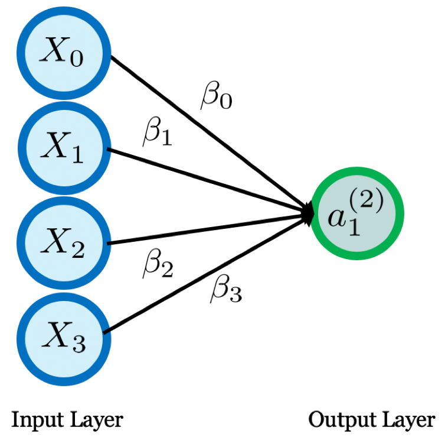
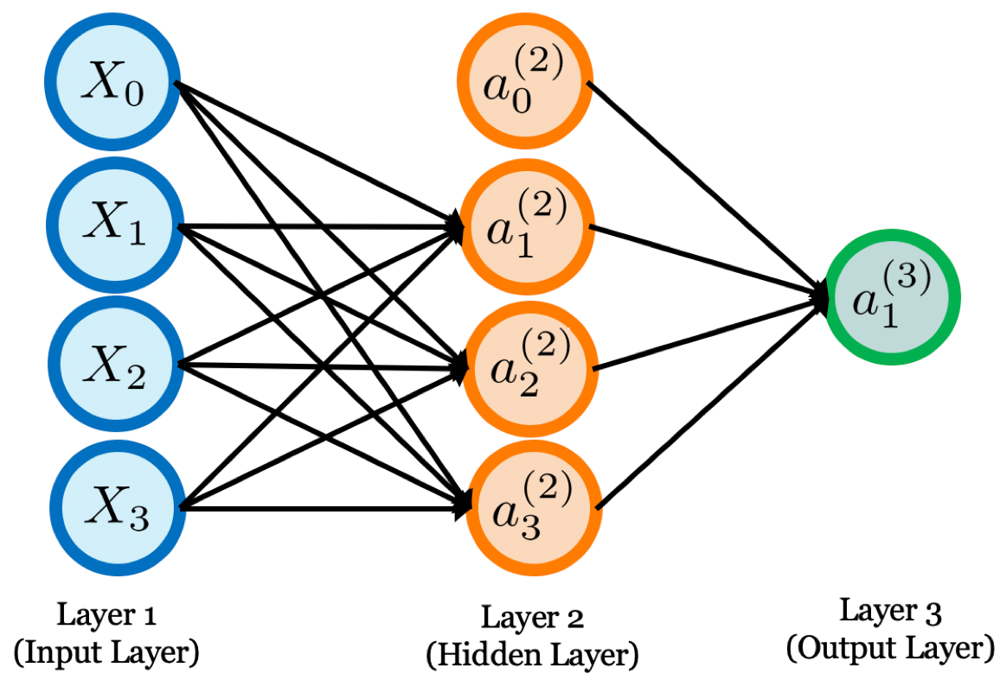
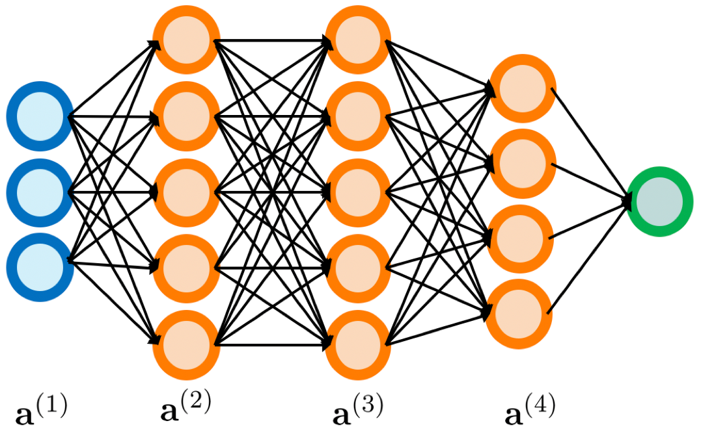
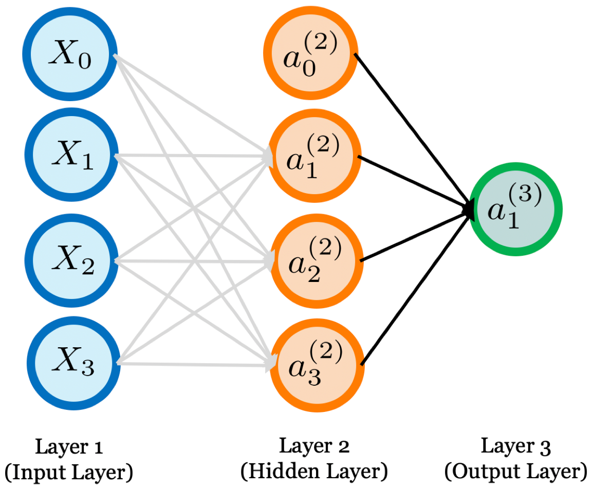

# Neural Networks {#NN}

Machine learning methods are attractive in epidemiological modeling and projection with their great flexibility to capture disease spread patterns. In this chapter, we describe a popular machine learning method for epi-forecasting called neural networks.

Artificial Neural Network is computing system inspired by biological neural network that constitute animal brain. Such systems “learn” to perform tasks by considering examples, generally without being programmed with any task-specific rules.

## A Single Neuron

The basic unit of computation in a neural network is the neuron, often called a node or unit. It receives input from some other nodes, or from an external source and computes an output. Each input has an associated weight ($w$), which is assigned on the basis of its relative importance to other inputs. The node applies a function $f$ (defined below) to the weighted sum of its inputs as shown in Figure \@ref(fig:NN1) below:
  
```{r NN1, out.width = "40%", echo=FALSE, fig.align = "center", fig.cap="An illustration of a single neuron."}

```

The above network takes numerical inputs $X_0,X_1,X_2,X_3$ and has weights $\beta_0,\beta_1,\beta_2,\beta_3$ associated with those inputs. The output $a_1^{(2)}$ from the neuron shown in the Figure \@ref(fig:NN1) is computed using $g(\sum_{k=0}^{3}\beta_kX_k)$, where $g(\cdot)$ is non-linear and is called the **Activation Function**. The purpose of the activation function is to introduce non-linearity into the output of a neuron. This is important because most real world data is non linear and we want neurons to learn these non linear representations.

Every activation function (or non-linearity) takes a single number and performs a certain fixed mathematical operation on it. There are several activation functions you may encounter in practice:
  
**Sigmoid:** takes a real-valued input and squashes it to range between 0 and 1
\[
  g(x) = 1 / (1 + \exp(-x))
\]

**tanh:** takes a real-valued input and squashes it to the range $[-1, 1]$
\[
  \tanh(x) = 2g(2x) - 1
\]

**ReLU (Rectified Linear Unit):** it takes a real-valued input and thresholds it at zero (replaces negative values with zero)
\[
  f(x) = \max(0, x)
\]

Figure \@ref(fig:active) show each of the above activation functions.

```{r active, out.width = "30%", echo=FALSE, fig.align = "center", fig.show='hold', fig.cap="An illustration of activation functions."}
knitr::include_graphics(c("figures/sigmoid.pdf", "figures/tanh.pdf", "figures/relu.pdf"))
```

As the number of training data for each country is limited, we use a single-layer neural network called the extreme learning machine (ELM) to avoid over-fitting. Due to the non-stationary nature of the time-series, a sliding window approach is used to provide a more accurate prediction.

## Neural Network Structure

Figure \@ref(fig:NN2) shows a neural network constructed from 3 type of layers:

**Input Layer:** The Input layer has four nodes. The other two nodes take $X_1$, $X_2$ and $X_3$ as external inputs (which are numerical values depending upon the input dataset). As discussed above, no computation is performed in the input layer, so the outputs from nodes in the Input layer are $X_0$, $X_1$, $X_2$ and $X_3$ respectively, which are fed into the Hidden Layer.

**Hidden Layer:** The Hidden layer also has four nodes with the bias node $a_0^{(2)}$. The output of the other two nodes in the Hidden layer depends on the outputs from the Input layer $(X_0, X_1, X_2, X_3)$ as well as the weights associated with the connections (edges). Figure 4 shows the output calculation for one of the hidden nodes (highlighted). Similarly, the output from other hidden node can be calculated. Remember that $g$ refers to the activation function. These outputs are then fed to the nodes in the Output layer.

**Output Layer:** The Output layer has one nodes which takes inputs from the Hidden layer and perform similar computations as shown for the highlighted hidden node. The value calculated $a_1^{(3)}$ as a result of these computations act as the output.

```{r NN2, out.width = "50%", echo=FALSE, fig.align = "center", fig.cap="A neural network with one hidden layer."}

```
```{r NN2coef, out.width = "50%", echo=FALSE, fig.align = "center", fig.cap="A neural network with one hidden layer."}

```

As shown in Figure \@ref(fig:NN2coef), let $a^{(2)}_i$ be the activation of unit $k$ in the hidden layer. For the hidden neuron $i$, we have
\[
\alpha_i^{(2)}=g\left(\sum_{j=0}^3\beta_{j,i}^{(1)}X_j\right),
\]
and for the output neuron, we have
\[
\alpha_1^{(3)}=g\left(\sum_{j=0}^3\beta_{j,1}^{(2)}\alpha_{j}^{(2)}\right).
\]

Let's make it more general. Let $a^{(j)}_i$ be the activation of unit $i$ in layer $j$, and let $\boldsymbol{\beta}^{(j)}$ be a weight matrix which stores parameters from layer $j$ to layer $j+1$. If network has $s_j$ units in layer $j$ and $s_{j+1}$ units in layer $j+1$, then $\boldsymbol{\beta}^{(j)}$ has dimension $s_{j+1} \times (s_j+1)$. Next, we denote
\[
\mathbf{X}= \begin{bmatrix}
X_0 \\ 
X_1 \\
X_2 \\ 
X_3 \\ 
\end{bmatrix},~
\mathbf{A}= \begin{bmatrix}
a_0^{(2)} \\ 
a_1^{(2)} \\
a_2^{(2)} \\ 
a_3^{(2)} \\ 
\end{bmatrix},
\]

The neural network model has unknown parameters (weights), and we seek values for them that make the model fit the training data well. For regression, we use sum-of-squared errors as our measure of fit (error function). Thus, our objective function is
\[
\ell(\boldsymbol{\beta}^{(1)}, \ldots, \boldsymbol{\beta}^{(L)})= \sum_{i=1}^{N}(Y_i - \widehat{Y}_i)^2.
\]

Typically we don’t want the global minimizer of $\ell(\cdot)$, as this is likely to be an overfit solution. Instead some regularization is needed: this is achieved directly through a penalty term, or indirectly by early stopping. 

The generic approach to minimizing $\ell(\cdot)$ is by gradient descent, called **back-propagation**; see details below. Because of the compositional form of the model, the gradient can be easily derived using the chain rule for differentiation. This can be computed by a forward and backward sweep over the network, keeping track only of quantities local to each unit.

For any $j$, a gradient descent update at the $j$th iteration has the form
\[
\boldsymbol{\beta}^{(j)} \leftarrow \boldsymbol{\beta}^{(j)} - \alpha \nabla_{\boldsymbol{\beta}^{(j)}} \ell(\boldsymbol{\beta}^{(1)}, \ldots, \boldsymbol{\beta}^{(L)}),
\]
where $\nabla_{\boldsymbol{\beta}^{(j)}} \ell(\boldsymbol{\beta}^{(1)}, \ldots, \boldsymbol{\beta}^{(L)})$ is the partial derivative of $\ell(\boldsymbol{\beta}^{(1)}, \ldots, \boldsymbol{\beta}^{(L)})$ w.r.t $\boldsymbol{\beta}^{(j)}$, and $\alpha$ is the learning rate. When $\alpha$ is too big, gradient descent may jump across the valley and end up on the other side. This will lead to the error function diverge. When $\alpha$ is too small, it will take the algorithm long time to converge. Therefore, we need to have a proper learning rate before starting the gradient descent.

### Forward propagation

```{r NN3, out.width = "60%", echo=FALSE, fig.align = "center", fig.cap="A neural network with three hidden layer."}

```

We start with one single observation point $(Y_i, \mathbf{X}_i)$. As shown in Figure \@ref(fig:NN3), we can use the following equations to form network’s forward propagation. 

\begin{eqnarray*}
\mathbf{a}^{(1)} &=& \mathbf{X}_i,\\
\mathbf{z}^{(2)} &=& \boldsymbol{\beta}^{(1)\top}\mathbf{a}^{(1)},\\
\mathbf{a}^{(2)} &=& g(\mathbf{z}^{(2)}), ~(\mathrm{add~} a^{(2)}_0),\\
\mathbf{z}^{(3)} &=& \boldsymbol{\beta}^{(2)\top}\mathbf{a}^{(2)},\\
\mathbf{a}^{(3)} &=& g(\mathbf{z}^{(3)}), ~(\mathrm{add~} a^{(3)}_0),\\
\mathbf{z}^{(4)} &=& \boldsymbol{\beta}^{(3)\top}\mathbf{a}^{(3)},\\
\mathbf{a}^{(4)} &=& g(\mathbf{z}^{(4)}).
\end{eqnarray*}

The final step in a forward pass is to evaluate the predicted output $\hat{Y}_i$ against an observed output $Y_i$. Evaluation between $\hat{Y}_i$ and $Y_i$ happens through an error  function, which can be the mean squared error in the regression case.

### Back-propagation

Back-propagation is an efficient method for computing gradients needed to perform gradient-based optimization of the weights in a multi-layer network.

**Backpropagation: top layer**

```{r back1, out.width = "50%", echo=FALSE, fig.align = "center", fig.cap="A neural network with one hidden layer."}

```

To minize the error function $\ell$, we want to find partial derivatives:
\[
\frac{\partial \ell}{\partial \beta_{01}^{(2)}}, \ldots, \frac{\partial \ell}{\partial \beta_{31}^{(2)}},
\]
and we can show, for example, 
\begin{align*}
\frac{\partial \ell}{\partial \beta_{01}^{(2)}} & = \frac{\partial \ell}{\partial a_1^{(3)}}
\frac{\partial a_1^{(3)}}{\partial z_1^{(3)}} \frac{\partial z_1^{(3)}}{\partial \beta_{01}^{(2)}}\\
& = 2(Y-a_1^{(3)})g'_0(z_1^{(3)})a_0^{(2)},
\end{align*}
where $g'_0$ is the derivative of the activation function $g$ in the output layer.

Then, we update $\beta_{0,1}^{(2)}$ by 
\[
\beta_{0,1}^{(2)} = \beta_{0,1}^{(2)} - \alpha \frac{\partial \ell}{\partial \beta_{0,1}^{(2)}}.
\]

**Backpropagation: next layer**

```{r back2, out.width = "50%", echo=FALSE, fig.align = "center", fig.cap="a neural network with one hidden layer."}
knitr::include_graphics("figures/back2.png")
```

Next, we want to find the following partial derivatives:
\[
\frac{\partial \ell}{\partial \beta_{0,1}^{(1)}}, \cdots, \frac{\partial \ell}{\partial \beta_{0,3}^{(1)}},
\]
and for example, we have 
\begin{align*}
\frac{\partial \ell}{\partial \beta_{01}^{(2)}} & = \frac{\partial \ell}{\partial a_1^{(3)}}
\frac{\partial a_1^{(3)}}{\partial z_1^{(3)}} \frac{\partial z_1^{(3)}}{\partial \partial a_1^{(2)}} \frac{\partial a_1^{(2)}}{\partial z_1^{(2)}} \frac{\partial z_1^{(2)}}{\partial \beta_{01}^{(2)}}\\
& = 2(Y-a_1^{(3)})g'_0(z_1^{(3)}) \beta^{(2)}_{11} g'_1(z_1^{(2)}) X_0,
\end{align*}
where $g'_0$ is the derivative of the activation function in the output layer and $g'_1$ is the derivative fo the activation function in Layer 2.

Then, we update $\beta_{01}^{(1)}$ by
\[
\beta_{0,1}^{(1)} = \beta_{0,1}^{(1)} - \alpha \frac{\partial \ell}{\partial \beta_{0,1}^{(1)}}.
\]

Initial values of the weights and biases $\boldsymbol{\beta}$ are randomly chosen.  Derivative of $\ell$ can be calculated using the partial derivatives described above. Termination condition is met once the error function is minimized.

**Back Propagation: Jacobian Matrix**

The Jacobian matrix of a vector-valued function in several variables is the matrix of all its first-order partial derivatives. Suppose $\boldsymbol{f}: R^{n} \to R^{m}$, the Jacobian matrix of function $\boldsymbol{f}$ is
\[
\boldsymbol{J} = \frac{\partial \boldsymbol{f}}{\partial \boldsymbol{x}}
 = \begin{bmatrix}
\frac{\partial f_1}{\partial x_1}  & \ldots  &  \frac{\partial f_1}{\partial x_n} \\
\vdots  & \ddots & \vdots \\
\frac{\partial f_m}{\partial x_1}  & \ldots  &  \frac{\partial f_m}{\partial x_n} 
\end{bmatrix}.
\]

We have the following chain rule:
\[
\frac{\partial \boldsymbol{f}\{{\boldsymbol{g}(\boldsymbol{x})\}}}{\partial \boldsymbol{x}} = \frac{\partial \boldsymbol{f}\{{\boldsymbol{g}(\boldsymbol{x})\}}}{\partial \boldsymbol{g}(\boldsymbol{x})}  \times 
\frac{\boldsymbol{g}(\boldsymbol{x}) }{\partial \boldsymbol{x}}. 
\]


## Overfitting

Often neural networks have too many weights and will overfit the data, so we add a penalty to the error function: 
\[
\sum_{j = 1}^{L} \|\boldsymbol{\beta}^{(j)}\|_F,~\|\boldsymbol{\beta}^{(j)}\|_F= \sum_{k=1}^{s_j} \sum_{k=1}^{s_{j+1}}(\beta^{(j)}_{k,k'})^2,
\]
where $\|\boldsymbol{\beta}^{(j)}\|_F$ is the Frobenius norm of matrix $\boldsymbol{\beta}^{(j)}$.

We minimize the following objective function
\[
\ell(\boldsymbol{\beta}^{(1)}, \ldots, \boldsymbol{\beta}^{(L)}) + \lambda \sum_{j = 1}^{L} \|\boldsymbol{\beta}^{(j)}\|_F,
\]
where $\|\cdot\|_F$ denotes the Frobenius norm.


## Neural Network Auto-Regressive (NNAR) models

Lagged values of the time series can be used as inputs to a neural network. In this section, we only consider feed-forward networks with one hidden layer, and we use the notation NNAR$(p,k)$ to indicate there are $p$ lagged inputs and $k$ nodes in the hidden layer. For example, a NNAR(9,5) model is a neural network with the last nine observations $(y_{t-1}, y_{t-2}, \ldots, y_{t-9})$ used as inputs for forecasting the output $y_t$, and with five neurons in the hidden layer. 

NNAR$(p,0)$ model is equivalent to an ARIMA$(p,0,0)$ model but without stationarity restrictions, but without the restrictions on the parameters to ensure stationarity.

For seasonal data, we can consider seasonal NNAR$(p,P,k)$, which use inputs $(Y_{t-1},Y_{t-2},\ldots, Y_{t-p}, Y_{t-m}, Y_{t-2m},\ldots, Y_{t-Pm})$ and $k$ neurons in the hidden layer. For example, an NNAR$(3,1,2)_{7}$ model has inputs $(Y_{t-1},Y_{t-2}, Y_{t-3}, Y_{t-7})$, and two neurons in the hidden layer. An NNAR$(p,P,0)_m$ model is equivalent to an ARIMA$(p,0,0)(P,0,0)_m$ model but without stationarity restrictions.

**NNAR models in R**

The `nnetar()` function fits an NNAR$(p,P,k)_m$ model. If $p$ and $P$ are not specified, they are automatically selected. For non-seasonal time series, default $p =$ optimal number of lags (according to the AIC) for a linear AR$(p)$ model. For seasonal time series, defaults are $P = 1$ and $P$ is chosen from the optimal linear model fitted to the seasonally adjusted data. Default $k = (p + P + 1)=2$ (rounded to the nearest integer).

When it comes to forecasting, the network is applied iteratively. For forecasting one step ahead, we simply use the available historical inputs. For forecasting two steps ahead, we use the one-step forecast as an input, along with the historical data. This process proceeds until we have computed all the required forecasts.

## COVID-19 Forecasting

The number of cases, we define $x_n = (y_{n-w+1}, ..., y_{n-1}, y_n)^{\top}\in R^{w}$ and $t_n = y_{n+h}\in R$. We use cross-validation to find the proper window size $w$, number of hidden neurons $L$, and the regularization hyperparameter $\lambda$.

The `nnetar` function in the `forecast` package for R fits a feed-forward neural networks model with a single hidden layer and lagged inputs for forecasting univariate time series. It uses lagged values of the time series as inputs (and possibly some other exogenous inputs). 

To use the `forecast` package, it is better to store the time series as a `ts` object in R. Let us consider the time series of daily new death counts for Florida, and we first turn this into a `ts` object using the `ts` function. There is a “frequency” argument in the `ts()` function, which needs to be set appropriately for your data. Here the “frequency” is the number of observations per “cycle”. For annual data,	frequency $=1$; for quarterly data, frequency $=4$; for monthly data,	frequency $=12$, and for weekly data, frequency $=52$. If the frequency of observations is greater than once per week, then there is usually more than one way of handling the frequency. For example, data with daily observations might have a weekly seasonality (frequency $=7$) or an annual seasonality (frequency $=365.25$). Read [Seasonal periods][https://robjhyndman.com/hyndsight/seasonal-periods/] for explanation how to set the frequency for seasonal period in `ts` objects. Since we have observed the 7-day cycle for this data, we can simply add a `frequency = 7` argument. 

```{r, collapse=TRUE, message=FALSE, warning=FALSE}
library(tidyverse)
library(slid)
data(state.ts)

Florida.ts <- state.ts %>%
    dplyr::filter(State == "Florida")  

y <- ts(Florida.ts$Y.Death, start = c(2020,1), frequency = 7)
```

Simply applying the default `nnetar()` function, we obtain feed-forward neural networks model NNAR$(21,1,11)_7$. It is based on an average of 20 networks, each of which is NNAR$(21,1,11)_7$ with 254 weights.

```{r, warning=FALSE, message=FALSE}
library(forecast)
set.seed(2020)
fit <- nnetar(y)
fit
```

```{r nnetar1, warning=FALSE, message=FALSE, fig.height=3, fig.width=7, fig.align = "center", fig.cap="Two weeks ahead forecast of the daily new death count for Florida using nnetar."}
nnar.fc.report <- as.data.frame(forecast(fit, h = 14)) %>%
  mutate(DATE = as.Date("2020-12-11") + 1:14)
names(nnar.fc.report) <- c("Y.Death", "DATE")

# plot of reported vs NNAR predictions
ggplot() +
  geom_line(aes(x = DATE, y = Y.Death, color = "Reported"), 
            data = Florida.ts) +
  geom_line(aes(x = DATE, y = Y.Death, color = "NNAR"), 
            data = nnar.fc.report) +
  scale_color_manual(
    values = c(Reported = "black", NNAR = "red")
  ) +
  labs(y = "Death count",
       title = "Reported vs NNAR(21,1,11)[7] predictions") +
  guides(color = guide_legend(title = "Series"))
```

We can also specify the `repeats` and `size` options in the `nnetar` function.

* The `repeats` option of `nnetar` shows the number of networks (`default = 20`) to fit with different random starting weights. These networks are then averaged when producing forecasts.

* The `size` option provides number of nodes in the hidden layer. Default is half of the number of input nodes (including external regressors, if given) plus 1.

We can consider a Box-Cox transformation for the data. For example, if we want to restrict to positive values, we can consider a Box-Cox transformation parameter `lambda`. 

If `lambda = auto`, then a transformation is automatically selected using `BoxCox.lambda`. The transformation is ignored if `NULL`. Otherwise, data transformed before model is estimated.

```{r, warning=FALSE, message=FALSE}
fit <- nnetar(y + 1, lambda = 0, size = 5)
fit
```

```{r nnetar2, warning=FALSE, message=FALSE, fig.height=3, fig.width=7, fig.align = "center", fig.cap="Two weeks ahead forecast of the daily new death count for Florida using nnetar with predictions constrained to positive values."}
nnar.fc.report <- as.data.frame(forecast(fit, h = 14)) %>%
  mutate(DATE = as.Date("2020-12-11") + 1:14)
names(nnar.fc.report) <- c("Y.Death", "DATE")

# plot of reported vs NNAR predictions
  ggplot() +
  geom_line(aes(x = DATE, y = Y.Death, color = "Reported"), 
            data = Florida.ts) +
  geom_line(aes(x = DATE, y = Y.Death, color = "NNAR"), 
            data = nnar.fc.report) +
  scale_color_manual(
    values = c(Reported = "black", NNAR = "red")
  ) +
  labs(y = "Death count",
       title = "Reported vs NNAR(14,1,5)[7] predictions") +
  guides(color = guide_legend(title = "Series"))
```

Note that the NNAR model is a nonlinear autogressive model, and it is not possible to analytically derive prediction intervals. Below we use the simulation method to generate simulated paths.

```{r, warning=FALSE, message=FALSE}
fcast <- forecast(fit, PI = TRUE, h = 14, npaths = 500)
```

```{r nnetar3, warning=FALSE, message=FALSE, fig.height=3, fig.width=7, fig.align = "center", fig.cap="Two weeks ahead forecast and prediction intervals of the daily new death count for Florida using nnetar with predictions constrained to positive values."}
#autoplot(fcast, xlab = "Days", ylab = "Daily new deaths")
fcast.report <- as.data.frame(fcast) %>%
  mutate(DATE = as.Date("2020-12-11") + 1:14)
names(fcast.report) <- c("Y.Death", "Lo.80", "Hi.80", 
                         "Lo.95", "Hi.95", "DATE") 

ggplot(Florida.ts, aes(DATE, Y.Death)) + 
  geom_line() + 
  labs(x = "Days", y = "Death Count") + 
  # Add prediction intervals
  geom_ribbon(mapping = aes(x = DATE, 
                            y = Y.Death, 
                            ymin = Lo.95, 
                            ymax = Hi.95,
                            fill = '95% Prediction intervals'), 
              data = fcast.report, alpha = 0.4) +
  # Add line for predicted values
  geom_line(mapping = aes(x = DATE, 
                          y = Y.Death,
                          colour = 'Predicted values'),
            linetype = "dashed", data = fcast.report,
            # Set the line type in legend
            key_glyph = "timeseries") + 
  scale_colour_manual("", values = "red") +
  scale_fill_manual("", values = "pink") + 
  theme(legend.position = "bottom")
```

Because it is a little slow, `PI = FALSE` is the default, so prediction intervals are not computed unless requested. The `npaths` argument in `forecast.nnetar` controls how many simulations are done (default 1000). By default, the errors are drawn from a normal distribution. The bootstrap argument allows the errors to be “bootstrapped” (i.e., randomly drawn from the historical errors).

## Exercises

1. Based on the input values and weights given in Figure \@ref(fig:NNE1), find the values of $a_1^{(2)}$, $a_2^{(2)}$ and $a_1^{(3)}$. Use the sigmoid activation function. 

```{r NNE1, out.width = "60%", echo=FALSE, fig.align = "center", fig.cap="An example of neural network with one hidden layer."}

```

2. From `state.long` in the R package `slid`, choose a state and focus on the daily new death count. 

  a. Apply the `nnetar` to your time series diectly, and report the fitted model.
  
  b. Based on the model in Part a, make a 7-day ahead forecast, and provide the 95% prediction intervals. 
  
  c. Apply the `nnetar` to the log-transformed time series, and repart the fitted model.
  
  d. Based on the model in Part c, make a 7-day ahead forecast, and provide the 95% prediction intervals.
