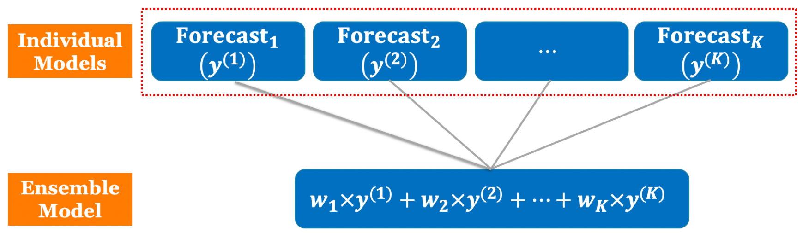

# Hybrid Mdels {#ensemble}

In the previous chapters, we introduced some time series models, an autoregressive model (ARIMA), an exponential smoothing state space model (ETS), a neural network autoregression model (NNAR). Hybrid modeling often refers to the approaches where part of a model is formulated on the basis of mechanistic principles and part of the model has to be inferred from data because of a lack of understanding of the mechanistic details. 

Hybrid models are identified by using the `hybridModel` function included in the package [forecastHybrid](https://cran.r-project.org/web/packages/forecastHybrid/forecastHybrid.pdf) (in R environment).

**Installation**

The stable release of the package is hosted on CRAN and can be installed as usual.

```{r, collapse=TRUE, message=FALSE, warning=FALSE}
# install.packages("forecastHybrid")
# Load the package
library(forecastHybrid)
```

## Ensembling Time Series Models

Hybrid method widely used in forecasting is the ensemble method, which combines multiple forecasting algorithms to improve predictive performance. Ensemble forecasting can overcome accuracy of simple prediction and to avoid possible overfit. The idea is that, when there is much uncertainty in finding the best model as is the case in many applications, combining may reduce the instability of the forecast and therefore improve prediction accuracy.

In a linear combination technique as illustrated in Figure \@ref(fig:ensemble), the combined forecast for the associated time series is calculated through a linear function of the individual forecasts from the contributing models. 

```{r ensemble, out.width = "75%", echo=FALSE, fig.align = "center", fig.cap="An illustration of ensemble methods."}

```

Let, $\{y_1, y_2, \ldots, y_n\}$ be the actual time series, which is to be forecasted using $K$ different models and $\{\hat{y}_{n+1}^{(k)}, \hat{y}_{n+2}^{(k)}, \ldots, \hat{y}_{h}^{(k)}\}$ be its forecast obtained from the $k$th model ($k=1, 2,\ldots, K$). Then, a linear combination of these $K$ forecasted series of the original time series produces
$\{\hat{y}_{n+1}^{*}, \hat{y}_{n+2}^{*}, \ldots, \hat{y}_{h}^{*}\}$, where
\[
\hat{y}_{n+j}^{*}=f\left(\hat{y}_{n+j}^{(1)},\ldots,\hat{y}_{n+j}^{(K)}\right)
\]
for $j=1,2,\ldots,h$. If $f$ is some linear function, then we have
\[
\hat{y}_{n+j}^{*}=w_1\hat{y}_{n+j}^{(1)}+w_2\hat{y}_{n+j}^{(2)}+\cdots+w_K\hat{y}_{n+j}^{(K)}
=\sum_{k=1}^{K}w_k\hat{y}_{n+j}^{(k)}, 
\]
for $j=1,2,\ldots,h$. Here, $w_k$ is the weight assigned to the $k$th forecasting method. To ensure unbiasedness, it is often assumed that the weights add up to unity. Some widely used linear combination techniques are briefly described below: 

* In the simple average, all models are assigned equal weights, i.e., $w_k=1⁄K$, for $k=1, 2,\ldots, K$.
* In the trimmed average, individual forecasts are combined by a simple arithmetic mean, excluding the worst performing $\alpha$% of the models. A trimming of 10% ~ 30% is usually recommended.
* In the Winsorized average, the $m$ smallest and $m$ largest forecasts are selected and respectively set as the $(m+1)$th smallest and $(m+1)$th largest forecasts.
* In the median-based combining, the combination function $f$ is the median of the individual forecasts. Median is sometimes preferred over simple average as it is less sensitive to extreme values.
* In the error-based combining, the weight to each model is assigned to be the inverse of the past forecast error (e.g. MSE, MAE, MAPE, etc.) of the corresponding model.

The `hybridModel` function in the “forecastHybrid” R package ensembles forecasts in R combining approaches from the 'forecast' package. Forecasts generated from the following models:

* `auto.arima()`: the best ARIMA model according to either AIC, AICc or BIC value;
* `ets()`: exponential smoothing state space model;
* `stlm()`: applies an STL decomposition, and models the seasonally adjusted data using the model passed as modelfunction or specified using method; 
* `nnetar()`: feed-forward neural networks with a single hidden layer and lagged inputs;
* `tbats()`: TBATS model (exponential smoothing state space model with Box-Cox transformation, ARMA errors, trend and seasonal components) proposed by @de2011forecasting;
* `thetaf()`: the theta method proposed by @assimakopoulos2000theta, which is equivalent to simple exponential smoothing with drift.
* `snaive()`: Seasonal naive method (random walk method)

These models can be combined with equal weights, weights based on in-sample errors introduced by @bates1969combination or cross-validated weights. Cross validation for time series data with user-supplied models and forecasting functions is also supported to evaluate model accuracy.

We consider the daily new death count for Forida. To use the “forecastHybrid” package, it is better to store the time series as a “ts” object in R. Let us consider the time series of daily new death counts for Florida, and we first turn this into a “ts” object using the `ts()` function. Since we have observed the 7-day cycle for this data, we can simply add a `frequency = 7` argument. Read [Seasonal periods][https://robjhyndman.com/hyndsight/seasonal-periods/] for explanation how to set the frequency for seasonal period in `ts` objects.

```{r, collapse=TRUE, message=FALSE, warning=FALSE}
library(tidyverse)
library(slid)
data(state.ts)

Florida.ts <- state.ts %>%
    dplyr::filter(State == "Florida")  

y <- ts(Florida.ts$Y.Death, start = c(2020,1), frequency = 7)
```

Using the default setting, we simply apply the `hybridModel()` function, and obtain the combined forecast from `auto.arima`, `ets`, `thetam`, `nnetar`, `stlm`, and `tbats` model. 

```{r, warning=FALSE, message=FALSE}
hmod <- hybridModel(y)
hmod.fc <- forecast(hmod, h = 14)
```

```{r hmod1, warning=FALSE, message=FALSE, fig.height=4, fig.width=7, fig.align = "center", fig.cap="Forecast from auto.arima, ets, thetam, nnetar, stlm, and tbats model."}
# autoplot(forecast(hmod), xlab = "Days", ylab = "Daily new deaths",
#     main = "Ensembled forecast from different models")
hmod.fc.report <- as.data.frame(hmod.fc) %>%
  mutate(DATE = as.Date("2020-12-11") + 1:14)
names(hmod.fc.report) <- c("Y.Death", "Lo.80", "Hi.80", 
                           "Lo.95", "Hi.95", "DATE")
ggplot(Florida.ts, aes(DATE, Y.Death)) + 
  geom_line() + 
  labs(x = "Days", y = "Death Count") + 
  # Add prediction intervals
  geom_ribbon(mapping = aes(x = DATE, 
                            y = Y.Death, 
                            ymin = Lo.95, 
                            ymax = Hi.95,
                            fill = '95% Prediction intervals'), 
              data = hmod.fc.report, alpha = 0.4) +
  # Add line for predicted values
  geom_line(mapping = aes(x = DATE, 
                          y = Y.Death,
                          colour = 'Predicted values'),
            linetype = "dashed", data = hmod.fc.report,
            # Set the line type in legend
            key_glyph = "timeseries") + 
  scale_colour_manual("", values = "red") +
  scale_fill_manual("", values = "pink") + 
  theme(legend.position = "bottom")
```

The individual component models are stored inside the `hybridModel` objects and be can viewed in their respective slots, and all the regular methods from the `forecast` package could be applied to these individual component models.

```{r warning=FALSE, message=FALSE}
#Examine the individual models 
hmod$auto.arima
arima.fc <- forecast(hmod$auto.arima)
# See forecasts from the auto.arima model
# plot(arima.fc, xlab = "Days", ylab = "Daily new deaths")
```


```{r hmod2, warning=FALSE, message=FALSE, fig.height=4, fig.width=7, fig.align = "center", fig.cap="Forecast from auto.arima model."}
arima.fc.report <- as.data.frame(arima.fc) %>%
  mutate(DATE = as.Date("2020-12-11") + 1:14)
names(arima.fc.report) <- c("Y.Death", "Lo.80", "Hi.80", 
                           "Lo.95", "Hi.95", "DATE")
ggplot(Florida.ts, aes(DATE, Y.Death)) +
  geom_line() +
  labs(x = "Days", y = "Death Count") +
  # Add prediction intervals
  geom_ribbon(mapping = aes(x = DATE,
                            y = Y.Death,
                            ymin = Lo.95,
                            ymax = Hi.95,
                            fill = '95% Prediction intervals'),
              data = arima.fc.report, alpha = 0.4) +
  # Add line for predicted values
  geom_line(mapping = aes(x = DATE,
                          y = Y.Death,
                          colour = 'Predicted values'),
            linetype = "dashed", data = arima.fc.report,
            key_glyph = "timeseries") +
  scale_colour_manual("", values = "red") +
  scale_fill_manual("", values = "pink") +
  theme(legend.position = "bottom")
```

## Model Diagnostics

The `hybridModel()` function produces an S3 object of class forecastHybrid.

The `print()` and `summary()` methods print information about the ensemble model including the weights assigned to each individual component model.

```{r, collapse=TRUE, message=FALSE, warning=FALSE}
print(hmod) 
summary(hmod)
```

Two types of plots can be created for the created ensemble model: either a plot showing the actual and fitted value of each component model on the data or individual plots of the component models as created by their regular S3 `plot()` methods. 

```{r hmod3, warning=FALSE, message=FALSE, fig.height=5, fig.width=7, fig.align = "center", fig.cap="Actual and fitted value of each component model."}
plot(hmod, type = "fit")
```

```{r, warning=FALSE, message=FALSE}
plot(hmod, type = "models")
```

## Forecasting

Now's let's forecast future values. The `forecast()` function produce an S3 class forecast object for the next 14 days from the ensemble model. The prediction intervals are preserved from the individual component models and currently use the most extreme value from an individual model, producing a conservative estimate for the ensemble's performance.

```{r, collapse=TRUE, message=FALSE, warning=FALSE}
hfc <- forecast(hmod, h = 14) 
# View the point forecasts
hfc$mean
# View the upper prediction interval
hfc$upper
# View the lower prediction interval
hfc$lower
```

Now, we plot the forecast for the next 14 days with the prediction intervals. 

```{r hmod5, warning=FALSE, message=FALSE, fig.height=4, fig.width=7, fig.align = "center", fig.cap="Two weeks ahead ensemble forecast from different methods."}
# Plot the forecast
plot(hfc, xlab = "Days", ylab = "Daily new deaths", 
     main = "Ensembled forecast from different methods")
```

After the model is fit, these weights are stored in the weights attribute of the model. The user can view and manipulated these weights after the fit is complete. Note that the `hybridModel()` function automatically scales weights to sum to one, so a user should similar scale the weights to ensure the forecasts remain unbiased. Furthermore, the vector that replaces weights must retain names specifying the component model it corresponds to since weights are not assigned by position but rather by component name. Similarly, individual components may also be replaced.

```{r, collapse=TRUE, message=FALSE, warning=FALSE}
hmod$weights
```

### Perform cross validation on a time series

It can be useful to perform cross validation on a forecasting model to estimate a model's out-of-sample forecasting performance. Cross validation of time series data is more complicated than regular $k$-folds or leave-one-out cross validation of datasets without serial correlation since observations $x_t$ and $x_{t+n}$ are not independent. 

The `cvts()` function overcomes this obstacle using two methods: 1) rolling cross validation where an initial training window is used along with a forecast horizon and the initial window used for training grows by one observation each round until the training window and the forecast horizon capture the entire series; or 2) a non-rolling approach where a fixed training length is used that is shifted forward by the forecast horizon after each iteration.

For example, let's perform cross validation for a `stlm()` model and a `naive()` model on the time series `y`. The most important `cvts()` arguments that commonly need adjusting are `rolling` (if `TRUE`, the model will always be fit on a fixed `windowSize` instead of growing by one new observation for each new model fit during cross validation), `windowSize` (starting length of time series to fit a model), and `maxHorizon` (the forecast horizon for predictions from each model). Since a naive forecast is a good baseline that any decent model should surpass, let's see how the `stlm()` model compares.

```{r, collapse=TRUE, message=FALSE, warning=FALSE}
stlmMod <- cvts(y, FUN = stlm, windowSize = 100, maxHorizon = 7)
naiveMod <- cvts(y, FUN = naive, windowSize = 100, maxHorizon = 7)
accuracy(stlmMod)
accuracy(naiveMod)
```

Note that the above errors are based on each of the forecast horizon. If you are interested in reporting the average errors over all forecast horizons up to maxHorizon instead of producing metrics for each individual horizon, you can specify `horizonAverage=TRUE`.

```{r, collapse=TRUE, message=FALSE, warning=FALSE}
stlmMod.mean <- cvts(y, FUN = stlm, windowSize = 100, 
                maxHorizon = 7, horizonAverage = TRUE)
naiveMod.mean <- cvts(y, FUN = naive, windowSize = 100, 
                 maxHorizon = 7, horizonAverage = TRUE)
accuracy(stlmMod.mean)
accuracy(naiveMod.mean)
```


## Weights Selection Using Cross Validation

Previously we explored fitting `hybridModel()` objects with `weights = "equal"`, but we can now leverage the process conducted in `cvts()` to select the appropriate weights intelligently based on the expected out-of-sample forecast accuracy of each component model. While this is the methodologically-sound weight procedure, it also comes at significant computational cost since the cross validation procedure necessitates fitting each model several times for each cross validation fold in addition to the final fit on the whole dataset. Fortunately this process can be conducted in parallel if multiple cores are available. Some of the arguments explained above in `cvts()` such as `windowSize` and the `cvHorizon` can also be controlled here.

```{r, eval=FALSE, collapse=TRUE, message=FALSE, warning=FALSE}
cvMod <- hybridModel(y, weights = "cv.errors", windowSize = 100,
                     cvHorizon = 8, num.cores = 4)
cvMod
```

## A Project

The coronavirus disease 2019 (COVID-19) pandemic caused by the novel severe acute respiratory syndrome coronavirus 2 (SARS-CoV-2) has placed epidemic modeling at the center of attention of public policymaking. Predicting the severity and speed of transmission of COVID-19 is crucial to resource management and developing strategies to deal with this epidemic. In this project, we focus on the projection of COVID-19. 

In this project, you will work with the `state.long` dataset in the `slid` package, which contains some COVID-19 count information from January 22 to December 11, 2020. 

```{r}
library(slid)
data(state.long)
```

Note that `state.long` is a dataframe with 15,925 rows and 7 columns. Each row of the dataframe stands for one state on a specific date. The columns are `State`, `Region`, `Division`, `pop`, `DATE`, `Infected` and `Death`. 

* `State`: name of a state.
* `Region`: region of a state.
* `Division`: division of a state.
* `pop`: population of a state.
* `DATE`: date that the data is reported.
* `Infected`: the cumulative infected count of a state.
* `Death`: the cumulative death count of a state.

### Projection

You will make a projection of the number of daily new death cases and the cumulative number of death cases for each state in the US. For each state, you will hold out the last two weeks as test data and use all the data except the last two weeks as your training data. Based on the training data, you fit model and make the projection of the number of daily new death cases and the cumulative number of death cases for the last two weeks. 

Recall that, in this course, we learned three main types of epidemic models: (i) mechanistic models, (ii) phenomenological models, and (iii) hybrid models. You can choose some models (with minimum 5 models and maximum 10 models) from what we have discussed in class or those in the `forecastHybrid` R package as individual models to make the forecast, and combining these models to make an ensemble forecast. 

For each state and forecast method, you need to provide point forecast, 80% prediction intervals, and 90% prediction intervals for the last two weeks. Then you aggregate all the state forecasts to obtain the forecast for the US. 

### Visualization

To demonstrate your projection results, you need to develop a shiny app. Through the app, you can (i) select each state and showcase the corresponding time series plot, (ii) select the forecast method, and illustrate your point projection, 80% prediction intervals and 90% prediction intervals. Some app design idea can be found from the following websites:

* https://covid19.stat.iastate.edu/longtermproj.html
* https://viz.covid19forecasthub.org/
