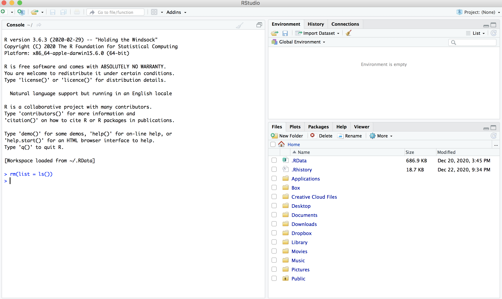
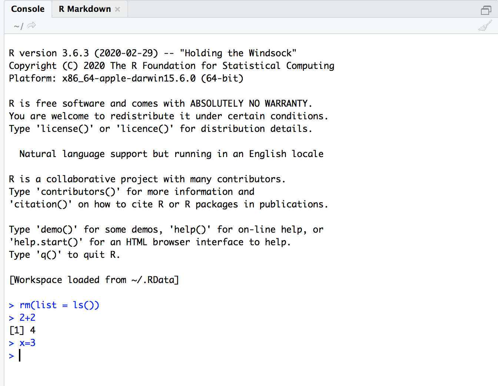
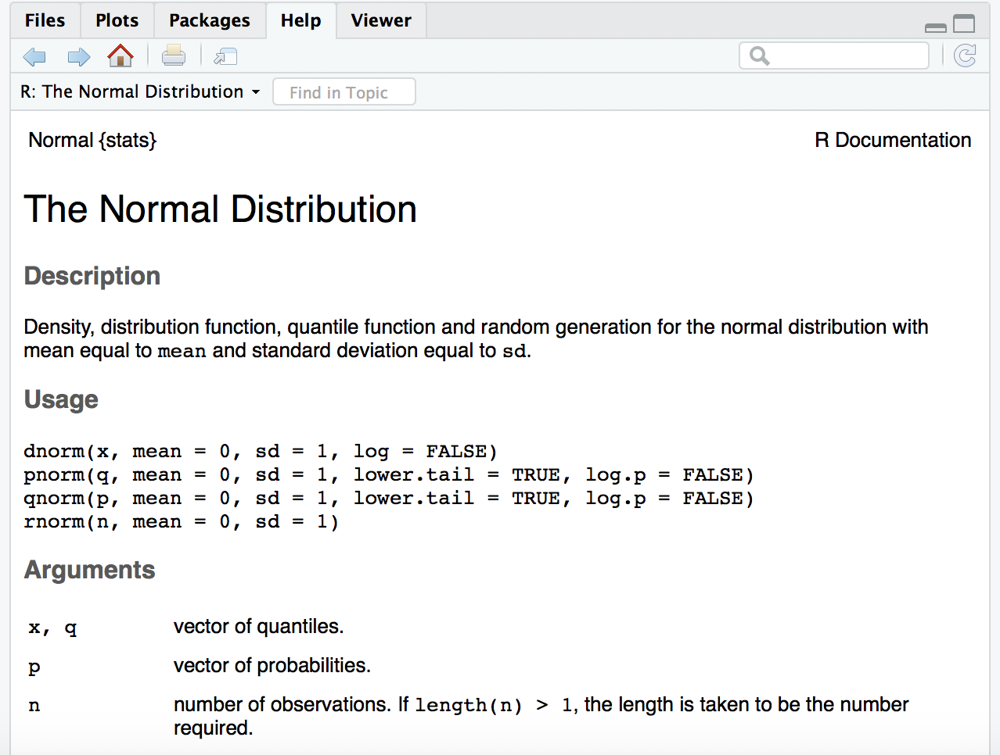
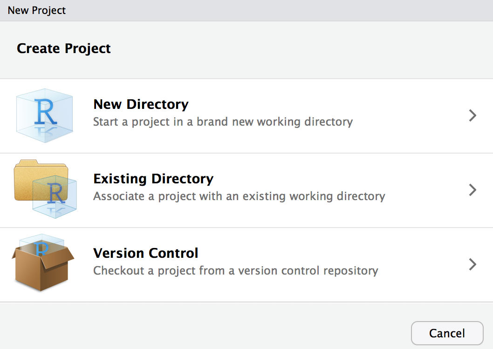
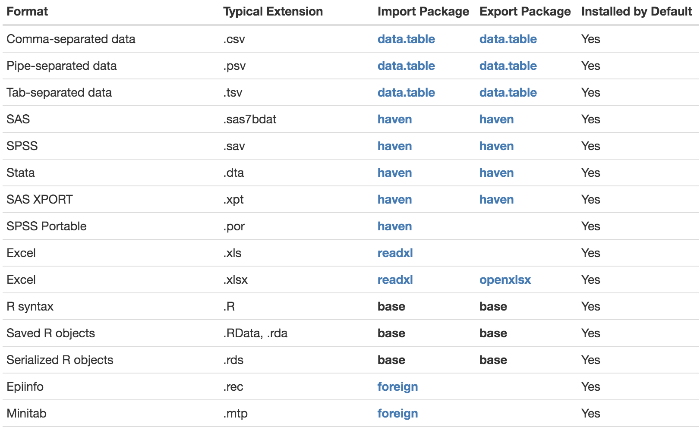

# Appendix A

This Appendix willl introduce you to the basics programming skills in R that are generally unrelated to the use of R as a statistical software such as downloading, reading, manipulating and writing data. 

## R Introduction and Preliminaries

### The R Environment and Language

R is an integrated suite of software facilities for data manipulation, calculation and graphical display. 

**The benefits of R for an introductory student**

*	R is free. R is open-source and runs on UNIX, Windows and Macintosh.
*	R has an excellent built-in help system.
*	R has excellent graphing capabilities.
*	Students can easily migrate to the commercially supported S-Plus program if commercial software is desired.
*	R's language has a powerful, easy to learn syntax with many built-in statistical functions.
*	The language is easy to extend with user-written functions.
*	R is a computer programming language. For programmers it will feel more familiar than others and for new computer users, the next leap to programming will not be so large.

**What is R lacking compared to other software solutions?**

*	There is no commercial support. (Although one can argue the international mailing list is even better)
*	The command language is a programming language so students must learn to appreciate syntax issues etc.

R can be regarded as an implementation of the S language which was developed at Bell Laboratories by Rick Becker, John Chambers and Allan Wilks, and also forms the basis of the S-Plus systems. 

### R and Statistics

Many people use R as a statistics system. We prefer to think of it as an environment within which many classical and modern statistical techniques have been implemented. A few of these are built into the base R environment, but many are supplied as packages. There are about 25 packages supplied with R (called “standard” and “recommended” packages) and many more are available through the CRAN family of Internet sites (via http://CRAN.R-project.org) and elsewhere. More details on packages are given later. 

Most classical statistics and much of the latest methodology is available for use with R, but users may need to be prepared to do a little work to find it.


### Obtaining R and installation

1.	Obtaining R

Sources, binaries, and documentation for R can be obtained via CRAN, the “Comprehensive R Archive Network” whose current members are listed at http://cran.r-project.org/mirrors.html.

2.	Installing R under Windows (via http://CRAN.R-project.org)

  + The `bin/windows` directory of a CRAN site contains binaries for a base distribution and many add-on packages from CRAN to run on Windows 2000 or later on ix86 CPUs (including AMD64/EM64T chips and Windows x64). Your file system must allow long file names (as is likely except perhaps for some network-mounted systems).
  + Installation is straightforward. Just double-click on the icon and follow the instructions. You can uninstall R from the Control Panel or the (optional) R program group on the Start Menu.
  
3.	Installing R under Macintosh (via http://CRAN.R-project.org)

  + Visit the Comprehensive R Archive Network (CRAN) and select a mirror site near you; a list of CRAN mirrors appears at the upper left of the CRAN home page. Click on the link Download R for Mac OS X, which appears near the top of the page; then click on R-X.X.X.pkg (or whatever is the current version of R), which assumes that you are using Mac OS X 10.9 (Mavericks) or higher. You will also find an older version of R if you have an older version of Mac OS X (10.6, Snow Leopard, or higher). Once it is downloaded, double-click on the R installer. You may take all of the defaults.
   
4. Installing RStudio

After you install R, you can install R Studio. Download and install RStudio at https://www.rstudio.com/products/rstudio/download/.

* Scroll down to “Installers for Supported Platforms” near the bottom of the page.
* Click on the download link corresponding to your computer’s operating system.
  
## Starting R

RStudio is most easily used in an interactive manner. After installing R and RStudio on your computer, you’ll have two new programs (also called applications) you can open. We’ll always work in RStudio and not in the R application. Figure \@ref(fig:Ricon) below shows what icon you should be clicking on your computer.

```{r Ricon, out.width = "85%", echo=FALSE, fig.align = "center", fig.cap="Icons of R versus RStudio on your computer."}
knitr::include_graphics("figures/Ricons.png")
```

After you open RStudio, you should see something similar to Figure \@ref(fig:Rconsole1) below.

```{r Rconsole1, out.width = "100%", echo=FALSE, fig.align = "center", fig.cap="RStudio interface to R."}

```

Note the three panels divide the screen: the console panel, the files panel, and the environment panel. Throughout this chapter, you’ll come to learn what purpose each of these panels serves.

* **Console:** This is the place to write any code that needs to be run.

* **Environment:** This lists what variables and objects (referred to in R) are currently available in your working environment. Within the environment window, there are also other tabs such as ‘history’, which shows a history of all code typed in the past. It also has a tab called ‘connection,’ which is meant for connecting to specific databases. This tab is not useful to a beginner.

* **Viewer:** For lack of a better way to refer to the third pane, it is referred to here as ‘viewer.’ However, the third pane has several tabs nested within it. The “files” tab shows all the files and folders in your current directory, which the program points to right next to the home icon below the header for the pane. The “plots” tab shows and allows for the saving of any plot output. The “packages” tab shows all the packages that are currently installed. As you start using R-Studio, you will find the need to install many packages and R-Studio makes it easy to do so.

### Description of three panels in user interface

1. **R Console window** 
   + The **R** Environment contains the software’s libraries with all the available datasets, expansion packages and macros. As compared to SAS, the Log and Editor windows are consolidated into a single interface, the “R Console”.
   
```{r Rconsole2, out.width = "80%", echo=FALSE, fig.align = "center", fig.cap="The R Console."}

```

   Note: The `>` is called the prompt. In what follows below it is not typed, but is used to indicate where you are to type if you follow the examples.
    
   + The Console can be used like a calculator. Below are some examples:
```{r, collapse = TRUE} 
2 + 2
(2 - 3) / 6
2 ^ 2
sin(pi / 2)
log(1)
```
   
   + Results from these calculations can be stored in an object.  The `<-` is used to make the assignment and is read as “gets”.  
   
```{r eval=FALSE} 
save <- 2 + 2
save
```
  
   + The objects are stored in R’s database. When you close R, you will be asked if you would like to save or delete them.  This is kind of like the SAS WORK library, but R gives you a choice to save them. To see a listing of the objects, you can do either of the following: 
   
```{r eval=FALSE} 
ls()
objects()
```
   
   + To delete an object, use `rm()` and insert the object name in the parentheses.
   
```{r eval=FALSE} 
rm(x, y, z, ink, junk, temp, foo, bar)
```
   
   + `rm(list=ls())` cleans out all objects from your work space.
   
   + All objects created during an R session can be stored permanently in a file for use in future R sessions. At the end of each R session, you are given the opportunity to save all the currently available objects. If you indicate that you want to do this, the objects are written to a file called `.RData` in the current directory (“**Save Workspace**”), and the command lines used in the session are saved to a file called `.Rhistory` (“**Save History**”).
   
```{r eval=FALSE} 
save(x, y, z, file = "objects.rdata") 
```

saves objects `x`, `y`, `z` to the file “objects.rdata” in your working directory.

```{r eval=FALSE}
load("objects.rdata") 
```

loads the objects in file “objects.rdata”.

2. **R Editor window** – type your long R program here

   + Often, you will have a long list of commands that you would like to execute all at once, i.e., a program. Instead of typing all of the code line by line at the R Console, you could type it in the R Script Window. Select `File -> New File -> R script` to create a new program. Below is what the editor looks like.
   
   + To run the current line of the code (where the cursor is positioned) or some code highlighted, click “Run”.
   
   + To save your code as a program outside of R, select File -> Save and make sure to use an `.R` extension on the file name. 
   
3. **Error messages**
 
**R** will provide intuitive error messages regarding the submitted syntax. Unlike in SAS these comments are printed right in the console.
```{r eval=FALSE} 
2 + 2
2 +
2 + (3xz
2 + (3 * z)
```
**R** will provide intuitive error messages regarding the submitted syntax. Unlike in SAS these comments are printed right in the console.


### R help

1. To see a listing of all R functions which are “built in”, open the `Help` by selecting Help -> R Help from the main menu bar. Under **Reference**, select the link called **Packages**.  All built-in R functions are stored in a package.

We have been using functions from the `base` and `stats` package.  By selecting `stats`, you can scroll down to find help on the `pnorm()` function. Note the full syntax for `pnorm()` is 

```{r, eval=FALSE} 
pnorm(q, mean = 0, sd = 1, lower.tail = TRUE, log.p = FALSE)
```

The `q` value corresponds to the 1.96 can be found by 

```{r, eval=TRUE, collapse = TRUE} 
pnorm(1.96)
pnorm(q = 1.96)
pnorm(q = 1.96, mean = 0, sd = 1)
```

These produce the same results. The other entries in the function have default values set.  For example, R assumes you want to work with the standard normal distribution by assigning `mean=0` and `sd=1` (standard deviation).  

2. If you know the exact name of the function, simply type `help(function name)` at the R Console command prompt to bring up its help in a window inside of R.  For example, 

```{r, eval=FALSE} 
help(pnorm)
```

brings up Figure \@ref(fig:Rhelp):

```{r Rhelp, out.width = "90%", echo=FALSE, fig.align = "center", fig.cap="The R help for the R function `pnorm()`."}

```

An alternative is
```{r eval=FALSE} 
?pnorm
```

For a feature specified by special characters, the argument must be enclosed in double or single quotes, making it a “character string”: This is also necessary for a few words with syntactic meaning including `if` and `for` functions.

```{r eval=FALSE} 
help("pnorm")
```

3. If you need to use a function but don’t know its exact name or are not sure of its existence. There is a very useful function called apropos(‘argument‘) that lists all functions that contain your argument as part of their names.  Note that your argument must be put within either single or double quotation marks. For example, here is what I got when I looked for similar functions containing the string `table`: 

```{r}
apropos('table')
```

Note that the argument is a string, so it does not need to be an actual word or name of a function.  For example, `apropos('tabl')` will return the same results. Try it!

4. There may be other times when you want to learn about all functions involving a certain term, but searching for R-related pages on that term returns too many irrelevant results.  This term may not even be an R function or command, making the Google search all the more difficult, even with good searching techniques.  In these situations, use the `help.search(‘argument‘)` function.  (Again, you need to put your arguments around single or double quotation marks.)  This will return all functions with your argument in the help page title or as an alias. 

For example, I wanted to know about using PDF files in R. I ran `help.search(‘pdf’)` in R and got the following results.

```{r}
help.search("pdf")
```


### Some mathematical expressions 

Try the following expressions:

```{r eval=FALSE}
-2^.5
-2**.5
-(2^.5)
(-2)^.5
```

The first three will give same result. The last produces `NaN`, not a number. In EXCEL the first produces an error (also in C). It is interpreted just as the 4th expression above. When in doubt, use `( )` to enforce proper order of evaluation.

Next try the following

```{r eval=FALSE}
factorial(5)
```

produces $5! = 1 \cdot 2 \cdot 3 \cdot 4 \cdot 5 = 120$; 

```{r eval=FALSE}
choose(8,4)
```

produces $\binom{8}{4}=70$, and

```{r eval=FALSE}
sqrt(2)
```

gives $\sqrt{2}=1.414214$. 

We will learn more mathematical and statistical expressions in the next few chapters. 


### R Packages

This is a very important topic in R. In SAS and SPSS installations, you usually have everything you have paid for installed at once. R is much more modular. The main installation will install R and a popular set of add‐ons called *libraries*. Hundreds of other libraries are available to install separately from the Comprehensive R Archive Network, (CRAN).

Right under the “viewer” tab, the icon for “setting” allows for changing the working directory or copying and moving files. The tab for “packages,” shows all the packages that are installed and available. Clicking on the checkbox next to the name of the package loads the package for use using the following command, which will appear in the console pane of the interface.

```{r eval=FALSE} 
Library(Package name)
```

Clicking on the name of the package (under the package tab on the lower right pane) itself brings up the description of what the package does. This is one of the benefits of using R-Studio as opposed to R, which makes it easy to look up all the packages available and what each does. Although the description and examples for packages are sometimes not explicit enough, it is nevertheless a useful starting point for many tasks. The viewer pane tab also makes it easy to install and update packages right from the lower right panel of the user interface.

1. If you want to use functions in other packages, you may need to install and then load the package into R. Packages if they have already been downloaded from a CRAN mirror site can be loaded using this procedure. If the package has not been downloaded, it can be installed using the `install.packages(package name)` option. Also, an installed package can be loaded by specifying `library(name of package)`. 

2. For example, we will be using the `ggplot2` package later for data visualization.  
   + While in the R console, select Tools -> Install Packages from the main menu.
   + A number of locations around the world will come up. Insert the `ggplot2` package and select `Install`.  
   + The package will now be installed onto your computer.  This only needs to be done once on your computer. To load the package into your current R session, type `library(ggplot2)` at the R Console prompt. This needs to be done only once in an R session.  If you close R and reopen, you will need to use the `library()` function again.
   + If the package contains example data sets, you can load them with the data command. Enter `data()` to see what is available and then `data(mydata)` to load one named, for example, `mydata`.
   
Clicking on the link to the package name from within the “packages” tab in the viewer pane provides an overview of what the package does. Here it is useful to spend some time understanding how to use a package. Clicking on the link provides details on its documentation. Next to the package is the package title, which states, “Create Elegant Data Visualisations Using the Grammar of Graphics.” Thus, `ggplot2` is a package that makes elegant data visualizations. Clicking on the package link provides an alphabetized list of all that the package does, such as a function called `aes` that helps construct aesthetic mappings. Another function called `borders` helps to create a layer of map borders.

Clicking on the link `aes` provides an explanation for what the function does and the way (syntax) it is used. Understanding the structure of this description helps us understand how to use packages. The description of the function within the package has several parts to it as follows:

**Description**: Aesthetic mappings describe how variables in the data are mapped to visual properties (aesthetics) of `geoms`. Aesthetic mappings can be set in `ggplot()` and in individual layers.

**Usage**: The second aspect of the description of the function refers to its usages.

**Arguments**: The third part of the structure of a function is referred to as arguments. This describes the objects or variables that this function will operate on.

**Example**: Typically, any description of what a function does is accompanied by an example of how to use it. 

Thus, understanding how to install a package, the functions it is capable of, along with the examples its description provides makes R very versatile for the user. In the next chapter, we will learn how to use R and its basic functions.

### Creating a project and setting working directory

Before launching into creating a dataset, it is important to understand how R handles data from a filing and directory perspective. Before creating a dataset, R starts with the creation of a ‘new project.’ A project name is a name given to a folder that will hold everything associated with a specific project such as data, history of commands used, objects (In R, a variable and/or data are stored as “objects”), or variables are created.

Along with creating a new project name, it is important to understand the concept of the working directory as R will look for variables and objects or any other files that are being called in the working directory. A simple way to check on the current working directory is to type the command `getwd()` into the command console. If it is not the intended directory you want to use, the simplest way to change it is by using the “viewer” pane and clicking on the tab that says ‘more.’ Ensuring that your working directory is where you want your files and objects created to be stored is important, especially to a beginner.

You may now create a new project by opening R-Studio, clicking on the `file`, and then ‘new project.’ As shown in Figure \@ref(fig:newproj) that opens asks if you would like to open the project in an existing directory, a new one, or simply version control. The existing directory is the directory that is currently the working directory. You may either choose an existing directory or a new one. However, if you choose a new one, you need to make sure that it is selected as the working directory as shown earlier. You may name your project as ‘Learning R.’

```{r newproj, out.width = "75%", echo=FALSE, fig.align = "center", fig.cap="Interface for creating a project in R."}

```

Once the project is created, you will see a .proj file under the files section in the viewer pane, as shown in Figure \@ref(fig:newprojw). As the figure shows, a new project called ‘Learning R.rproj’ has been created in the directory ~/STAT 480/Learning R. Any work done will now be stored in this directory (by setting it as the working directory) and in this project as long as it is saved when you exit.

```{r newprojw, out.width = "100%", echo=FALSE, fig.align = "center", fig.cap="Directory with new project."}
knitr::include_graphics("figures/newprojw.png")
```

## Export/Import Data

In this section, you’ll learn how to read plain-text rectangular files into R, and how to export data from R to txt, csv, and R data file formats.

First, we need is an idea of where the files are stored with R and how to manipulate those files. Every R session has a default location on your operating system's file structure called the working directory. You need to keep track and deliberately set your working directory in each R session. If you read or write files to disk, this takes place in the working directory. If you don't set the working directory to your desired location, you could easily write files to an undesirable file location.

**Working Directory**

The `getwd()` function tells you what the current working directory is:

```{r, eval=FALSE, collapse = TRUE} 
getwd()
```

To change the working directory, use the `setwd()` function. Be sure to enter the working directory as a character string. This example shows how to change your working directory to a folder called “F:/STAT480/R”:

```{r, eval=FALSE, collapse = TRUE} 
setwd("F:/STAT480/R")
getwd()
```

Note that the separator between folders is “/”, as it is on Linux and Mac systems.
When working in Windows, you need to either use “/” or “\textbackslash\textbackslash”.

### Data Export

**Using function `cat()`**

The function `cat` is useful for producing output in user-defined functions.

```{r eval=TRUE}
cat("Good morning!","\n") #\n: newline
```

```{r eval=TRUE}
cat(file = "test.txt", "123456", "987654", sep = "\n")
```

**Using function `print()`**

The function `print` prints its argument. It is a generic function which means that new printing methods can be easily added for new classes.

```{r eval=TRUE}
print("Good morning!")
```

**Write a matrix or data frame to file**

The commonest task is to write a matrix or data frame to file as a rectangular grid of numbers, possibly with row and column labels. This can be done by the functions `write.table` and `write`.

1. Command to copy and paste from R into Excel or other programs. It writes the data of an R data frame object into the clipboard from where it can be pasted into other applications.

```{r eval=FALSE}
age <- 18:29
height <- c(76.1, 77, 78.1, 78.2, 78.8, 79.7, 79.9, 81.1, 81.2, 
            81.8, 82.8, 83.5)
village <- data.frame(age = age,height = height) 

# Write village into clipboard
write.table(village, "clipboard", sep = "\t", col.names = NA, 
            quote = F) 
```

**Remark:** 	

* The argument quote is a logical value (`TRUE` or `FALSE`) or a numeric vector. If `TRUE`, any character or factor columns will be surrounded by double quotes. If `FALSE`, nothing is quoted. 

* The argument `col.names= NA` makes sure that the titles align with columns when row/index names are exported (default).

2. Write data frame to a tab-delimited text file. 

```{r eval=FALSE}
write.delim(village, file = "village.txt")
# provides same results as read.delim
write.table(village, file = "village.txt", sep = "\t")
```

3. Write data to csv files:  

```{r eval=FALSE}
write.csv(village, file = "village.csv")
```

4.	Write matrix data to a file.

```{r eval=FALSE}
x <- matrix(1, 20, 20)
write(x, file = "file path", ncolumns = 20)
```

Remark: `write.table()` is the multipurpose work-horse function in base R for exporting data. The functions `write.csv()` and `write.delim()` are special cases of `write.table()` in which the defaults have been adjusted for efficiency.

5 `.RData` files

The best way to store objects from R is with `.RData` files. `.RData` files are specific to R and can store as many objects as you’d like within a single file. 

** The `save()` function

```{r eval=FALSE}
age <- 18:29
height <- c(76.1, 77, 78.1, 78.2, 78.8, 79.7, 79.9, 81.1, 81.2, 
            81.8, 82.8, 83.5)
village <- data.frame(age = age, height = height)

# Save the object as a new .RData file
save(village, file = "data/village.rda")
```

To save selected objects into one `.RData` file, use the `save()` function. When you run the `save()` function with specific objects as arguments, (like `save(a, b, c, file = "myobjects.RData")` all of those objects will be saved in a single file called `myobjects.RData`. For example, let’s create a few objects corresponding to a study.

```{r eval=FALSE}
# Create two objects
student.df <- data.frame(id = 1:5, 
                        sex = c("m", "f", "m", "f", "m"), 
                        score = c(90, 80, 97, 62, 82))

score.by.sex <- aggregate(score ~ sex, 
                          FUN = mean, 
                          data = student.df)

# Save two objects as a new .RData file
save(student.df, score.by.sex, file = "data/student.rda")
```

### Data Import

1. The `load()` function

To load an `.RData` file, that is, to import all of the objects contained in the .RData file into your current workspace, use the `load()` function. For example, to load the three specific objects that I saved earlier (`study1.df`, `score.by.sex`) in `study1.rda`, I’d run the following:

```{r eval=FALSE}
# Load objects in village.rda into my workspace
load(file = "data/village.rda")
```

To load all of the objects in the workspace that we have saved to the data folder in a working directory named  `projectnew.rda`, we can run the following:

```{r eval=FALSE}
# Load objects in projectnew.rda into my workspace
load(file = "data/projectnew.rda")
```
 
2.	The `read.table()` function

Large data objects will usually be read as values from external files rather than entered during an R session at the keyboard. R input facilities are simple, and their requirements are fairly strict and even rather inflexible. 
If variables are to be held mainly in data frames, as we strongly suggest they should be, an entire data frame can be read directly with the `read.table()` function. There is also a more primitive input function, `scan()`, that can be called directly. For more details on importing data into R and also exporting data, see the R Data Import/Export manual.

To read an entire data frame directly, the external file will typically have a special form.

* The first line of the file should have a name for each variable in the data frame.
* Each additional line of the file has its first item, a row label, and the values for each variable.
 
By default, numeric items (except row labels) are read as numeric variables and non-numeric variables, such as name and gender in the above example, as factors. 
The function `read.table()` can then be used to read the data frame directly. For the file, scores_names.txt, you might want to omit, including the row labels, directly and use the default labels.
In this case, the file may omit the row label column as in the following.

```{r eval=FALSE}
scores <- read.table("scores_names.txt", header = TRUE) 
scores[['gender']]
scores[['aptitude']]
```

where the `header=TRUE` option specifies that the first line is a line of headings, and hence, by implication from the form of the file, that no explicit row labels are given. This can be changed if necessary.

```{r eval=FALSE}
scores <- read.table("scores_names.txt", 
                     colClasses = c("character", "character", 
                                    "integer", "integer"), 
                     header = TRUE)
> scores[['gender']]
```

If the values are separated by commas or another “delimiter,” we have to specify the delaminating character(s). For example, look at the file `reading.txt` on the Blackboard folder.

```{r eval=FALSE}
reading <- read.table("reading.txt", sep = ",")

# names() is to get or set the names of an object.
names(reading) = c("Name", "Week1", "Week2", "Week3", 
                   "Week4", "Week5") 
print(reading)
```

If `sep = ""` (the default for read.table) the separator is ‘white space’, that is one or more spaces, tabs, newlines or carriage returns.

3. The `read.csv()` function

Alternatively, you may have data from a spreadsheet. The simplest way to enter this into R is through a file format. Typically, this is a CSV format (comma-separated values). First, save the data from the spreadsheet as a CSV file say `data.csv`. Then the R command `read.csv` will read it in as follows

```{r eval=FALSE}
x <- read.csv(file="data.csv")
```

CSV file can be comma delimited or tab or any other delimiter specified by parameter `sep =`. If the parameter `header =` is `TRUE`, then the first row will be treated as the row names. 

```{r eval=FALSE}
read.csv(file, header = FALSE, sep = ",", quote = "\"", dec = ".", 
         fill = TRUE, comment.char = "", ...) 
read.csv2(file, header = TRUE, sep = ";", quote = "\"", dec = ",", 
          fill = TRUE, comment.char = "", ...)		    
```

* `file`: file name
* `header`: 1st line as header or not, logical
* `sep`: field separator
* `quote`: quoting characters
... 

The difference between `read.csv` and `read.csv2` is the default field seperator, as "," and ";" respectively. Following is a csv file example: 

```
t1	t2	t3	t4	t5	t6	t7	t8
r1	1	0	1	0	0	1	0	2
r2	1	2	2	1	2	1	2	1
r3	0	0	0	2	1	1	0	1
r4	0	0	1	1	2	0	0	0
r5	0	2	1	1	1	0	0	0
r6	2	2	0	1	1	1	0	0
r7	2	2	0	1	1	1	0	1
r8	0	2	1	0	1	1	2	0
r9	1	0	1	2	0	1	0	1
r10	1	0	2	1	2	2	1	0
r11	1	0	0	0	1	2	1	2
r12	1	2	0	0	0	1	2	1
r13	2	0	0	1	0	2	1	0
r14	0	2	0	2	1	2	0	2
r15	0	0	0	2	0	2	2	1
r16	0	0	0	1	2	0	1	0
r17	2	1	0	1	2	0	1	0
r18	1	1	0	0	1	0	1	2
r19	0	1	1	1	1	0	0	1
r20	0	0	2	1	1	0	0	1
```

```{r eval=FALSE}
x <- read.csv("readcsv.csv", header = T, dec = ".", sep = "\t") 
is.data.frame(x) 
```

4. Import an Excel file into R

You can import an excel file using the `readxl` package. To start, here is a template that you can use to import an Excel file into R:

```{r eval=FALSE}
library("readxl")
read_excel("<name and extension of your file>")
```

If you want to import a specific sheet within the Excel file, you may use this template:

```{r eval=FALSE}
library("readxl")
read_excel("<name and extension of the file>", sheet = "sheet name") 
```

If you want to set a three column excel sheet to contain the data as dates in the first column, characters in the second, and numeric values in the third, you would need the following lines of code:

```{r eval=FALSE}
library("readxl")
read_excel("<name and extension of your file>",
           col_types = c("date", "numeric", "text"))
```

5. Accessing built-in datasets

Around 100 datasets are supplied with R (in package datasets), and others are available in packages (including the recommended packages supplied with R). To see the list of datasets currently available use `data()`. 

As from R version 2.0.0 all the datasets supplied with R are available directly by name. 

```{r eval=FALSE}
AirPassengers
```

However, many packages still use the earlier convention in which data was also used to load datasets into R, for example,

```{r eval=FALSE}
data(AirPassengers)
```

and this can still be used with the standard packages. In most cases this will load an R object of the same name. However, in a few cases it loads several objects, so see the on-line help for the object to see what to expect.


**Loading data from other R packages**

To access data from a particular package, use the package argument, for example,

```{r eval=FALSE}
data(package = "rpart")
data(Puromycin, package = "datasets")
```

Figure \@ref(fig:import) shows a subset oof supported file formats.

```{r import, out.width = "90%", echo=FALSE, fig.align = "center", fig.cap="A non-inclusive list of supported file formats."}

```

